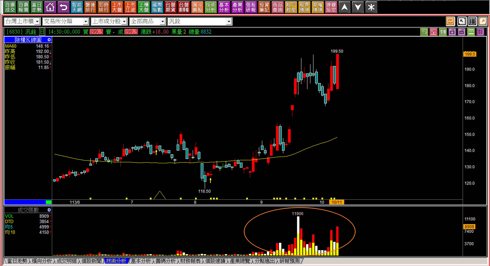
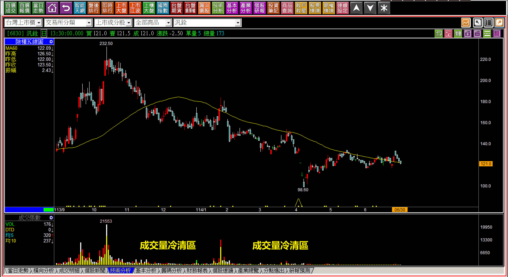
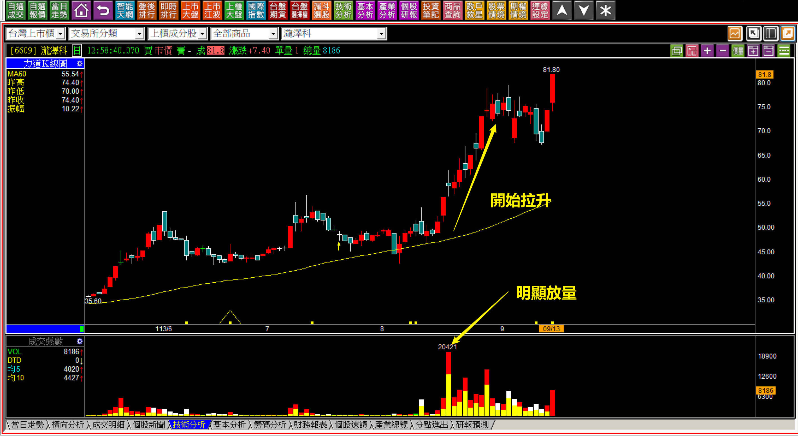
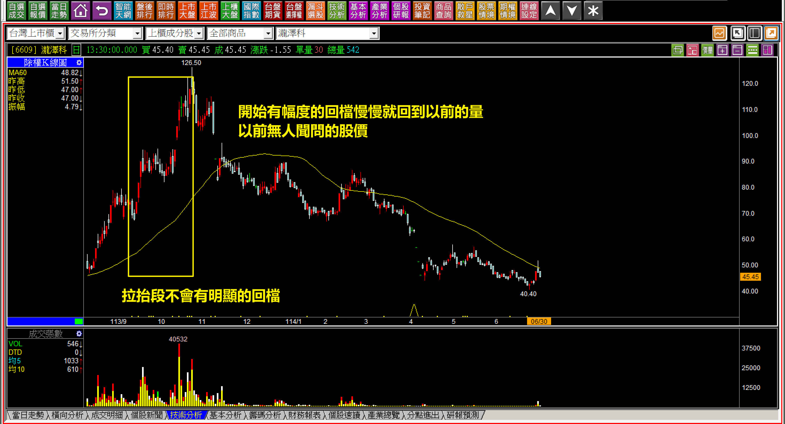
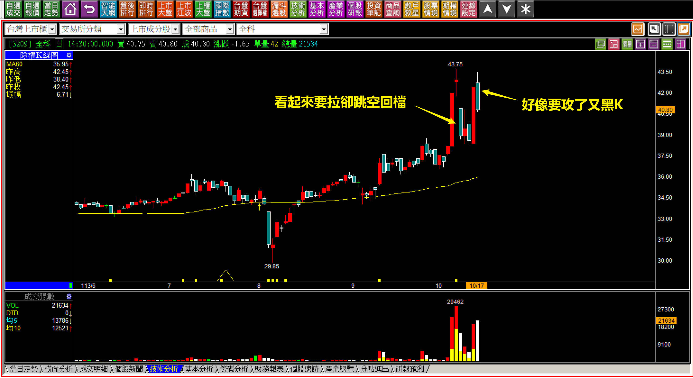
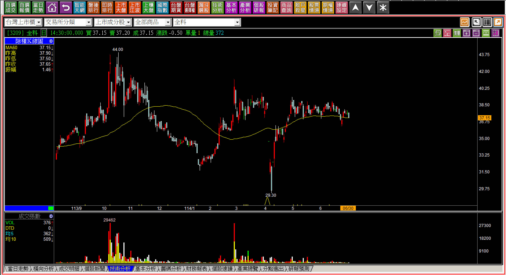
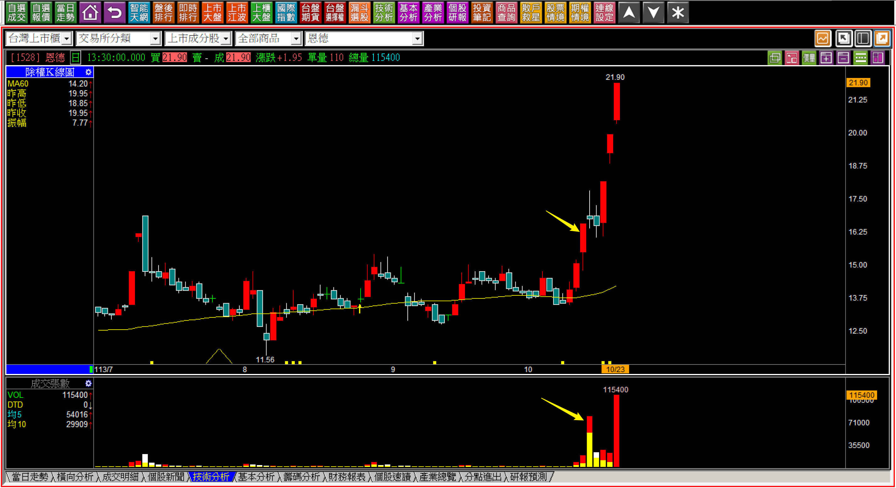

# 【明日K線】「明顯放量創新高後」篇

當市場多頭趨勢進行久了，會出現一個特殊的現象：**主力已經找不到太多股票可以拉抬，有題材的、被冷落的、基本面好的，只要符合需要吃下的籌碼不多的，早就會被主力鎖定為拉抬標的。**主力觀念裡認為，大部分股票以後要出貨都沒有什麼問題，因為這個市場有著最佳的助攻員，就是財經網路媒體，散戶會滑手機、買低買拉回。

股價漲了，自然會有記者報導，到處東挖西挖，把以前的舊聞拼裝現在的熱門產業，很快的從來都名不見經傳的公司，頓時就熱門了起來，以前沒人聽過八貫這家公司，可是無人機話題一流行起來之後，大家也就都知道八貫(1342)了。

但是有的股票主力也太過於自信了，明明基本面很糟糕，到了整個話題過了之後還是沒有辦法順利出貨，就像是車王電、長園科，最後不得已主力只能變成長期抗戰的策略，慢慢地尋找機會出脫。這就是為什麼題材飆漲股如果回檔，很可能走出一座山的走勢，原因就是等到主力跑光了，剩下的都只是散戶，還有散戶繼續拉回攤平加碼。

先理解這些，再來看怎樣的訊號是股價有主力開始進來了，答案就是：「明顯且異常的放量」，且不只一天放大。不過，開始進來不代表主力就一定會往上攻擊，也就是量先價行這個說法，不一定是對的。

**汎銓(6830)**

有些股票本來根本就沒有什麼量，每天都是交投清淡，但突然出現的大量，當然是有某個力量開始進去玩股價。市場有一種「底部爆大量」的說詞，這個說法是有問題的，就像上圖，如果股價未來狂飆，就會給人一種底部爆大量的錯覺，其實突然的爆大量表示開始有人去玩了，以後會不會飆？這可不一定。

可是散戶愛聽那種輕鬆、簡單、容易接受的語言，要追高要克服障礙，低檔買進就願意接受，其實飆股當初也是突破創新高的，只不過後來更飆讓人誤會可以低檔買進。

**114-06-30汎銓(6830)**

發現了這種異常的量，就是主力進來了，股價會拉還是不會拉？是明日K線的重點判斷，可是有一件事情可以確定，當股價開始有明顯的回檔，等於沒人要的時候，股價就會跌回原本的冷清區。

**放量之後的明日判斷有兩大要點**

**直接先點出這兩大要點，再來慢慢說明：一、攻擊姿態直接延續；二、不能才剛要拉又回檔量縮。**

**113-09-13-6609瀧澤科(6609)**

來看典型的攻擊模式，放大量是第一步，然後股價就沒有再回頭過了。

為什麼說這是典型？因為主力夠乾脆的拉升，這就代表如果交易者買了、股價漲了就賣掉，顯然就犯下了價差交易的重大錯誤，有的人甚至還分批進場，打算有低再買一點，這個心態的人無法在價差交易賺到任何大段行情。

這也是「明顯放量創新高後」需要作為重點的原因，有了第一項的放大量，當然要看股價要不要拉上去，通常要拉的，就不會搞東搞西回檔再拉區間震盪。

**114-06-30瀧澤科(6609)**

這檔股票以前我們做過攻擊的教學了，這裡的判斷是當有幅度的回檔出現，股價慢慢就回到了無人聞問的股價。我常常在講座、教學課程都不斷地強調攻擊過後，這邊要說的是，本來冷清，後來異常的明顯放量，就等要有認知，終有一天成交量會回到以前的冷清，如果基本面本來就跟不上，只有題材，那股價也會回到以前。

**113-10-11全科(3209)**

很多散戶習慣幫主力找理由，像是會不會是因為大盤不好？會不會是因為財報不好？會不會是剛好有利空？所以有這種現象，就是根本沒有攻擊企圖。

主力要玩一檔股票的時候，都已經花錢了，就會做出決定，要拉還是不要，是真的還是假裝，會有決定，不會等到每天看新聞狀況，那是散戶在做的事。既然都已經出大量，就表示已經買了很難一天內就出貨散戶的數字了，不可能又回檔給大家買得比主力更便宜然後才拉。

**114-06-30全科(3209)**

對於價差交易者來說，「明顯放量」等於擺出了拉抬姿態，卻回檔就是「沒有要攻擊的意思」。

**113-10-23恩德(1528)**

創新高的第一天就會有大量，既然是創新高，股價就不會再跌回到攻擊意圖(賣壓化解區段)之下，這是攻擊的基本價位辨別，也是創新高突然異常大量第一天之後，唯一的重點。

讀者可以回頭檢視之前教學的「休息一天的攻擊」篇，創新高的隔日，股價休息也不會回到攻擊意圖之下，是同樣的道理。

**都是散戶的本性問題使然**

本來無人聞問，突然來了大量，主力當然知道散戶喜歡聽「底部爆大量」的說法，所以自己用力當沖沖出量來，散戶慢慢地就會注意到，加上散戶慣性不會停損，只會跌下來繼續攤平，所以更加肆無忌憚地拉股價。

所以操作的基本要點是：不要以為拉回是天上掉下來的又一次機會。而進階的要點：既然都攻上去了，沒有理由才剛剛開始就又掉下來讓來不及進場的散戶進去做點短線。

而這個起點除了創新高之外，還有「剛開始明顯的放量」，等於到了關鍵點，要攻或不攻，必須看得懂才行。