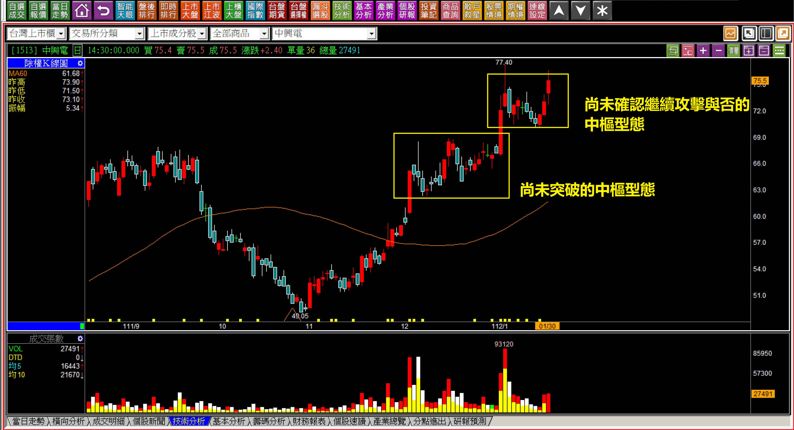
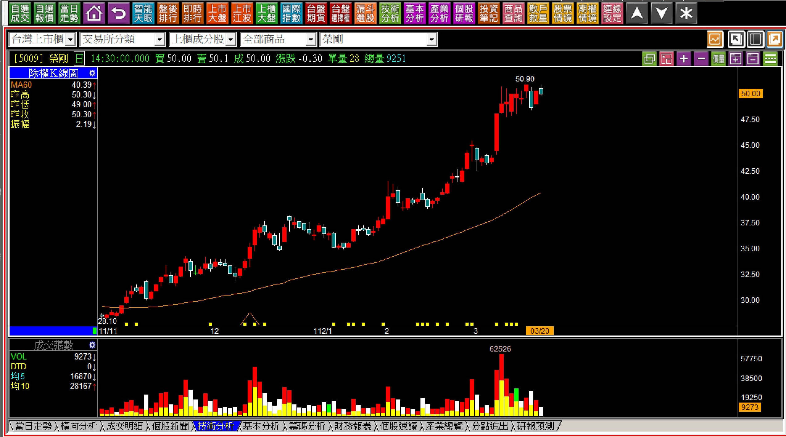
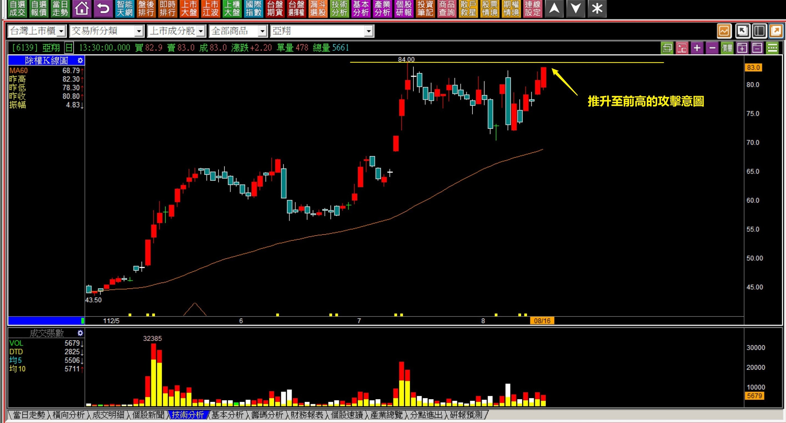
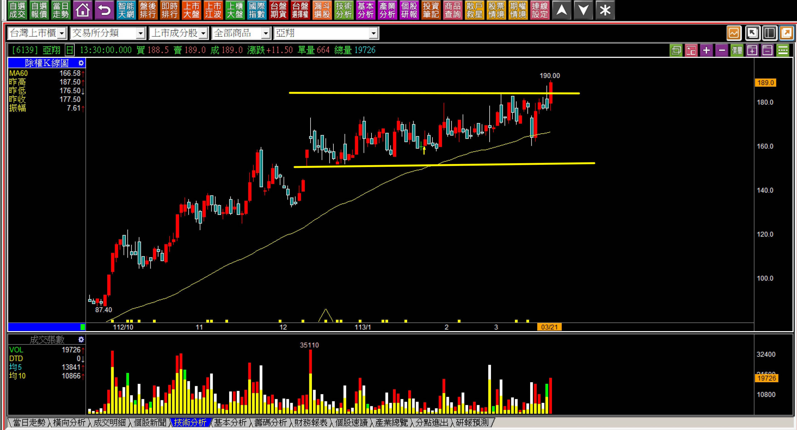
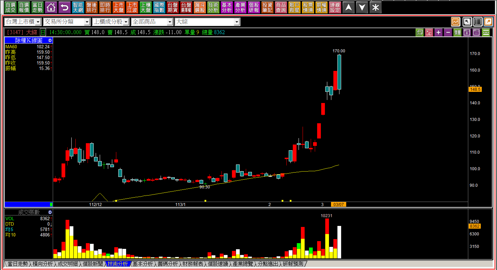
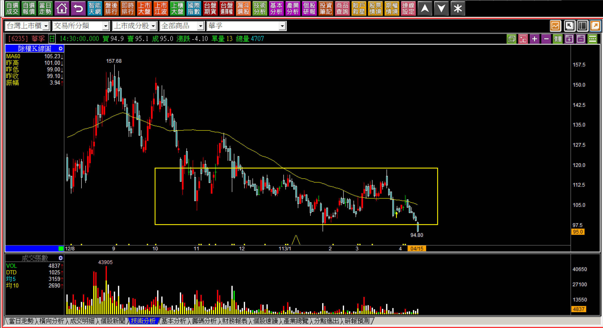
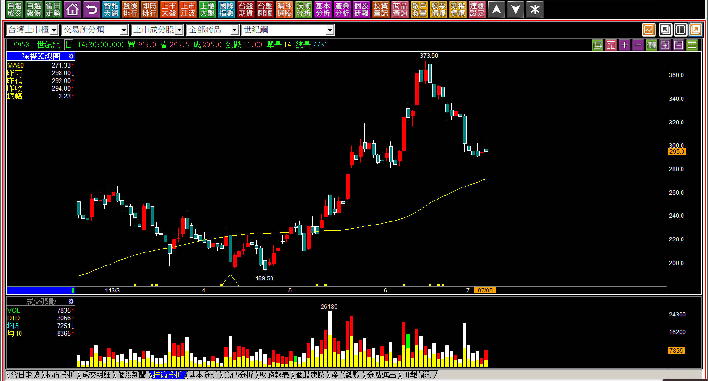
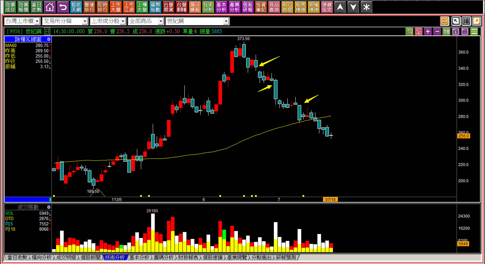

# 【明日K線】「中樞型態」篇

如果單純談攻擊型態，「中樞型態」讀者一定都不陌生，若站在明日K線的角度，最後一根K線的往上或者往下確認若尚未發生，但過往已經符合這個狀態的，就都是明日K線判斷的範圍，也就是還沒有發生確認的那一根，都需要警覺隨時會出現，多方攻擊當然是如此，好不容易逮到一檔攻擊股，沒有確認「不攻擊」之前，行情不可以放過。

這是價差交易的要點，可是多數人根本就等不及、忍不住、用過去幾天的走勢，就被影響感受，做出錯的決定。

**112-01-30中興電(1513)**

所謂的「上升中樞型態」指的是先上漲、橫向盤整，但是都沒有跌破原本先上漲的紅K低點，然後股價慢慢的來到中樞區段的上緣。對於明日K線來說，只要一突破新高，就是中樞型態的結束、繼續攻擊的確認點，股價上揚。

相反的假如隔天不漲反向回檔，那就是繼續中樞的整理過程。

對於交易者來說，假如手上持有股票，答案就很清楚，繼續上漲、創新高，是不應該賣出的，這樣會錯過股價繼續強勢的一段，那是交易者的重點。也就是漲才是對的、跌反而又繼續進入未知等待，偏偏人們都是想賣上漲的股價。

**112-03-20榮剛(5009)**

這裡的判斷我就不為大家畫上中樞區段，但是如果採用明日K線的態度看待，答案會是一樣的，雖然從K線看起來好像股價已經漲很多了，這只是一種假象，股價若再往上，就是又新一波的攻擊拉抬。也正式確認中樞區段結束繼續多方。

人們在此要對抗的就是懼高問題而已，有賺錢就想賣的缺點，這件事技術分析幫不上忙。

**中期持有與短線交易的判斷**

為什麼明日K線的概念如此重要？當然是要對抗人性採用過去的「近因偏誤」來判斷決策，所以輔助判斷的各種技巧都相當重要，這樣才能再隔日的開盤就知道應該要怎樣做決策。

**112-08-16亞翔(6139)**

以攻擊意圖來說，股價接觸到前高，代表攻擊意圖已經出現，明日，只需要出現「攻擊企圖」出現即完成攻擊起始。若以中樞型態而言，這個整理的區間依然在一根漲跌停的範圍，幅度是比較大了一點，卻無礙中樞型態的定義。

同樣也是隔天只要往上就確認了過渡的整理型態完成。

**112-09-25亞翔(6139)**

從一根突破創新高之後，股價又再一次進入中樞型態，然後再用長紅來完成突破，期間有過除息，不過無妨，對於明日K線的判斷來說，既然已經完成中樞型態，當然這個攻擊是繼續進行的。

**112-10-23亞翔(6139)**

一個月後，股價又再一次的上演一樣的戲碼，「攻擊、中樞、突破」反覆上演。所以這張K線圖又來到中樞型態的高點，明日起只欠缺一根長紅，投資者、交易者都在等的本來應該就是股價往上走。

為什麼這個等待的目標如此重要？因為多數人會在盤整狀態，慢慢失去耐心，就想當日找高點出脫一趟，這種心態很容易造成攻擊出現的時候，股票早就已經獲利了結賣掉了。

**113-03-21亞翔(6139)**

來到這張圖，相信讀者可以理解，為什麼亞翔可以成為技術分析中「股價攻擊的最經典範例」，因為符合所有教學中的要點，且可以自此確認，明天起只要不再回到這個區間，股價就是再次進入攻擊。

當然事後的走勢我們知道不只是攻擊，還是最強烈的日出攻擊型態。

**下降中樞型態的「明日K線」**

相對的下降中樞更是如此，因為人心總有著買低，或者持股下跌了想攤平的自然反應，因此明日K線的意義就在於看出股價是有可能發生下降中樞型態的。

**113-02-16大綜(3147)**

下降中樞型態意義與上升中樞型態相反，先有下跌，然後進入中間的整理，就差一根再往下跌了。

只要往下跌破，空方中樞型態就能確立。偏偏此時股價反向往上跳空突破這個中樞型態的整理區，這就表示股價根本就「沒有打算」往空方趨勢前進，這也是一種判斷。

**113-03-07大綜(3147)**

股價在空方中樞狀態中，並沒有往下形成下降中樞，而是往上，一路漲到黑K吞噬才停。這個例子並不是說沒有進入下降中樞就會漲，而是沒有往下表示多方資金的力量還在，不應該還沒跌就看空，這也是明日K線的意義。

股價的判斷並不是只有單一答案，而是保持謹慎的面對明天開始的走勢方向。

**113-04-15華孚(6235)下降中樞跌破頸線**

這就是正常的空方型態，是在區間整理的狀態中往下，改用空方波動觀察，只要跌破創新低，這也是明日起已經可以確認，空頭趨勢將會持續的跌破。

下降中樞並不算常見，如果是在多頭市場的大盤環境中，股價的下跌往往不清晰，有時還會反彈；若是在空頭市場，股價可能沒有這麼整齊的先有中樞才跌。

因此明日K線對於下降中樞功用沒有比趨勢改變來得有意義，只需要「不要在股價的空方趨勢買進股票」就可以幾乎都避開。

上升中樞型態，加上明日K線判斷，因為要對抗人性的問題，相對比較重要得多。

**測驗題與複習明日K線判斷**

**113-07-05世紀鋼(9958)**

拉回的股價，往往會先讓高檔有賣一趟的人，想要逢低買回當作是做價差。

上圖先有下跌，然後五天整理，讀者可以自我檢測，明天開始股價應該會怎樣走？假如真如預期，又應該怎樣判斷？

**解答：113-07-18世紀鋼(9958)**

明日K線並不是預測功能，而是檢視股價可能的走勢，在一發生的時候馬上就明白，而不是都等跌完確認了才理解原來這是某種技術分析的型態。

以上升、下降中樞而言，都是在中間的整理區就得要知道日後的K線會如何，還不算是很高深的技巧，卻是交易判斷時的重要能力。