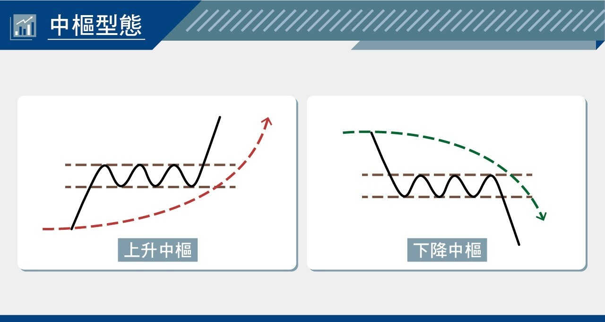
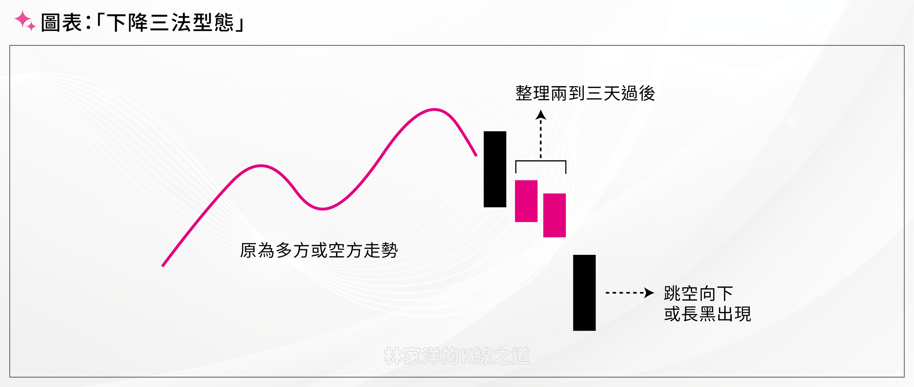
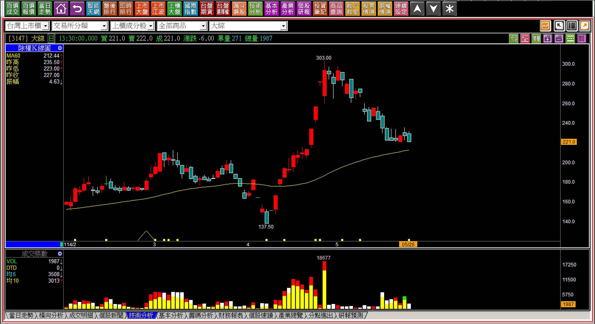
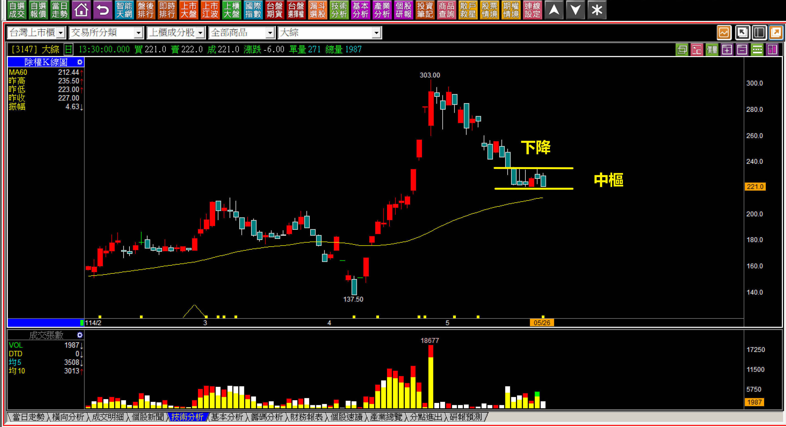
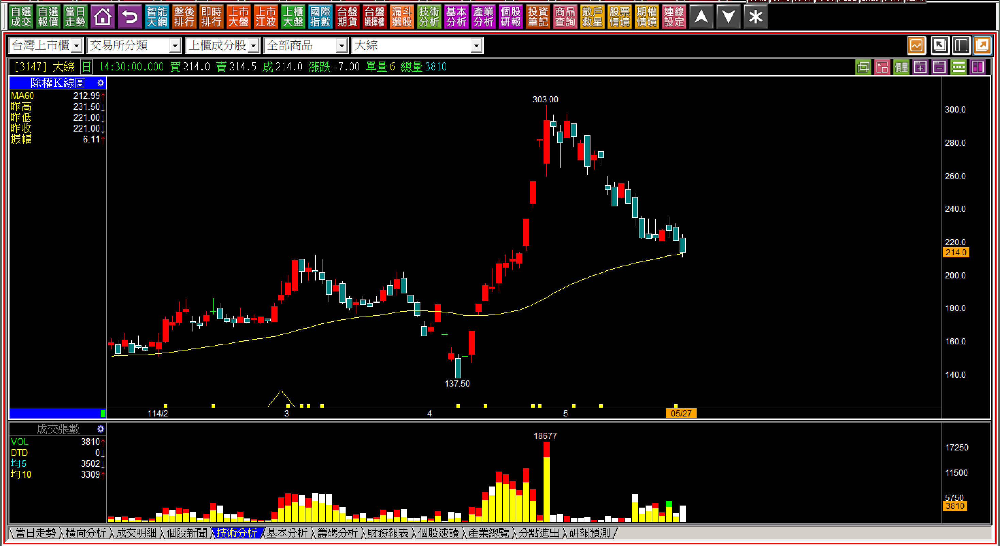
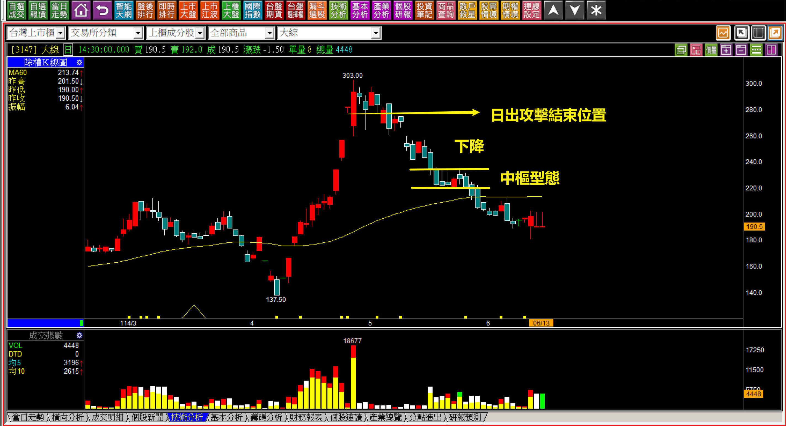
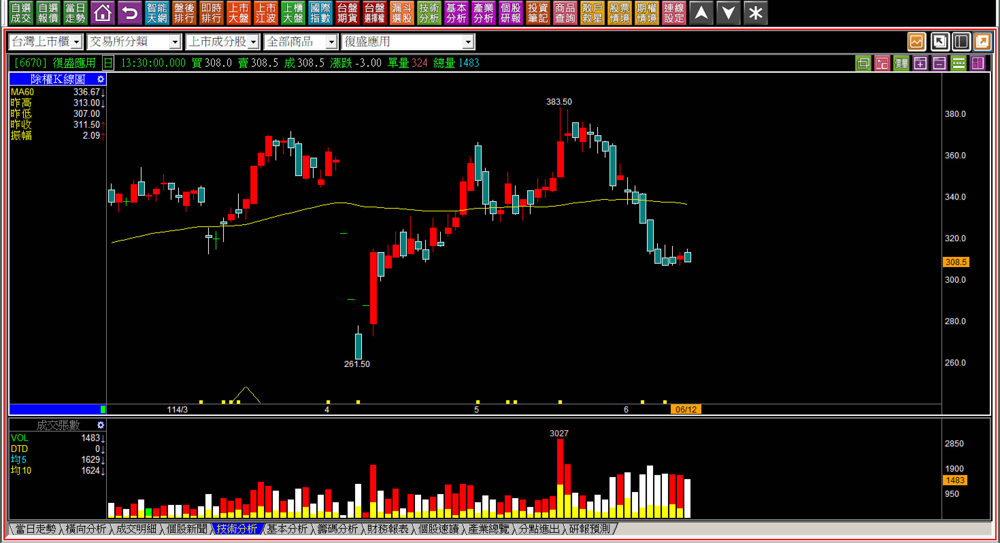
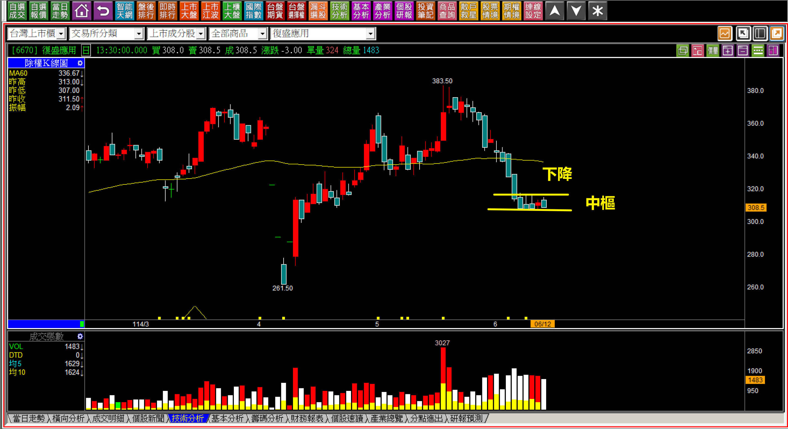
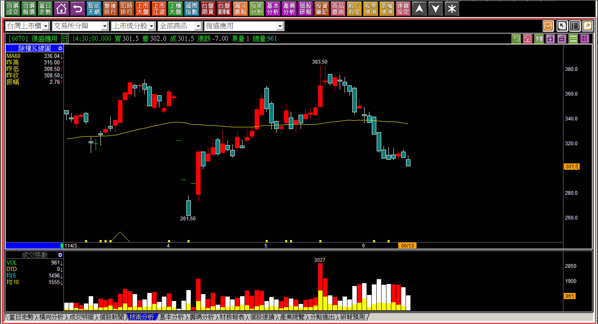

# 【明日K線】下降中樞型態發生「之前」

關於「明日K線」，是很多人學習K線後自然而然會演進的推想，例如股價大跌的起點是跳空反轉，跳空反轉就是紅K之後的兩根黑K，中間有著一個向下跳空，學會後投資人就會開始思考：有需要等到收盤才確定這是跳空反轉嗎？不該在一開盤看到向下跳空，就應該先有預警和反應作為嗎？

這是跳空反轉，如果談到其他轉折或者攻擊研判，甚至會有想在「前一天」就提前應變的本能反應。

當然，有些組合K線的意義，是不能提前的，得要等到發生才能確定，例如空頭吞噬、高檔長黑，你不可能還沒有長黑就看出來明天會長黑，也不可能在創新高的狀態之下預言隔天不攻擊。所以如果以研究五檔買賣單來作為預警，是一個方法，只是效果不明確。

所以明日K線的研判角度某種程度是：理解明天開始有哪些可能、每一種可能會演變成什麼結果，來作為交易判斷的輔助效果，這個認知也可以幫助讀者理解：**『為什麼我們學了轉折K線還不夠？還要學非轉折的組合型態？』**

我相信這篇教學就可以解決大家的這個疑惑。

**接下來的說明分為兩個層面，都很簡單：先認識中樞型態、再來談明日K線判斷**

**先認識『中樞型態』定義**

所謂的「中樞型態」其實是一種中繼，文字定義不困難，就是下跌一段、橫向整理、再往下跌，稱之為下降中樞，反之稱為上升中樞。實務上下降中樞的用處比起上升中樞有效，因為可以做到避開不必要的跌價風險，且既然是下跌狀態就不是創新高，也就沒有太大「下跌一段馬上轉變為攻擊飆漲」的可能性。

中樞型態分為三段：**一個方向、中樞、持續這個方向**。

中樞型態的判斷並不是訊號，而是一種事後理解的型態結果，所以在尚未發生之前，不需要以為實現是必然，而是如果真的有可能實現，就是避開風險(下降中樞)或者持續漲勢(上升中樞)而已。

避開風險往往是交易上的主角，只要買了一檔股票，卻看不到拉抬資金的動作，股價還持續下跌，馬上就打擊了投資人的信心，更別說把目光放在其他強勢股了，人性只會專注在留意自己的損失，對交易是巨大障礙。

**補充說明：下降中樞型態是下降三法的拖戲**

中樞與三法之間的差異，是在中途的整理時間，兩到三天的整理稱之為三法，超過三天以上就改稱為中樞，其實原理邏輯相似，只是時間上的差異，不影響判斷。

**再來談明日K線判斷**

**114-05-26大綜(3147)**

日出攻擊結束的大綜，在研判下降中樞是否會發生前，為什麼要確認一下當初的日出攻擊結束？因為有過攻擊表示股價經歷過一段時間的資金彙集拉抬，等到主力資金離去，缺乏力量支撐也會下跌，就會造成下降中樞型態成立的機率上升。

下降中樞的三區段是下降、中樞然後再下降，因此站在明日K線的角度，這一天就應該要預期得到，明天不是繼續中樞的整理，就是下降出現了。

**114-05-27大綜(3147)**

這一天股價下跌7元，任何一張持股僅失去7000元，對於理解下降中樞型態的人來說，就是根本不必要的損失，也是我們學習K線判斷的目的。這一根K線出現之前，就已經知道會有這樣的走勢，就是明日K線學習的意義。

**114-06-13大綜(3147)**

接下來股價會怎麼走？無法預測，從日出攻擊結束的多單離場，到下降中樞型態出現的避免進場，股價至此每一張的價差已經達到88元，等於看不懂就要涉入每一張八萬八的損失風險。

**114-06-12復盛應用(6770)**

當我們看懂下降中樞型態時，可能馬上會想那是否只是某一個大盤的弱勢時期產生的影響股價現象？並非如此，這就是為什麼要看到現在股價的疲弱，結構意義的重要性。

這個下降中樞與上一個例子大綜的差異在哪？似乎形狀上看起來差不多，不同之處在於一檔是攻擊結束後，一檔是股價不攻擊。

**114-06-13復盛應用(6770)**

對比的角度，雖然中樞過後都是下跌，不過大綜是攻擊過後，下跌讓籌碼相對較亂，而復盛應用並沒有經歷過攻擊拉抬，所以籌碼沒有被拉抬過之後的太大量高檔套牢。

這兩者之間的差異往往被人忽略，這是因為知道了差異並不代表復盛應用以後就會拉上去，或者一定會繼續再跌，只不過是知道了結構狀況而已。

**114-08-18復盛應用(6670)走勢**

