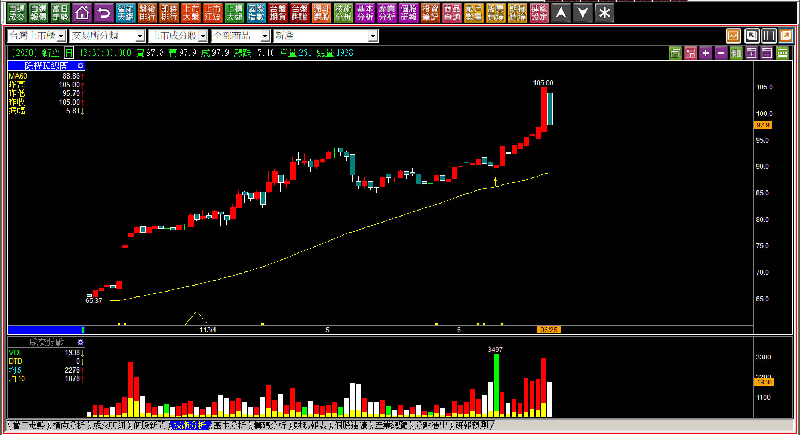
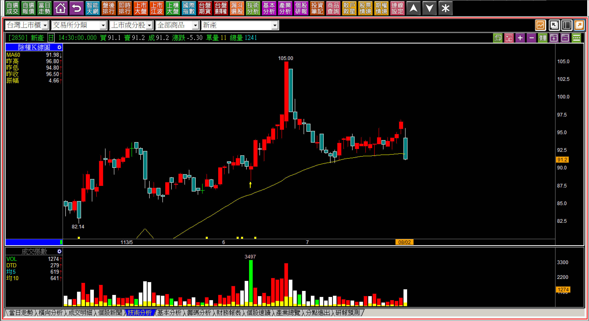
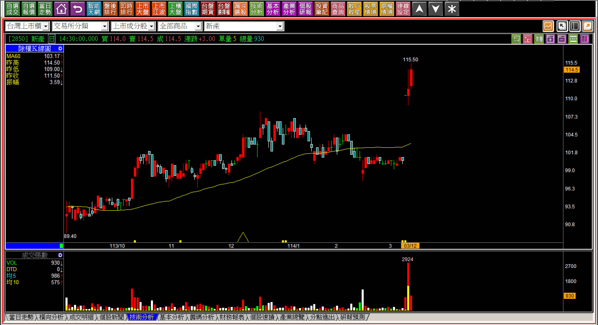
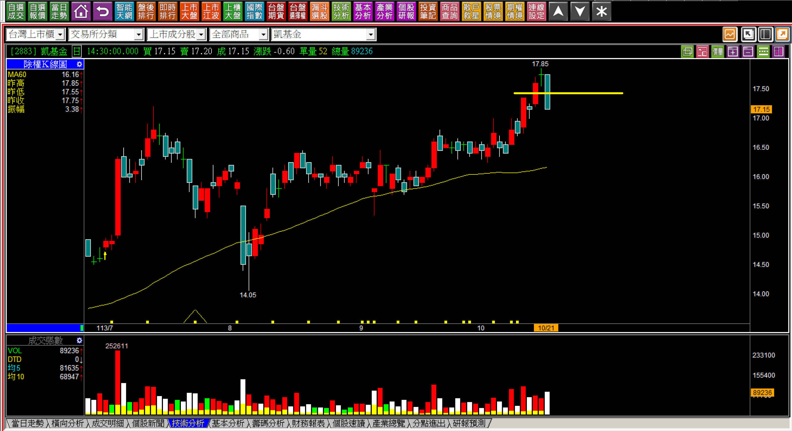
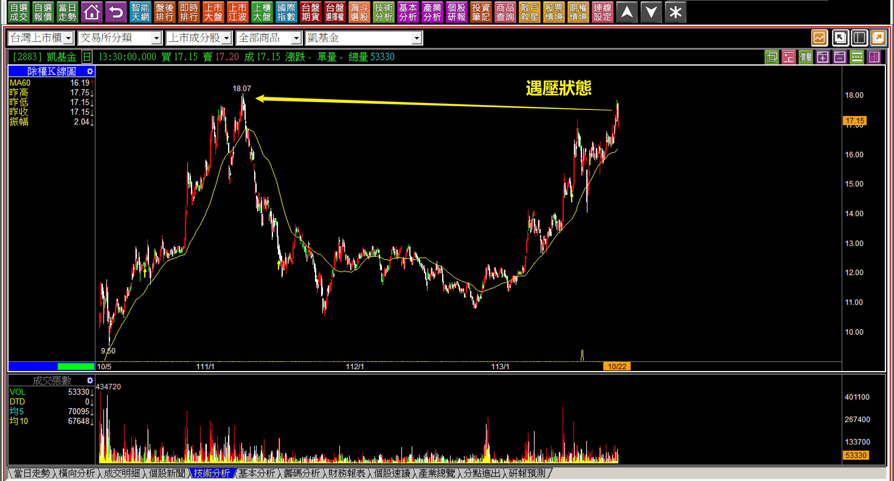
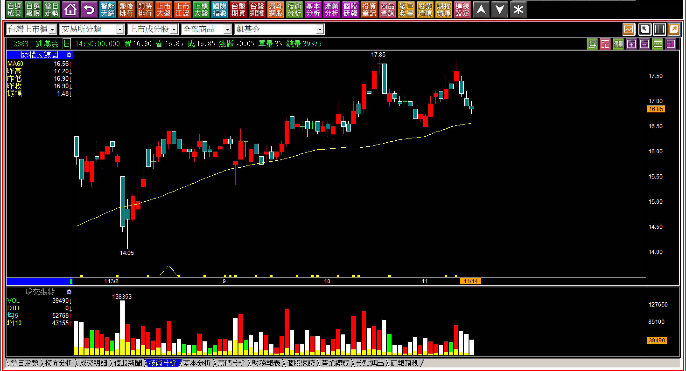
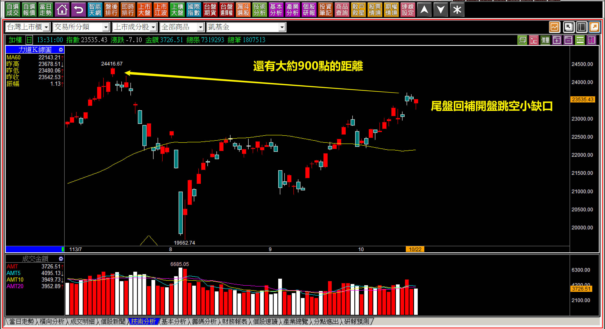
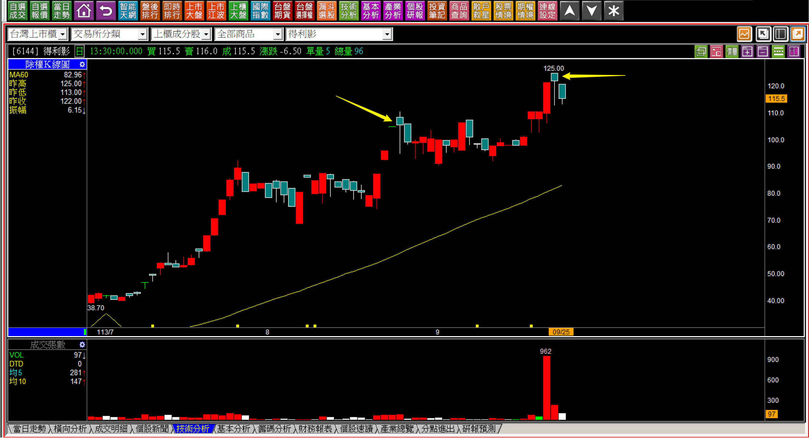
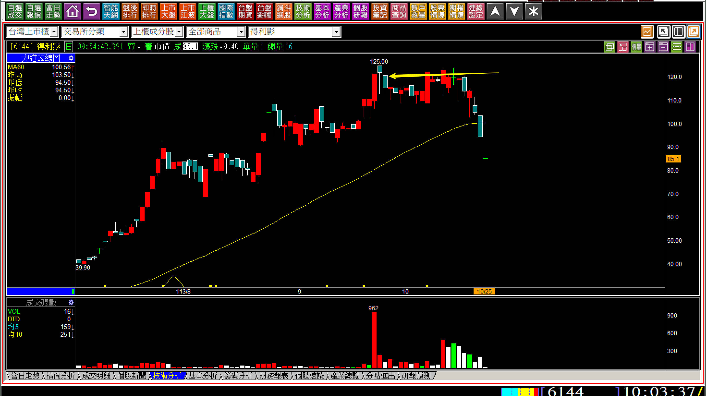
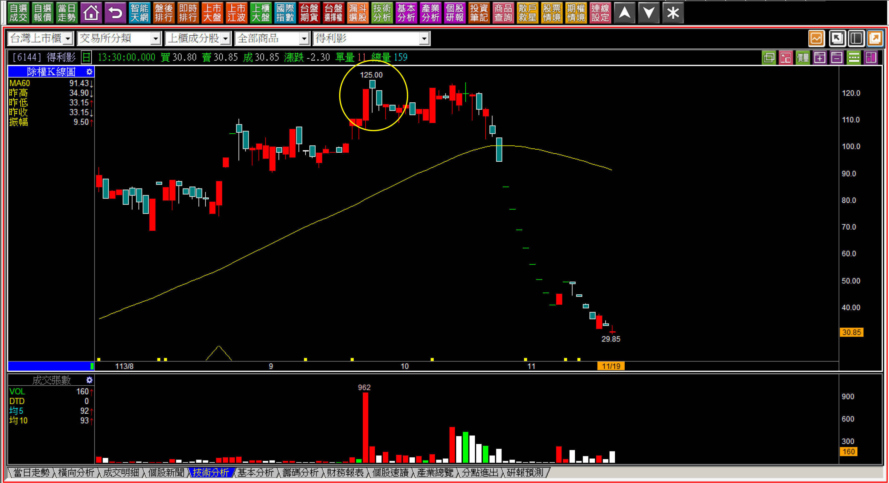

# 【明日K線】抵抗意義出現的明天

抵抗力量，源自於主控K線的說法，當上漲的態勢遇到了阻力，或者下跌的態勢沒有持續，主控稱之為「抵抗力量」，不過這個說法有點薄弱，也很鄉愿，等到股價再次上漲，就說是空方抵抗失敗，不足以改變已經錯過機會的事實。我這裡談到的「抵抗意義」與主控K線的說法無關，指的是：**力量還不到轉折力竭程度的K線組合**。

我沒有更好的名詞創造，以前這類型態統稱為「非轉折組合」，不過這個名稱也還不夠清晰，所以回到結構上來形容，才以抵抗意義來解說，例如「高檔長黑」，是打地鼠遊戲的概念，冒出頭的紅K，是突破前高再創新高，隔天卻被上下幅度超過10%的黑K包覆。

形狀看起來像是空頭吞噬，卻少了之前的多方持續拉抬，與其用形狀套在力竭原理上，不如用成賣單的阻礙抵抗更清晰。當然，轉折也是一種反向力量的抵抗意義。

**持有上漲股遇到了抵抗意義的K線組合**

遇到了認知中的暫停上漲意義，對於短線價差交易者來說，就是出場另謀時機，但是對於中長期看好基本面的投資者，就顯得為難，所以才需要辨別誰是誰。也就是說，目標穩定收益的人，只有一個特徵，就是期望投資標的物進入價格空頭趨勢，這樣他才能持續以更便宜的價錢買進。

不希望價格下跌的人，都不是真心想要穩定收益，只是包裝給自己看的態度。

站在明日K線的判斷，就是明天要有買賣決策行動的作為，才需要透過K線邏輯來辨識明日，所以抵抗意義出現時，不能沒有看到，至於相對應的作為，就看每個人進場目的的不同來決定。

**新產的內困型態出現：113-06-25新產(2850)**

所謂的「內困型態」其實就是孕線，只不過真正有內困意義的走勢，出現孕線之前有一段明顯的行情，這樣才有阻礙抵抗之意，如果沒有，就單純是個孕線的話，誰要抵抗誰呢？

對於投資的角度，當然是看好這家公司長遠穩定的收益，可是在這樣的時刻，判斷能力還是要有的，所以假如隔天又出現一根黑K，就是內困三日翻黑的定義符合。表示股價遇到了抵抗的力量，在這個位置就是短線獲利了結的賣單而已。

後來的走勢證明了這一點，因為隔天繼續翻黑之後，股價就看得出來當時遇到了抵抗力量，即使這段時間依然是投信、外資持續的買超。

內困當然「不是」力竭意義，所以不是轉折組合，只不過是有反向抵抗意義而已，這在投資的層面上需要理解這一點，股價並不是非多即空，看得懂知道接下來會如何就行，不一定要立馬做出買或賣的決策。以新產來說，基本面持續成長，股價最終還是創新高，應驗了投資最佳的那句話：企業營運的獲利趨勢就是股價趨勢。

**114-03-12新產(2850)**

看懂去年六月份的內困型態，並且知道只是抵抗意義，不是反轉組合，目的也是為了投資的態度上，不要被網路的錯誤影響。因為多方轉折有母子晨星，網路就反過來教學說內困翻黑是空方轉折，並不是，只不過是出現了短線中的抵抗力量而已。

這就是我們要辨別程度的原因，不是多方轉折相反過來也可以當作空方轉折使用。

**凱基金的夜星棄嬰：113-10-21凱基金(2883)**

上漲的紅K隔天十字線出現時，很重要的判斷就是馬上回頭去看股價過往還有沒有更高價的壓力位置，如果有，隔天跌破紅K的中值，就是符合「夜星棄嬰」這個空方轉折的定義。

遇壓的明日，往往就是以下跌為正常，再往上創新高為力量。

隔天的走勢果然來了一根黑K，不能等到出現了才感到意外，而是前一天就必須要有這個準備，同時，在黑K出現之後，就知道這裡遇到的力竭，明天起就無法對股價過度樂觀了。

**113-11-14凱基金(2883)**

低價還有一種易漲易跌的特性，就是本益比偏低時雖然低價籌碼較亂容易漲，也會再漲上去本益比偏高的時候容易跌，看到轉折組合，至少具備了抵抗力量出現的意義，因為已經是低價股，有一定基本面就不至於崩跌，但也不必抱太大的希望。

**大盤的雙鴉出現：113-10-21大盤**

雙鴉躍空的定義是股價來到了壓力區段，先有一根跳空的黑K，隔日又是黑K，明天就不能往下跳空，如果往下，表示雙鴉躍空的條件成立，是空方的反轉當然也是抵抗力量出現的意義。

所幸隔天雖然開盤小幅度往下，當日就回補缺口，定義上不符合雙鴉躍空。

不過雙鴉躍空如果用在大盤的K線組合，就需要了解一下當下大盤是否有權值股的影響，這個時間是大盤完全由台積電主導的時期，所以就算符合了雙鴉躍空，光靠台積電拉抬依然可以化解，所以有時候被單一權值股影響，轉折組合的抵抗力量就不如那一檔權值股來得大。

看懂結構，也是明日K線的判斷重點所在。

**投****機****股得利影的高檔吊首：113-09-25得利影(6144)**

「高檔吊首」指的是高檔的下影線，出現之後只要股價不再創新高，這個阻礙的意義就一直存在。對於未來走勢的判斷就是轉折的組合，不過，明日K線研判的是未來走勢，得利影這檔股票比較不一樣的是主力拉抬著營運績效很差，平常沒有成交量，利用籌碼很輕盈的優勢把股價拉到百元，接下來是主力要煩惱怎樣出貨，因為散戶不會來買，煩惱的就是主力了。

也因為這樣的原因，出現了高檔吊首很正常，因為主力自己總是偷拉尾盤，K線上會出現一堆高檔區域的下影線，這個形狀自然不可能是支撐意義，而是主力自己上演情境劇，可能沒有什麼散戶看戲的那一種。

**113-10-25得利影(6144)**

得利影的特殊之處在於「明日」不一定代表的就是明天，意義上明天「之後」股價會有的反應，都在判斷範圍之內，尤其是這種主力為主，幾乎沒有散戶的個股。

**113-11-19得利影(6144)**

本文雖然主題討論抵抗力量，但也是組合K線的複習，對於沒有本質的公司，股價表現有時候更為強烈，都是交易中務必要警覺的K線理論。