# 【明日K線】「主力出貨的秘密」篇

券商大廳、人們聊天，常常會冠上「股價有主力拉」的說法，來解釋股價的飆漲行情，表示投資人是知道的，知道股價要飆就得要有人用大資金拉抬，拉抬就是把股價抬高，買上去，當然就是等於盤中有著追高意願的買盤進駐。

既然有主力在拉高，自己不敢買的時候，應該要推給「主力拉高出貨」嗎？這是民間很愛用的說法，邏輯卻是錯誤的。

因為拉高，就是要用買的拉高啊，你想像得到用賣方式的拉高嗎？如果不可能，又為什麼以為會有一種出貨叫做拉高出貨？有人說是拉高引誘散戶去買，這就更謬論了，散戶就是因為不敢追高，才說那是拉高出貨，既然不敢，為什麼引誘得到散戶去買？這就是一廂情願地解釋不敢追高的原因而已。

對於主力來說，要出貨就是要「賣在散戶會來買」的地方，才能有效的出貨，既然散戶慣性買低買拉回，這就是我們在選股進場時最重要的判斷點，這一篇要來談主力如何出貨的明日K線判斷。

先談類型，再談看到這樣狀態的「隔日起」判斷。

**箱型區間讓人失去戒心**

**主力出的順，股價就變「一座山」，主力出不順，就變成「箱型區間」。**

股價如果一段時間的拉抬過後，當然變得比以前貴很多，散戶投資人透過K線圖一眼就可以看到過去的漲勢，就算想買，也會等到拉回再來「慢慢佈局」，這就是投顧老師給出來的觀念，網紅分析的人又進一步沿用而已。

客觀的說，當股價拉完之後，站在主力的角度，想要快速出脫大量部位應該是很難的，慢慢出脫就得要先做出一個高檔區間整理的樣子。

在攻擊型態的教學中，對於箱型區間的風險已經都做過說明，所以對K線圖一眼就能判斷也沒有困難，明日K線要看的，是主力的做法，理解之後就不會上當。

**113-08-23直得(1597)**

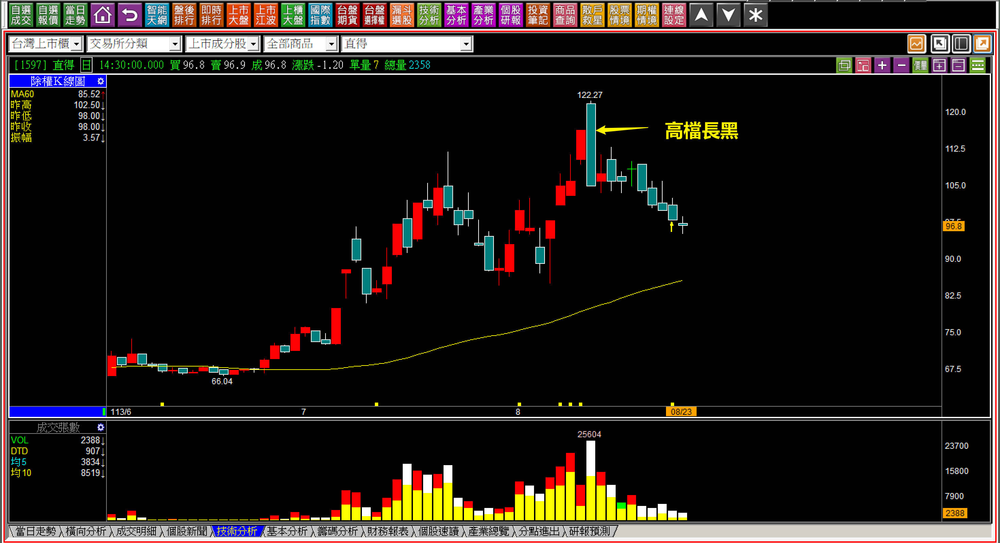

高檔長黑當然是一種不攻擊，且等同於股價被賣出來的走勢，這在組合K線的判斷教學中常常有說明。其中還有細節等一下會解說。

從高檔長黑之後股價開始往下掉，那麼主力會怎樣達到慢慢出貨的目的呢？答案就是高檔的區間整理，所以，要有區間就有箱底箱頂，再來看看箱底。

**113-08-28直得(1597)**

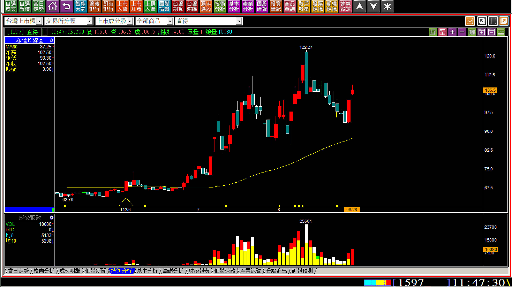

突然有一天出現紅K，隔日還往上跳空，帶給市場一種好像又要再上漲拉抬一次的機會，要不是那根高檔長黑，我們都快要相信了。既然有了箱底，再來就等著看箱頂，通常箱頂不會超過高檔長黑的高點。

**113-09-02直得(1597)**

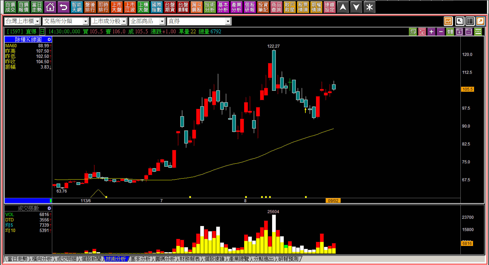

果然經過了四天假裝有漲有跌，短期應該已經看到箱頂。

在未來還沒有發生任何走勢之前，只要對於主力的出貨有一定的認識，幾乎已經可以看懂箱頂箱底是怎樣構築而成的，何況此時市場正在熱門機器人的話題。

**113-09-12直得(1597)**

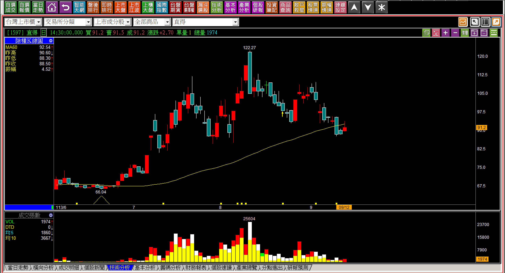

這個位置就等於比箱底還要低了。

其實做出來箱型有沒有很整齊完整不重要，重點在於股價還沒發生之前，就需要有認知，回檔往往代表的是套牢者越來越多，並不是股價拉回慢慢佈局的機會。

**五檔買單掛大單讓人以為有買盤**

依然還是用近期的範例來說明，也是直得，日期是在八月十二日高檔長黑的那一天。

**113-08-12直得(1597) 盤前預掛單**

盤前預掛漲停板是假象，因為如果真的要拉，為什麼要盤前這樣給人看，然後開盤的時候又通通取消？這是台股裡很無用的制度，主力可以利用來幫助製造假象。雖然預掛漲停板又取消，不代表股價就會跌下去，但是這代表著虛假的心態很明顯。

**113-08-12直得(1597) 09:02**

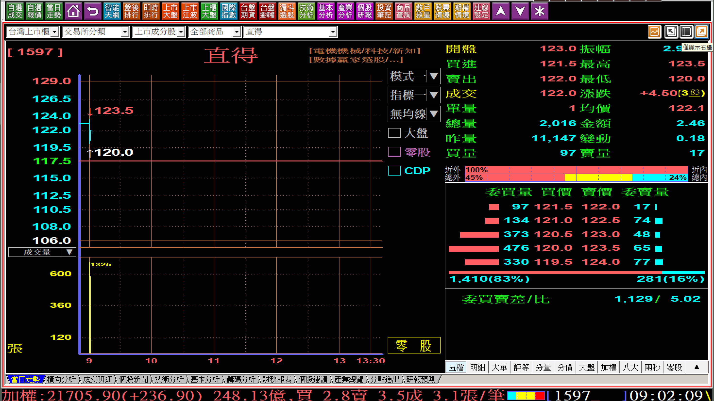

接下來都注意五檔買單，都有幾百張且不只在一個檔次的大單掛著。這就是一種給人以為是低檔有承接買盤的假象，真的要買不需要這樣掛著給人看，就算是真的，這個買單也不是具備拉抬意義的買單。

**113-08-12直得(1597) 09:05**

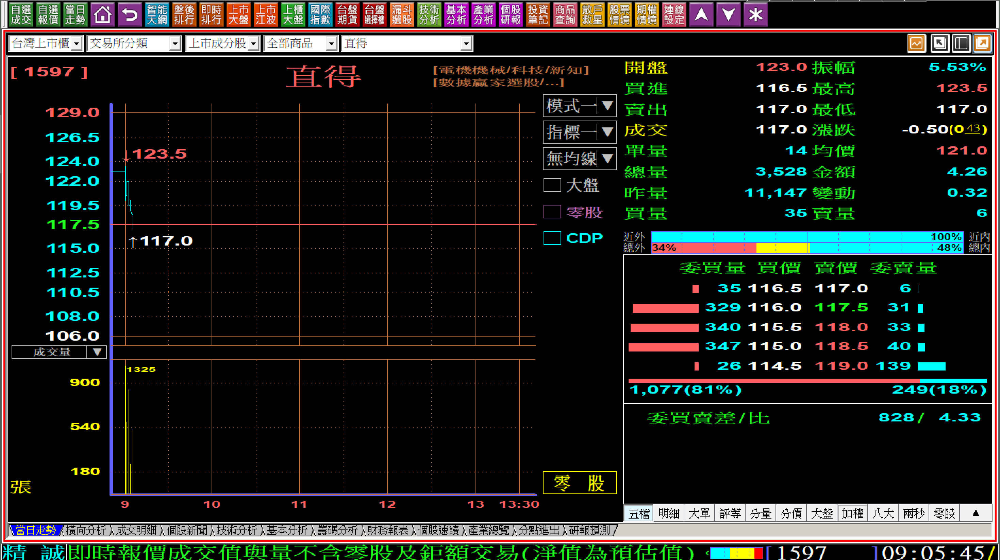

當股價跌破平盤時，表示前一天突破新高的攻擊成本已經跌破。

這個位置依然有三檔次都是掛著大單。

**113-08-12直得(1597) 09:57**

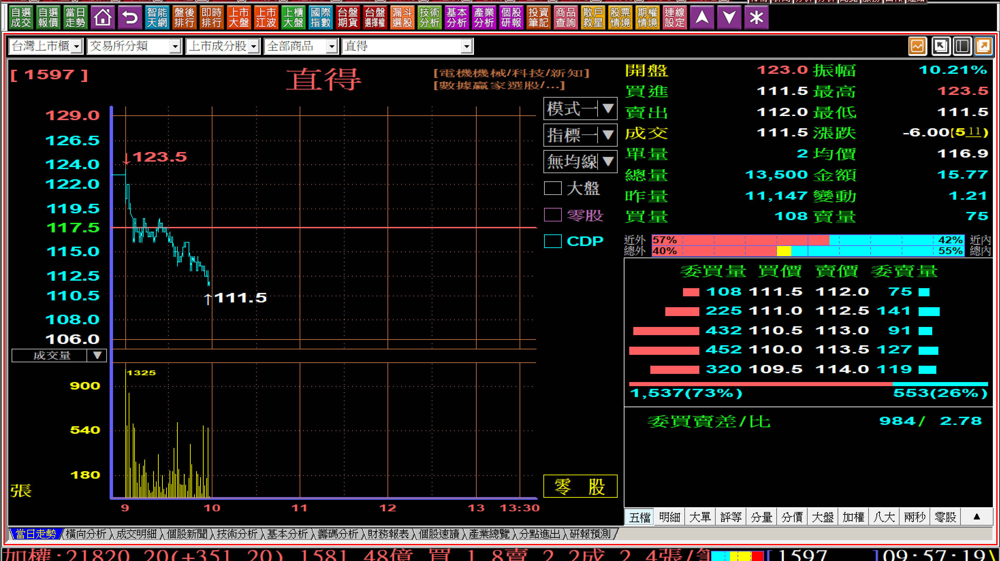

跌到這裡，買單低接的假象更明顯了。

**113-08-12直得(1597) 10:11**

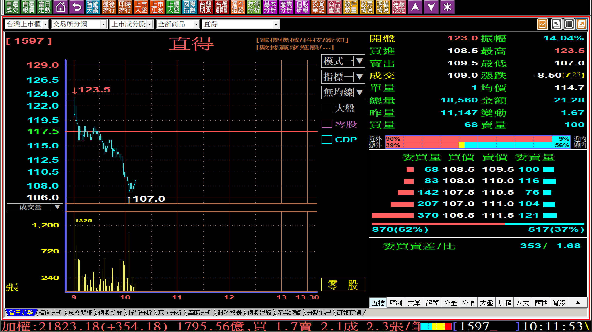

整個跌勢的過程我們只能用盤中的截圖來呈現，五檔買單掛大單，也是主力出貨的方式之一，因為這樣就始終讓散戶喜歡拉回低接者，一直誤以為低檔有買盤承接，於是勇敢攤平。

**113-08-12直得(1597) 收盤**

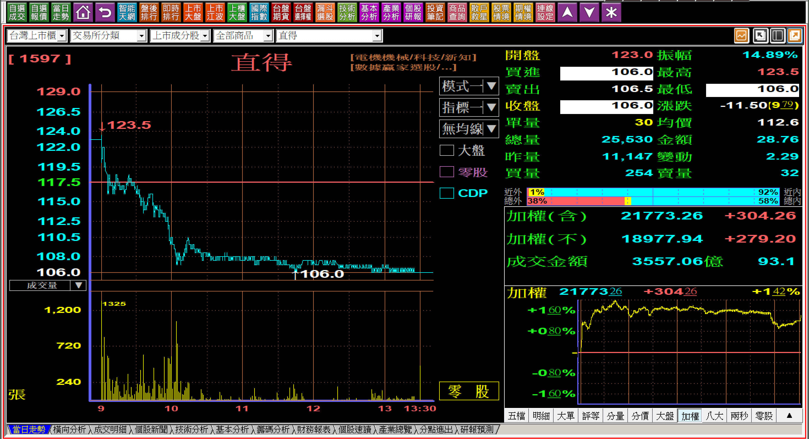

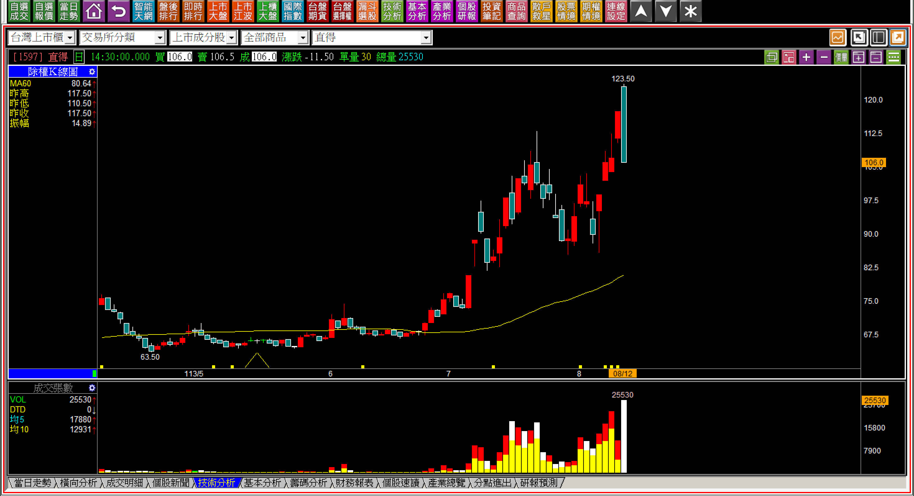

這就是「高檔長黑」的過程。

為什麼高檔長黑力量意義接近空方轉折？就是因為持有大量多單的主力利用機會獲利了結，通常是題材最熱的時候，想要搶個短的散戶，往往以為拉回就是機會，上去想要賺個短線，沒曾想誰要為這些短線客拉抬股價？

這些都是明日K線的判斷中，對於主力出貨的熟悉，避免自己陷入拉回買進結果大跌一段的窘境，當然，攤平更是要不得的錯誤，當然，主力出貨也有可能不順，這樣股價就會高檔整理拖得很長很久，去年車王電就是一例。

**114-03-12直得(1597)**

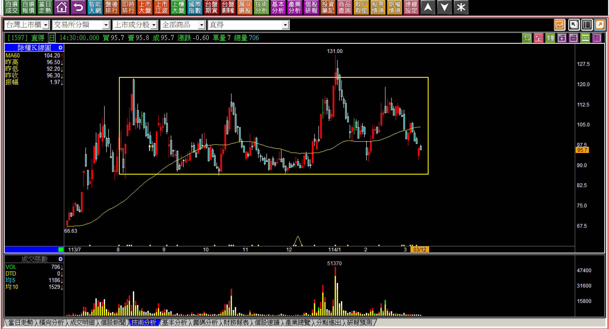

從K線型態角度來看，直得應該主力出貨並不順利，所以只好在機器人題材出現時再拉一波，但最終依然轉弱，且如果跌破箱型區間，等於跌破頸線。

**低價股的震盪讓人以為風險低**

在攻擊K線的輔助篇中我談過「低價股的冒險」，這是因為低價股散戶介入容易，以為只買個幾張風險不高，但是八張低價股，跟買一張百元的中價股，價格的風險一樣，籌碼風險更高一些，就是因為散戶會相對的比較多。

**113-08-02億泰(1616)**

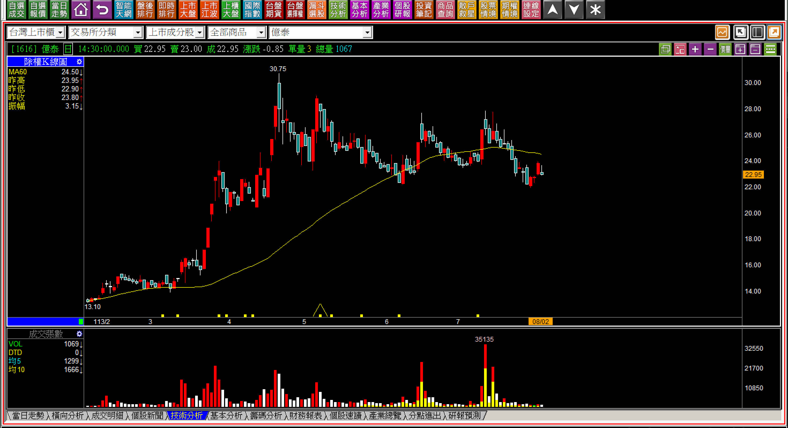

單純以K線圖就已經看得出來目前主力採用的，就是箱型區間讓人失去戒心的出貨方式，這個區間已經長達三個月，表示如果有一天跌破下緣，就是等於「跌破頸線」。

只不過因為這是22元左右的股價，投資人往往覺得風險並不大，就多少買一點低檔，沒有意識到問題所在。

**113-08-05億泰(1616)**

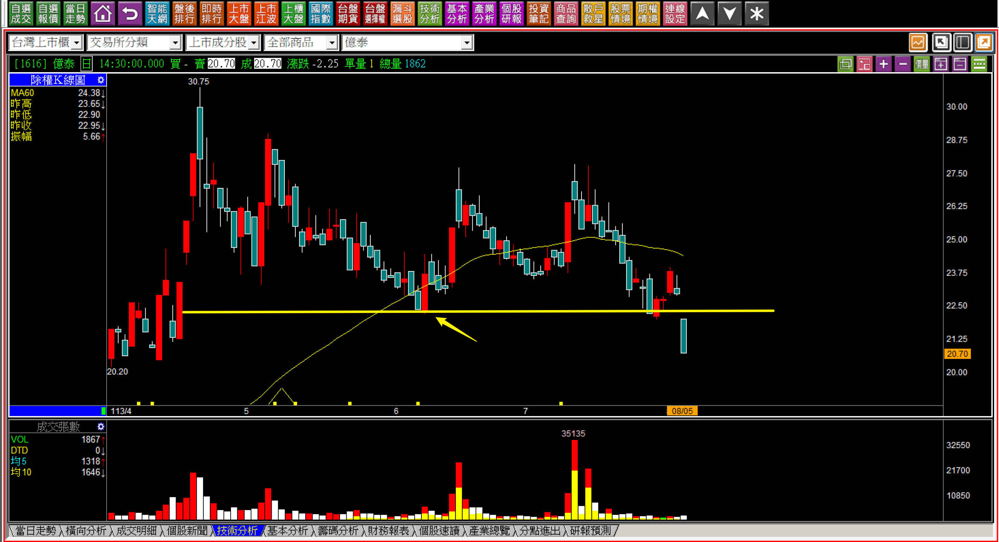

不要管價位，這根跌破當然就是跌破頸線，因為季線下彎的前一個低點已經破了。

在這一根跌破之前就應該要意識到「明日」起，隨時只要出力出得差不多了，就撐不住。在這一根出現之後，就應該要知道，明日起，股價上方已經有了天花板，與是不是低價股無關，只不過低價股籌碼更亂，要拉上去更難，因為主力更不願意幫套牢的散戶解套。

至於題材，沒有意義，股價跌了根本就沒人記得題材是什麼。

**113-09-12億泰(1616)**

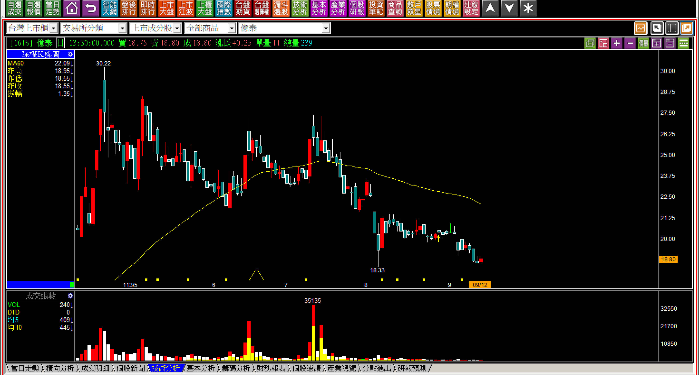

從跌破頸線開始，股價已經約略下跌兩成。

下跌兩成對於交易者來說是很大的損失，即使沒有使用融資，這也是很難處理的持股狀態。低價股比起中價位、高價股都更存在著散戶會攤平形成的層層套牢，是每一天檢視明日起的可能性，需要多一分留意之處。

**補充說明**

在明日K線的單元中，我經常反覆的說明「明日K線」的角度，其實就是在股價還沒有發生質變之前，就應該要理解質變發生的可能性高，或者已經發生了質變之後，接下來的走勢瞭如指掌的把握，與買賣點沒有直接的關聯，而是對股價的變化，早已有了心得。

常態保持這樣的訓練，不只是練習的方式，更是提升對判斷的自信，因為交易的關鍵時刻，每個人都需要具備相信自己判斷的能力。

主力出貨怎樣出、出光了沒？並不是最重要的，不能以為網路上說的，就是標準答案，這才是最重要的。

通常誤謬都出現在很普通的地方，只因為人性喜歡報喜不報憂，錯誤不排解，問題會累積成為思想上的制約。