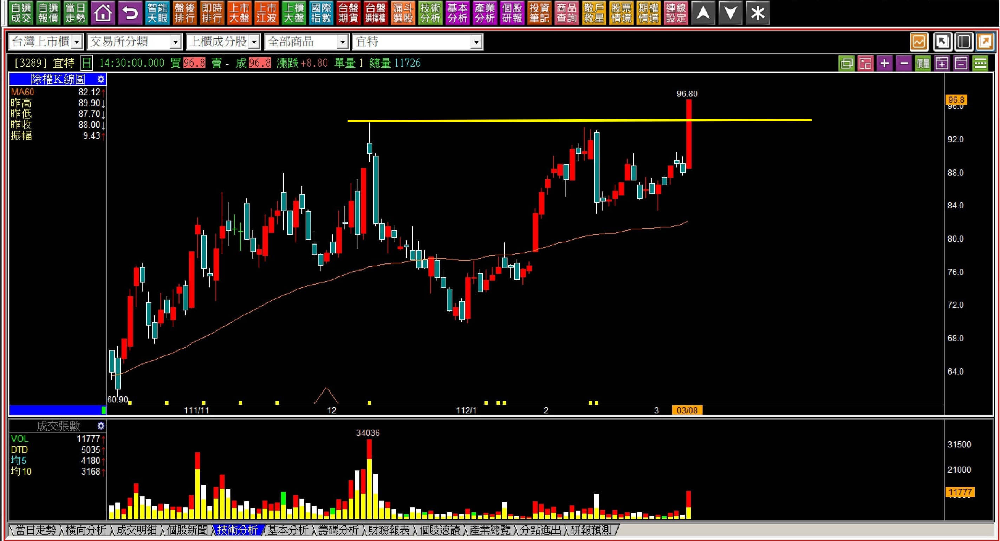
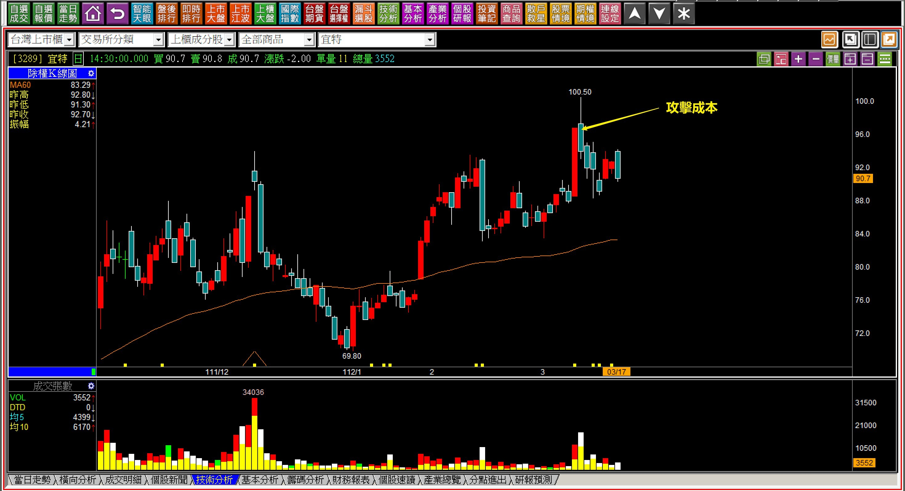
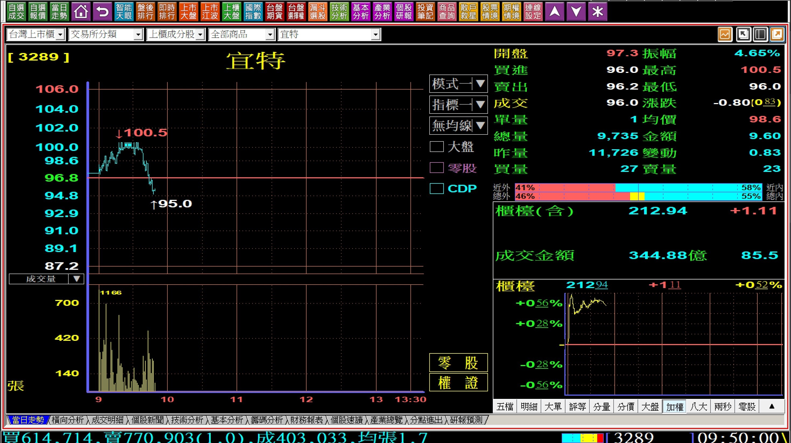
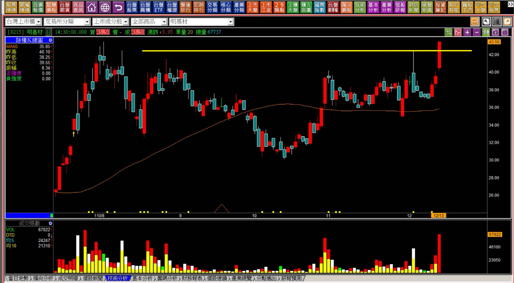
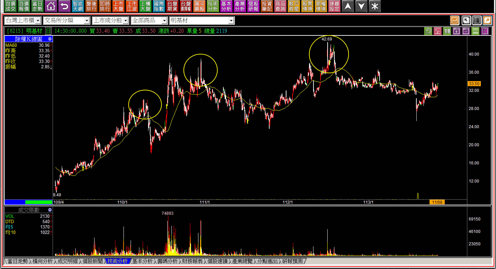
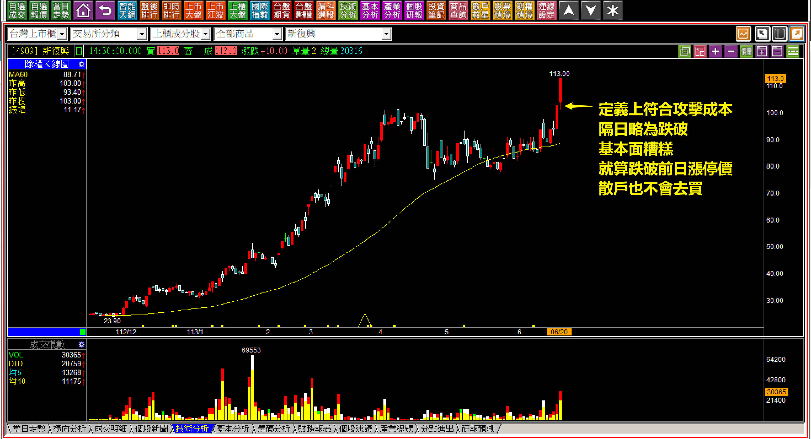
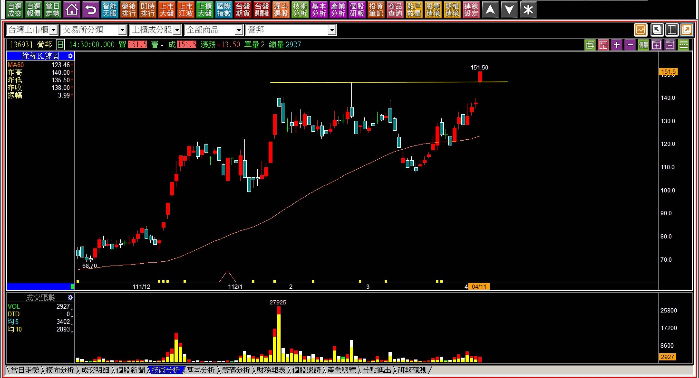
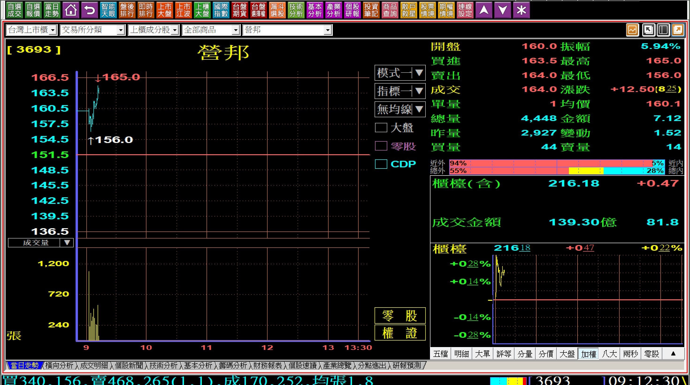
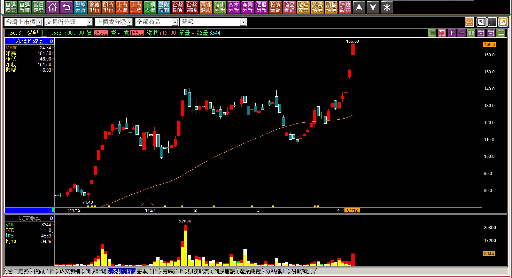

# 【明日K線】「攻擊成本顯現日」篇

「攻擊成本顯現日」篇，是基於攻擊K線本質之下的明日K線判斷，意思是先有「攻擊的意圖出現」之後，開始來判斷接下來的走勢，所以需要先複習對於「攻擊成本」的定義與使用時機，然後才有辦法確認明日的走勢，而且通常就真的是明日，不是明日以後的任何一天。

攻擊成本其實是不能顧名思義的，因為也不是主力的真正成本所在，而是「股價突破前高之後，最能判斷攻擊企圖的價位」，定義是「突破前高的當日，股價鎖住漲停板，且最大量就是在這個漲停板的價位，成交量越大、成本意義越高」，適合很短線的價差交易者使用。

所以假如隔天又回檔跌破，等於是讓還來不及買的短線客，又有一次機會先買低，股價才往上拉，先給他們賺一趟，就不符合攻擊原理，因為主力耗費了這個大的成本，完全是有能力隔天直接往上，為什麼要先掉下來，讓人有機會低接賺短線呢？然後才拉不就等於又讓散戶先賺點價差？

定義如此，細節要注意的很多。

例如突破前高漲停板的這一天，如果是個股有利多，那就更不能跌破，因為這樣會讓盤後才看到利多消息的人進去搶短，主力再拉高給散戶賺，是沒有這種攻擊意義存在的。但是如果是利空當日突破前高漲停鎖住，這就表示強烈的企圖了，也就不用再看攻擊成本。

如果這根突破前高定義已經符合攻擊成本判斷了，可是就算是股價跌破前一天漲停價，散戶還是「不會」去買的，那就不需要採用攻擊成本這個定義，實務就還是有這種狀況，只是比較少數，這種類型就依照攻擊假設即可。

某些狀態之下更不能違反攻擊成本，例如前一天漲停板可能有很多散戶賣出，但是隔天又跌出價差幅度，讓高賣的人之後又有低檔可以回接，也是不符合攻擊原理，這一點在股價第一次突破前高時，最為關鍵，漲太多已經不是第一次突破前高的，就不在此限。

簡單地說，打算用攻擊成本跌破來判斷出場，是很短線的交易者使用，一般價差交易還是要以攻擊假設作為停損標準。

**攻擊成本出現的隔天**

上述各種狀況都是攻擊成本出現了之後的注意細節，沒有辦法用個單一標準全部股票套用，需要花時間體會背景環境細節的不同，也就是需要更多的經驗判斷，輔以當下市場的氣氛。由於氣氛無法用文字塑造，所以只能提醒的是要與氣氛反過來看。

也就是利多不應該再下跌讓人有機會買、利空環境如果不再跌，那就要開始注意防守姿態，而非單純只看攻擊成本的那個點位。

**類型一：****112-03-08宜特(3289)有頸線意義的攻擊成本**

突破前高，有時候在多頭市場也會定義變得模糊，例如季線未曾明確下彎，但是整理期間超過三個月，自然突破前高也等於突破頸線。依照關鍵K線的定義，理論上是以頸線為停損點，不過有時頸線與攻擊成本之間距離頗遠。

這就要看交易者本身打算短線操作或者中期投資持有。

但是這個例子沒有什麼問題，因為隔天就兩者都跌破了。

**112-03-17宜特(3289)**

跌破攻擊成本代表的意義是：「這一次創新高股價並沒有要攻擊」，所以站在明日K線的角度，其實第二天就有答案，也會馬上知道要怎樣應對。

**攻擊成本顯現的隔天112-03-09宜特(3289)**

不能等到股價已經有幅度的回檔才知道，明日K線的意思就是攻擊成本出現了，隔天會怎樣、應該如何應變，都得事先就有答案才對。

**類型二：110-12-13明基材(8215)以往沒有拉抬的攻擊成本**

雖然這裡也是頸線的定義，但是突破之後漲停板，跌破攻擊成本就需要警惕，不攻擊很正常，尤其以前沒有過明顯用力的拉抬，加上是中低價股，散戶買進門檻很低，就更需要正視攻擊成本。

怎樣是用力拉抬的定義？必須要股價遠遠脫離基本面還繼續飆漲，才是有過用力拉抬。

明基材是過去三年以來，跌破攻擊成本次數最多的一檔股票，也就是每一次創新高突破前高，當天就紅K漲停，隔天就馬上跌破的次數最多，至少一共出現三次，對明日K線來說，累犯也是一種慣性。

三次攻擊成本跌破的歷史。

**類型三：股價已經漲到沒有散戶願意佔便宜的點，就不看攻擊成本**

這就是脫離基本面的例子，所以即使定義上突破前高，但是攻擊成本位置與前高很接近，加上這種漲勢，就算掉下來也不會有人接手，所以攻擊成本判斷的意義就很小。

交易判斷上可以用來確認股價到底回檔會不會被散戶賺到便宜？來作為判斷。

**回到「攻擊成本」判斷的明日K線**

當股價突破前高且當日鎖住漲停，漲停價還是當天最大量，那就是攻擊成本的顯現日。這一天出現之後，明天開始就必需得要攻擊，所以沒有跌破攻擊成本就是正常的，完全不需要再想任何細節，只要出現跳空攻擊、推升攻擊，都可以。

問題往往會出現在明天跌破平盤價，才需要檢視其他問題，例如利多利空事件、股價是不是第一次突破前高等等。

**112-04-11營邦(3693)**

對於攻擊成本出現的日子來說，最正常的就是明天開始繼續創新高攻擊，也就是只要符合這一點，那麼最重要的事情就是把股票抱穩，不要想東想西，往往人性是漲了焦躁不安，就想盡快獲利了結，這剛好是最錯誤的觀念。

人性也是跌了反而心態穩定，但是攻擊成本的隔日開始，跌了才是錯誤的走勢，需要細節判斷了，這就是明日K線最重要的事。

**112-04-12營邦(3693) 09:12**

跳空攻擊算得上是攻擊成本浮現之後，明日K線是「繼續攻擊」的最佳解答，交易就希望股價攻擊，這裡當然就是繼續的答案。

**112-04-12營邦(3693)**

至此已經不用再判斷會不會轉變，而是開始設定移動停利，進入了攻擊結束的判別，攻擊沒有結束，不用考慮出場。

**後記：112-12-15今國光(6209)攻擊成本被跌破**

雖然以攻擊假設看，突破日的紅K低點尚未跌破，但是攻擊成本已經跌破，主力拉抬的決心已然不足。明日起，股價應該盤整轉弱居多，跌破攻擊假設就更不用談了，這一次沒有打算要攻擊的意思。