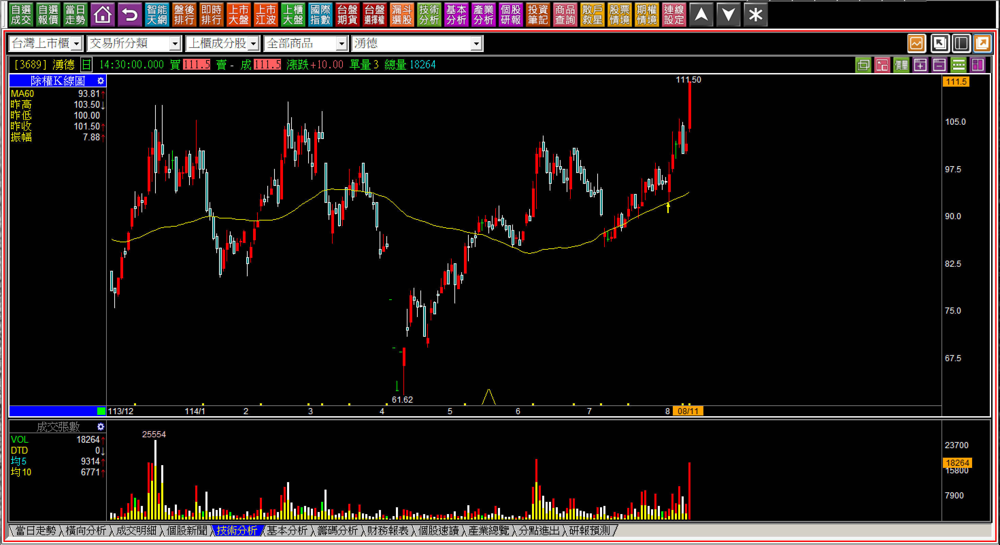
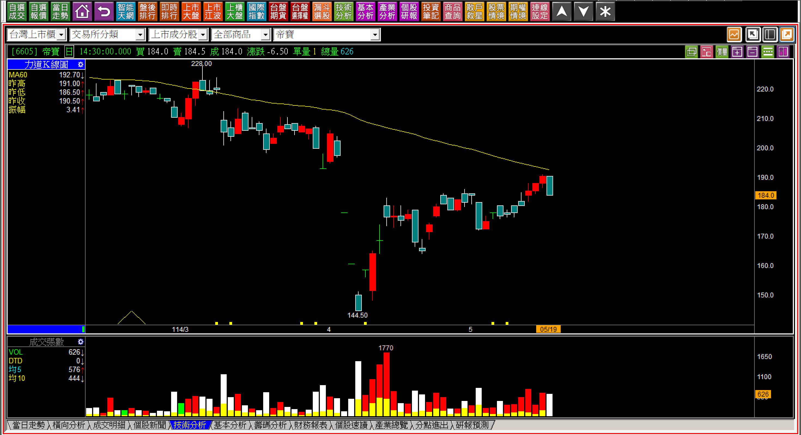
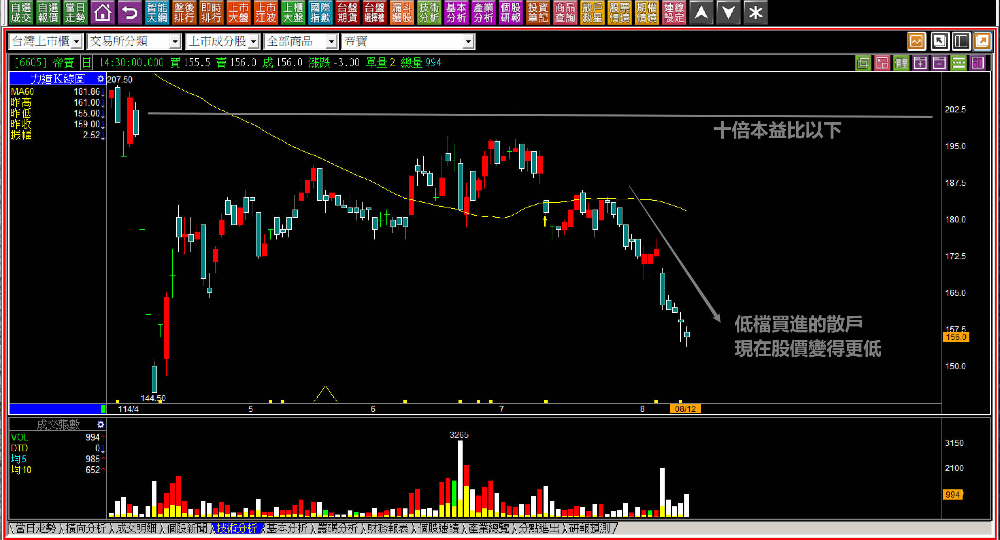
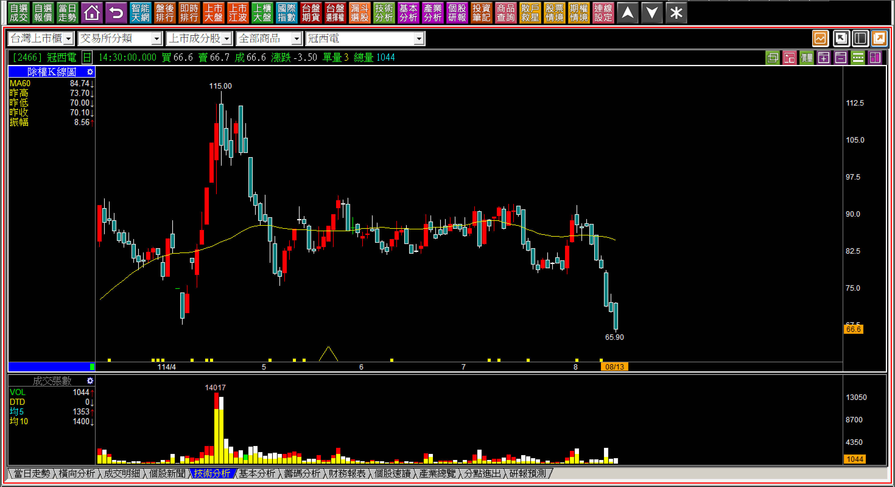

# 【明日K線】人性的弱點與K線判斷

關於明日K線，是一種保持練習的態度研判，透過今天的K線圖來推演未來股價應該會怎樣走。

這並不算是預測未來，預測採用的是歸納法，也就是用以前發生過的例子來推演以後的可能性，這樣問題會很多，明日K線則是使用技巧邏輯理論，理解排除掉眾多的可能性之後，即使看起來很不合理，但最後也會是答案。明日K線採用的是「演繹法」。

**114-08-11湧德(3689)**

這張圖是湧德(3689)在八月十一日的K線圖。這根紅K出現「之前」，股價並沒有創新高，等到賣壓化解過去之後，股價創下了新高的第一天，這些文字如果不說明，光看圖你會想什麼？

多數人想的是如果四月有買就好了，如果上週有買也可以，完全都不會再去思考到底是誰？到底資金願意賣壓化解的力量有多大？因為人性就是想買低。大多數人都是買低心態，那大多數人買股票遇到什麼問題？

判斷明日K線，重點在於接下來股價會怎樣走？也就是攻擊出現股價就會繼續上攻，如果「沒有」攻擊企圖，那還是會重演之前的反轉跡象，回到攻擊意圖區，也就是明天開始就是關鍵走勢，既然主力都買了，很快就可以看出「有沒有」攻擊的態度。

**來到我們本文的主角：帝寶(6605)。**

帝寶在今年第一季每股盈餘公告5.04元後，投資人的解讀就會是一年可能有20元，因為直接乘以四，但是股價僅有180元，表示本益比嚴重偏低連十倍都不到。尤其去年2024已經是連續第三年的成長狀態，表示帝寶只不過是沒有題材、話題而已，只要有耐心，願意等待，這是安全的標的。

真的是如此嗎？

**114-05-19帝寶(6605)**

其實投資人就是幫自己的買低找理由，覺得本益比偏低，可以中長期投資。

為什麼投資人不想學技術分析，基本分析又總覺得自己不擅長呢？因為在投資上選擇了每個人都能輕易接受的理論，買低。所以面對這種本益比不到十倍的績優股，又不敢追高買進AI題材，就轉向認定這樣是「安全」，其實只是買低而已，這個低的感覺是由過去股價的高價對比過來的。

結果是什麼？

**114-08-12帝寶(6605)**

在這個大盤已經接近歷史新高的時期，當初買本益比偏低當作是中期投資的標準，現在就變成了嚴重套牢的一族。這也是很多人搞到這個地步，就覺得基本面沒有用的原因，其實不是基本面不行，而是大家都買低買好等人拉上去，那誰要去拉股價？

明日K線的角度就得判斷這件事。

**籌碼混亂的低檔誰要拉？**

就算基本面好，沒人要拉的股價沒有用。

網路上自然有很多幫投資人整理的「低基期」個股，因為股價回檔所以人們的關注度就會更高，卻沒有想過的是，如果股價有這麼好的機會，為什麼市場上的資金都看不懂？

不是看不懂，是因為散戶都看懂了，所以越低散戶越買，主力如果去拉股價，不用多，單拉一成就好，那麼散戶就會開始獲利了結，等於是主力送錢給散戶賺，試問有哪一個主力會那麼佛心？

這就是明日K線的環節，你知道某檔股票缺乏了攻擊拉抬的力量，自然就會理解接下來股價會怎樣走。

本文沒有太複雜的K線判斷，而是對比財報、市場感受會有的演繹推論，這也是我們在做投資或者交易時需要有的理解，並不是績優股買了股價就會漲，也不會是有足夠的耐心就會有好的結果。

沒有人要拉的股價，除了基本面好的以外，主力在其中的尷尬股：不想再拉抬卻又出不掉，也是明日K線的判斷方式，知道了接下來就是「無力」，例如我們已經多次講解過的冠西電(2466)，以下是結果。

**當時的低檔區間，現在是更低。**

不過冠西電屬於主力出不掉的尷尬，與本文的帝寶是投資人買低看基本面優本益比低，不太相同的類型。

**事後走勢參考114-10-23冠西電(2466)**

