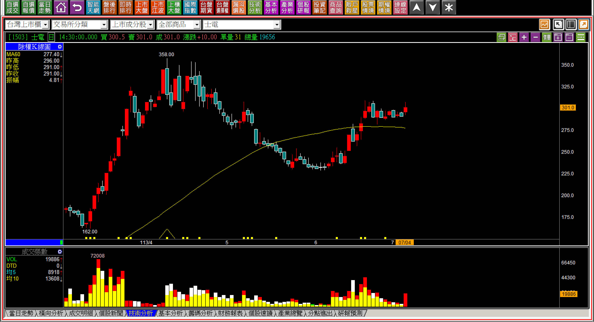
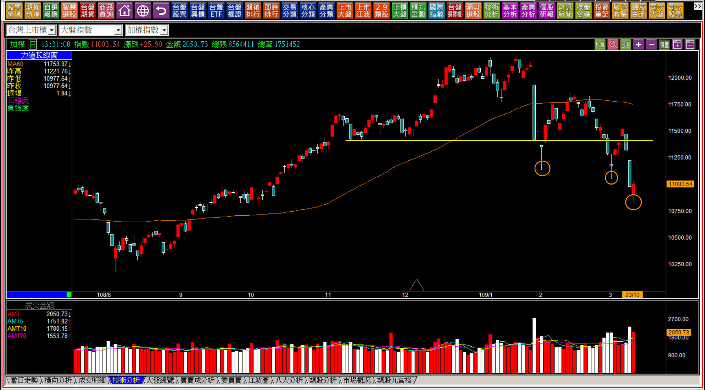
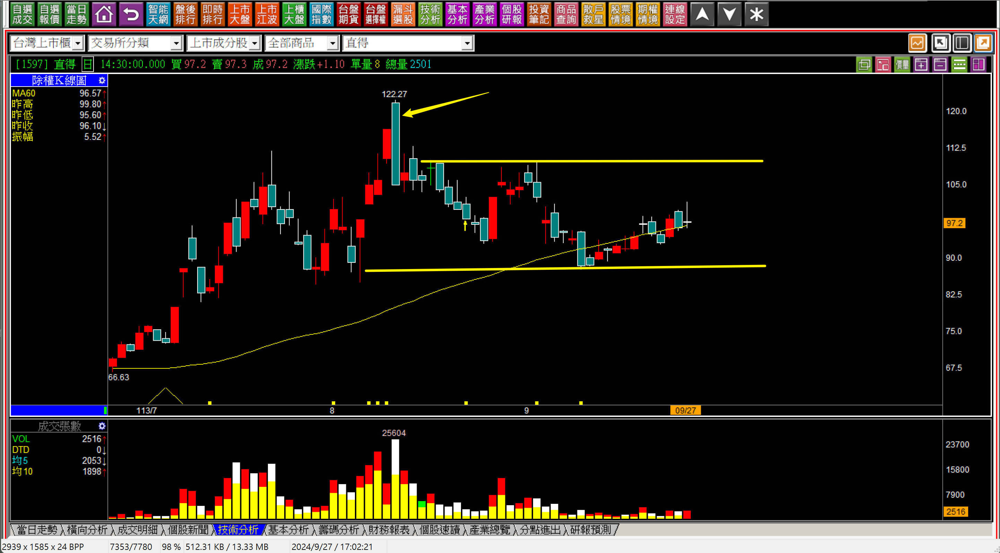
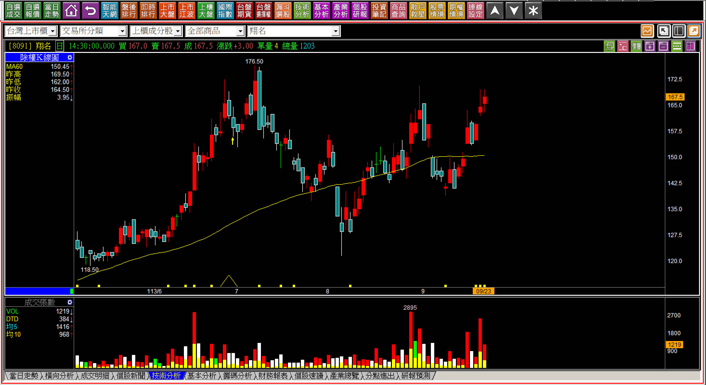
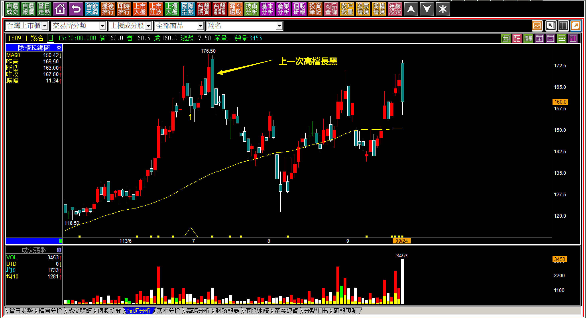
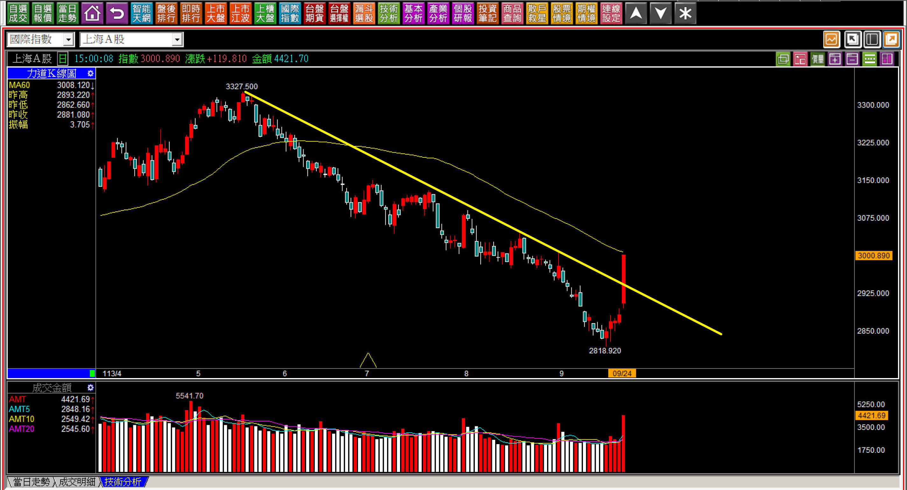

# 【明日K線】「壓力的分類」篇

最基礎的技術分析判斷，除了趨勢方向之外，很重要的就是壓力位置，當股價上漲到以往的壓力位置時，會有怎樣的反應？名稱上我們直覺地稱之為「遇壓反應」，並不是直接稱為遇壓下跌，遇壓下跌是等跌了才這樣說的，但是在股價剛剛上漲碰到壓力時，還不知道資金打算怎樣處理這個問題。

所以，壓力的「類型」就變得重要，是明日K線判斷的重點要素之一。

**壓力的類別**

所謂的壓力，用最淺的方式理解，就是辨別出某一個位置會有賣壓，你可以理解為在某個價位就會有人把股票賣出來的地方，這也是「K線上只有壓力沒有支撐」的原因，只不過這句話大多數人很難接受。因為在K線圖上你無法辨識哪一個位置會有誰、會不會有人會去買進，所以說是支撐，就是一種虛幻的想像，可是壓力卻是真實的存在。

**一、套牢賣壓**

這是最大的賣壓來源，因為套牢帶給投資者的就是損失的感受，一旦有機會解套，想賣出的人就會很多，也因為當初的成交量越大，壓力也就越大，判斷點將會是碰到了賣壓之後，接下來股價會怎樣走呢？明日K線的意義，就是隔日會怎樣變化，心裡已經有答案，往往資金不會去幫別人解套，也就是不想買進大量套牢者的解套籌碼，形成「遇壓下跌」。

**113-07-04士電(1503)**

以重電三雄的產業地位來看，加上美國基建需求，的確話題熱門、前景看好。但是在K線圖上，四月份高檔出現過空頭吞噬，也有過將近一個月的高檔整理之後下跌，雖然這一天來了一根小紅K，但是只要具備了套牢賣壓的明日判斷，就不會輕易的進場買進。

**二、波動賣壓**

通常波動狀態的壓力使用在大盤上，這是因為結構上呈現出市場資金的心態，假如市場整體偏向保守，行為上會有反彈賣一賣，頂多有低檔再買一點，慢慢就形成波動狀態下高點越來越低的走勢，前高越不過，也就稱之為波動賣壓。至於個股，則採用下降壓力線來判斷比較貼切。

**109-03-10大盤K線圖**

對於跌勢，明日K線的判斷點有兩個，一個就是「波動狀態前高」的賣壓，另外一個就是「有沒有再出現低點」。如果這兩者都有，就確認市場正在往空方波動前進。

接下來呢？

當然就得要等這樣的狀態改變，才會有資金力量的變化。

**三、獲利了結賣壓**

發生的當下比較難以當下就辨識的，是獲利了結賣壓，因為主力要賣當然不會事先預告，會盡可能採用不讓人發現的方式出脫股票，相信任何人都會這樣做，所以在K線上就有兩種面向來判斷：一、轉折組合、二、高檔區間。

**113-09-27直得(1597)**

這是一個剛好兩種都有的例子，除了箭頭所指的高檔長黑，還有接下來將近兩個月的高檔區間整理。

因為主力如果在盤勢不佳、話題熱度消退的環境下要倒貨，當然有難度，所以透過比較長時間的整理，有一個區間就會讓人以為可以「箱底買進、箱頂賣出」，等到投資人低接，當然就會更有出貨的機會。

不過獲利了結賣壓依然沒有明確的點位，因為高檔長黑是壓力，不過股價已經上不去，只不過是遇壓下跌，到了區間這一段的時候，箱頂是壓力，可是箱底不能當作是支撐。

所以判斷時，只要是明確的看到箱底跌破，且「季線下彎」，就等於箱底就是頸線，頸線跌破當然就是股價進入空頭。

**「明日K線」測試題：113-09-23翔名(8091)**

這是七月高檔長黑出現之後，股價第二次又來到170元附近，倘若對於壓力有正確的體認，應該就可以推演出來，隔天要確認是攻擊，必須就是一開盤開在176.5元以上的跳空攻擊，或者是股價推升到176.5元之後，繼續走出推升攻擊，才能確認是拉抬。

原因就是當初高檔長黑，是獲利了結賣壓。

**113-09-24翔名(8091)**

讀者可以從這裡理解明日K線對於交易判斷的意義，因為隔天股價根本都沒有越過，就再次走出高檔長黑，這是K線可以為交易者帶來的力量判斷，同時，明日K線的角度可以讓我們理解本來就應該要事先對走勢有準備，不是等發生了才又感嘆沒想到。

**補充說明：沒有支撐這回事**

技術分析的判斷，支撐是一種自我安慰，時至今日不管錯誤發生幾次，人們還是會以為有支撐意義，甚至總愛找低檔黃金交叉這種理論，實務上，空頭趨勢改變就已經足以讓大家找到低檔的機會了，不需要到處找支撐，因為如果總想著這些虛無飄渺，就會錯過真正的關鍵K線。

**113-09-24上海A股**

指數的部分當然也可以採用下降壓力線判斷。

下降壓力線突破，就是「關鍵K線」，就是趨勢改變的那根K線，在還沒有這一根突破之前，任何低檔都是用猜的，KD、RSI也都沒有任何意義，因為根本就沒有支撐這種東西，只有壓力才是最確實存在的。這一根一旦出現，表示原本的趨勢出現了改變，明天起不再使用「今天以前」對於市場方向的觀點。