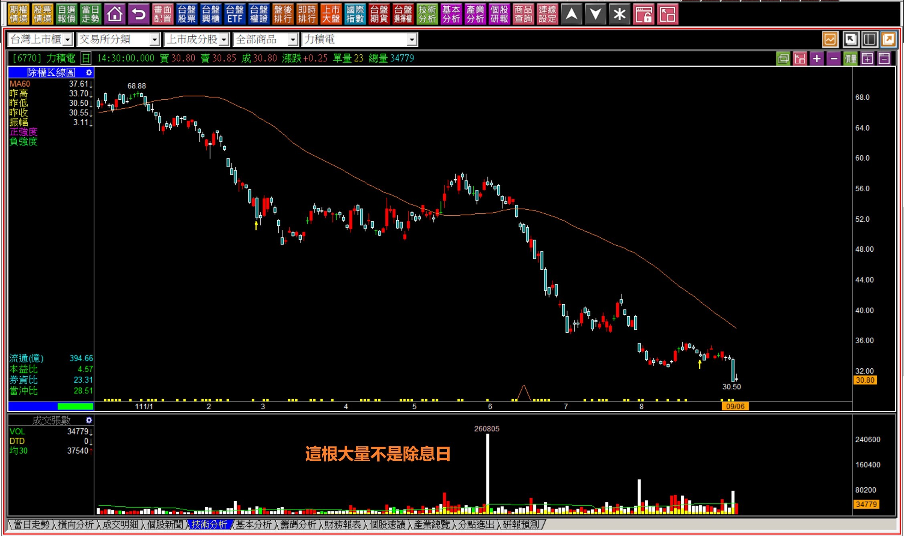
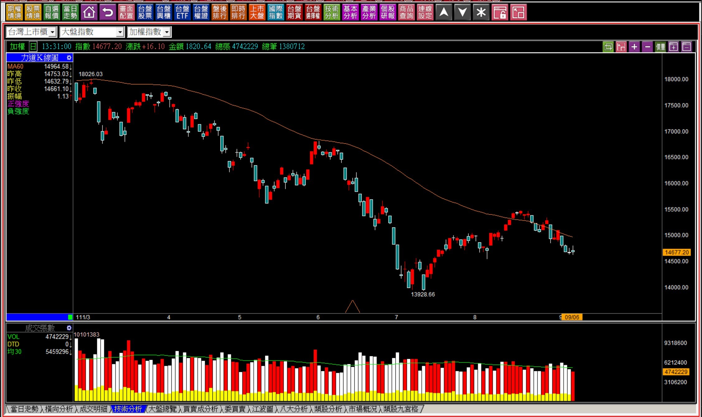
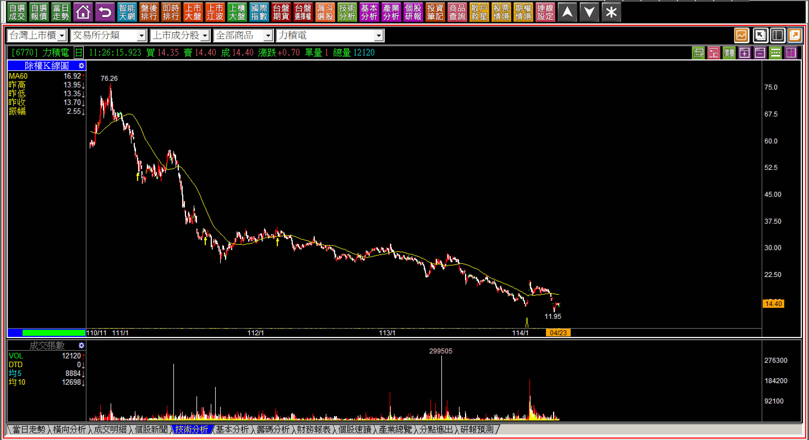
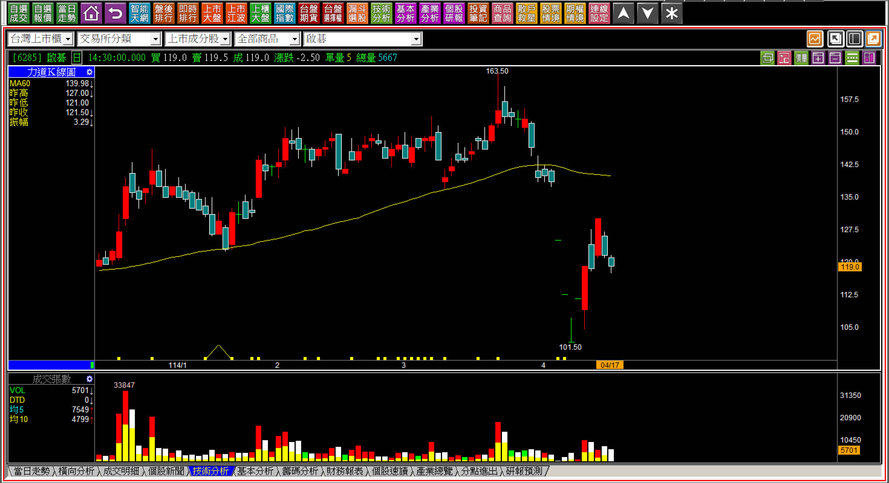
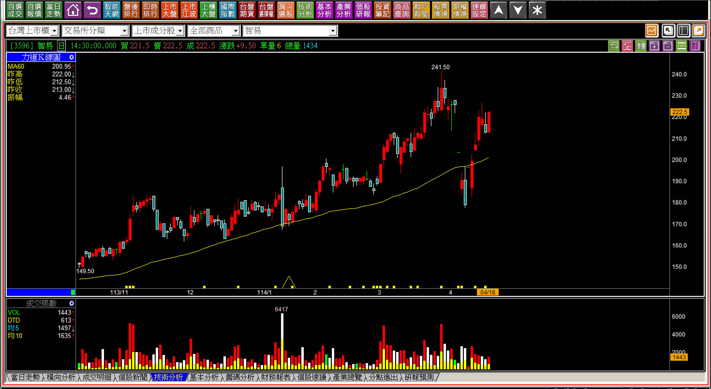
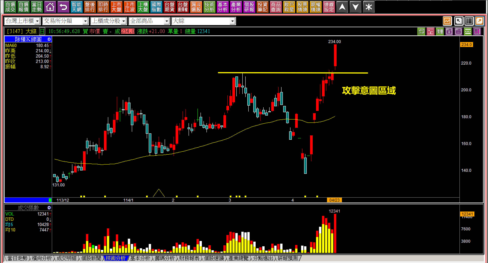
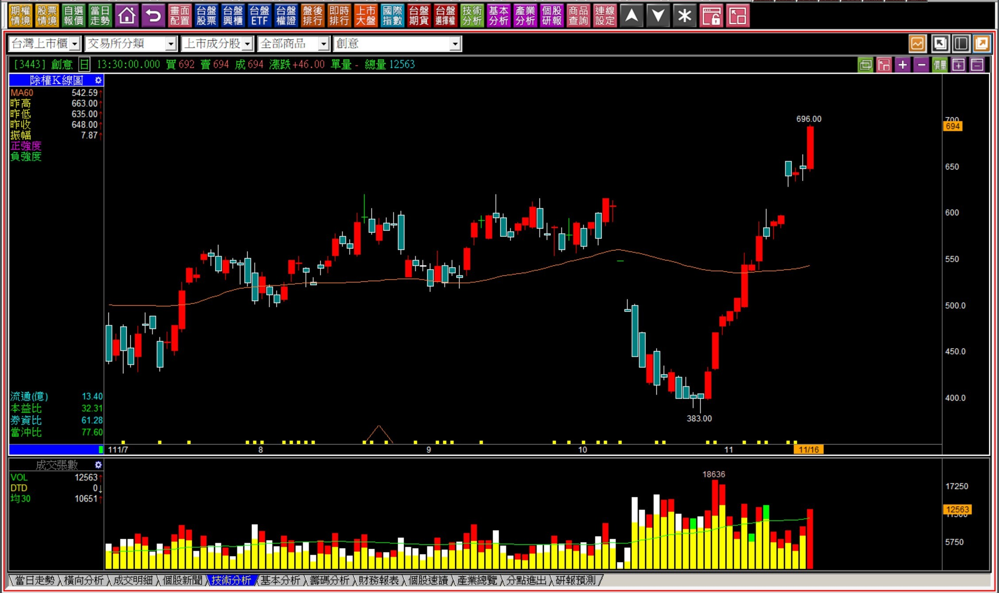
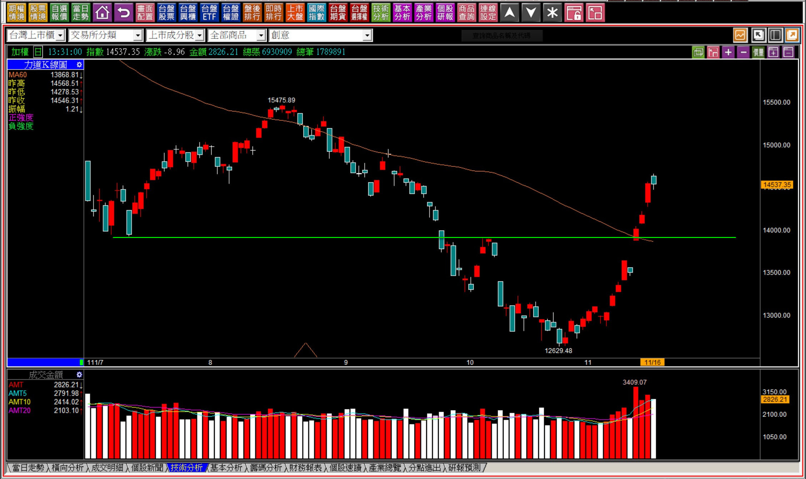
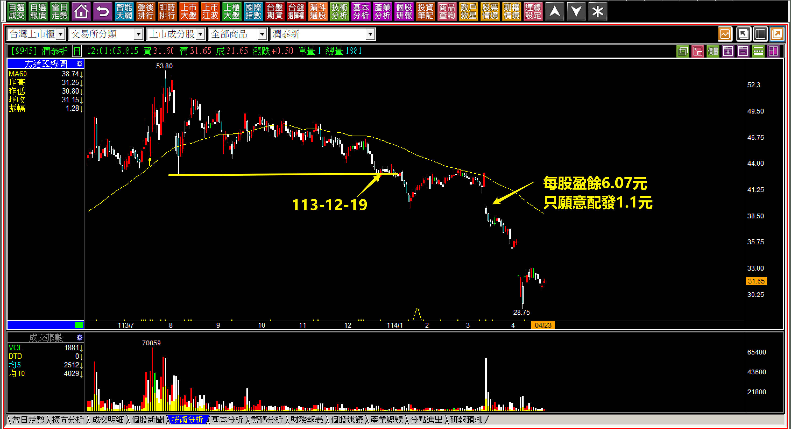
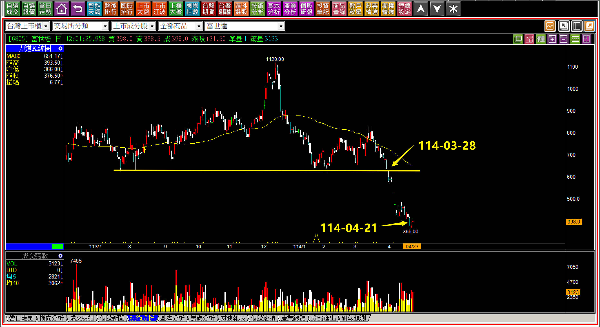

# 【明日K線】領先環境出現趨勢反向的意義

所謂的「領先」對照的標的是環境，也就是大盤。

意思是當大盤還在多方趨勢或者整理趨勢，尚未轉變為空方趨勢時，某檔個股股價已經轉入空方(跌破頸線)，或者股價已經領先環境，再創新低。

這是技術分析的節奏要點。

**111-09-06力積電(6770)**

在2022年「庫存疑慮」的時期，七月份大盤一度反彈到八月，但是領先破底的就像是力積電，顯示營運狀況出現了很大的問題，請留意當時的股價已經崩跌，再創新低，可是股價還有30元。

**114-04-23力積電(6770)**

這中間還出現過力積電跨入先進製程的笑話，結果公告第一季每股盈餘又是負的0.26元，且資本支出僅有7.39億美元，這是光用在設備維護的支出，並沒有任何擴廠或產線的規劃。領跌，就是一定要避開的風險。

**領漲表示股價有人在乎**

當然，如果大盤依然處在空方趨勢，個股卻領先結束空頭，甚至突破頸線轉為多頭趨勢，這樣也都算是領先，只不過要注意的是「轉變」，假如沒有轉變，就不是領先。

舉例來說，因為關稅戰整個股市中的多數個股都已經翻空了，少數還沒翻空的個股硬撐著趨勢沒有轉空，這樣的狀態就算股價創新高，也不是領先的意思，只不過是逆勢而已。

**114-04-17啓碁(6285)vs智易(3596)**

同屬於網通股的智易與啟碁，在對等關稅利空出現的時候，一檔是幾乎再跌一根就轉入空頭，另一檔是在高檔還正準備要再創新高的狀態之下。

這個對比可以先讓大家理解股價由市場的資金決定這件事，創新高表示股價沒有套牢，而有頭部現象的個股，往往就會受限於頭部套牢壓力天花板的限制。

相對的，假如在風雨飄搖的時代，股價卻突破前高出現攻擊意圖，然後又緊接著攻擊企圖，就是「領先股」。價差交易選擇領先股，投資不能選擇領跌股，這是進入金融市場的基本原則。

**114-04-23大綜(3147)**

領先大盤上漲的這件事，必須要有題材搭配才有機會變成下一檔飆股。以大綜來說，籌碼穩定且有資金在拉抬，雖然還無法判斷會不會變成飆股，但股價已經沒有套牢存在，是一眼可以看出的事實。

**111-11-16創意(3443)**

**111-11-16大盤**

庫存問題的那一年2022年，指數跌到十月底的12629點，然後開始反彈，結果在11月16日，創意(3443)已經領先創下新高，賣壓化解之後的股價對比最低點已經漲了一倍，來到696元。

股價漲了一倍在空方時期，投資人會去買嗎？

現在當然說會，那是因為後來股價飆漲到2015元，有印象的人就會說會，實際上不會，在那個市場空頭持續超過半年以上的環境中，投資人照樣擔憂害怕，怎麼可能去買已經漲了一倍的股票？

這就是本文的重點所在，要對領先股保持隨時觀察，不論是轉弱的領先，或者是轉強的領先。

**領先大盤跌破趨勢的個股有一定的問題存在**

上市櫃公司的選擇，必須要留意的層面還有很多，都可以透過領先破底或者領先突圍來檢視。

當然真正的風險還要進一步理解，每家公司都不太一樣，只要花時間不斷地觀察，就可以累積越來越多經驗，對於公司會有的鬼故事知道應該避開，不應該過度美化或者期待。

**潤泰新(9945)**

尹衍樑被外界號稱紅頂商人，但其實這是一個滿眼中國的人。

他有錢的時候寧可去中國幫忙蓋學校，卻對投資他公司的股東非常小氣，我的觀點這不是一個值得投資的老闆，連轉投資的日友都沒有做得很好，光是想用南山人壽來撈更多的錢罷了。

股價在113年就已經領先破底，直到今年的三月份才又再度出現每股盈餘6元卻只小氣的給1.1元，也就是發錢的決定在他手上，要不要給股東？他說了算，避開這種股價領先下跌，就等於避開了後來的利空。

**富世達(6805)**

富世達在三月份跌破頸線，大盤是在三月十一日跌破頸線，所以表面上看並沒有領先跌破，但是四月二十一日領先創下新低。軸承四雄是過去兩年內出現的熱門話題，富世達也是很多台灣的貴婦圈最喜歡擁有的投資標的，我想我這樣說只要對富人圈比較熟悉的人都知道這些事。

如果股價要再創新高，就得要賣壓化解，突破新高才能確認。