# 【明日K線】「剛創新高上影線的高點」篇

剛創新高的上影線，並不代表壓力意義。

這一篇雖然是明日K線的篇章，不過用途偏重於當沖、隔日沖、繼續持有與否的判斷使用。作為交易層面的經驗之談，只要解說的過程中用到「通常」二字，往往是經驗使然，理論有，實務變化也還是存在，但是作為「明日K線」的判斷，在短線交易中很常用到，於是本篇列為主題內容之一。

以過往的教學不同，這裡我先提供答案：**「剛創新高上影線的高點，通常還是會越過。」**這一點只對於短線交易、當沖者較為有效。

這是對「剛」創新高的上影線出現之後，於明日K線的立場來判斷。但是越過上影線的高點之後，股價還會不會繼續上漲？這就要回到攻擊K線的角度行進判斷，並沒有那種只要怎樣就一定會怎樣的答案。但對於「不是」剛創新高的上影線，例如已經創新高很久了才出現的上影線、前面還有套牢壓力的上影線，就沒有這方面的判斷。

有沒有可能上影線的高點還是不過？當然有可能，這就是「攻擊假設」的用處了，先設定好停損點避免擴大損失。那怎樣的狀況不越過的機率會下降呢？離突破點越遠的上影線，高點要再越過的機率就越低，因為拉抬力量的發揮，是股價越漲，力竭的可能越大。

就跟醜陋的日出攻擊代表攻擊力量沒企圖心，是一樣的道理。知道這個道理，可是判斷點依然單純，突破前高的上影線，就是採用攻擊假設來作為停損點。相信說到這，大家會明白這是短線交易使用的判斷，如果以經驗之談，那就是當沖隔日沖常常會用到的判斷技巧：**上影線的高點通常會越過。**

**直接以範例來說明細節**

我們沒有辦法採用理論SOP解說，因為主力要拉還是不拉的心思，我們不可能事先確認，只能推測。網路上、傳統錯誤的教學中，對上影線有一種避雷針的說法，以為這樣就是代表賣壓很重，其實，假如這根上影線是創新高的第一天，且上影線越長，代表的攻擊意義就越大，因為最高點時不是由散戶共同買進拉上去的。

當然，股價接下來還要不要攻擊由市場的主力資金決定，可是我們可以進一步的推想，這根上影線當天的高價位置是誰買進股票的？會是散戶嗎？如果不是散戶，那當日股價呈現上影線，是套牢狀態，那麼新高價被套牢的又是誰？股價會自此就往下掉嗎？

**113-06-11堤維西(1522)**

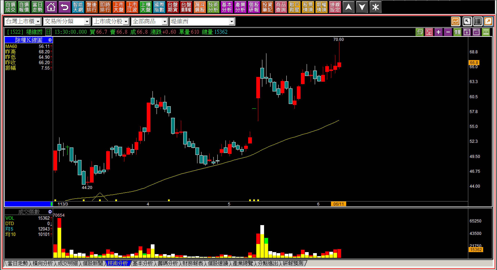

這是一根突破前高的上影線，我們站在空手者的立場來推估明日K線，就會有答案：**這一天價量背離，表示前高的套牢者，有很大程度與這一天的拉抬者是同樣的人，才會使得這一天的走勢不需要那麼大量**，換言之，主力自己在這一段區間之內，搞了很久，到今天才又創新高價。

既然主力持有這麼多，接下來就算了嗎？應該不會，但是主力的性格沒有改變。因此解答就會是突破前高的上影線，股價應該還是會越過上影線高點，使得外觀看起來股價有攻擊的跡象，散戶持有者這時就會再多耐心等一天。但是股性通常還是沒變的，要看到日出攻擊太難了。

不過我們要的答案還是有，就是：**剛創新高上影線的「高點」通常還是會越過**。

**113-06-11堤維西(1522)攻擊假設停損點**

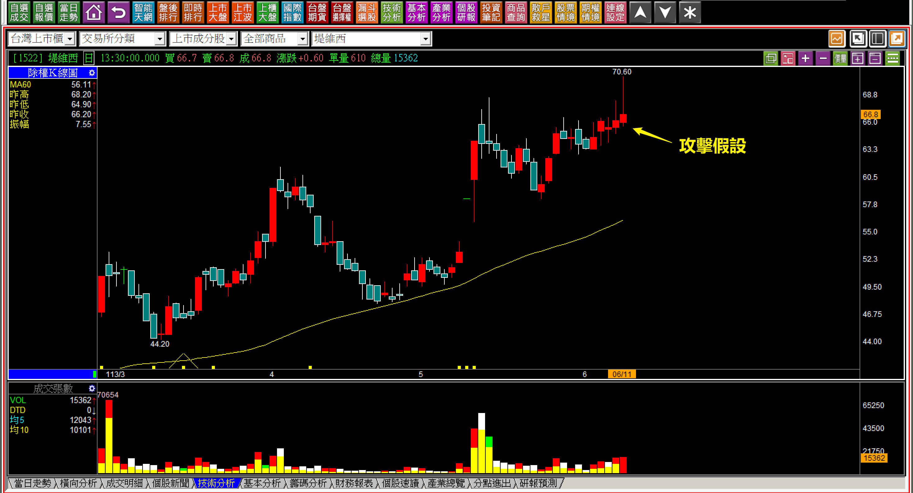

有限的損失，隔日股價越過高點的推估，對於短線交易來說還是划算的。

**113-06-12堤維西(1522)
**

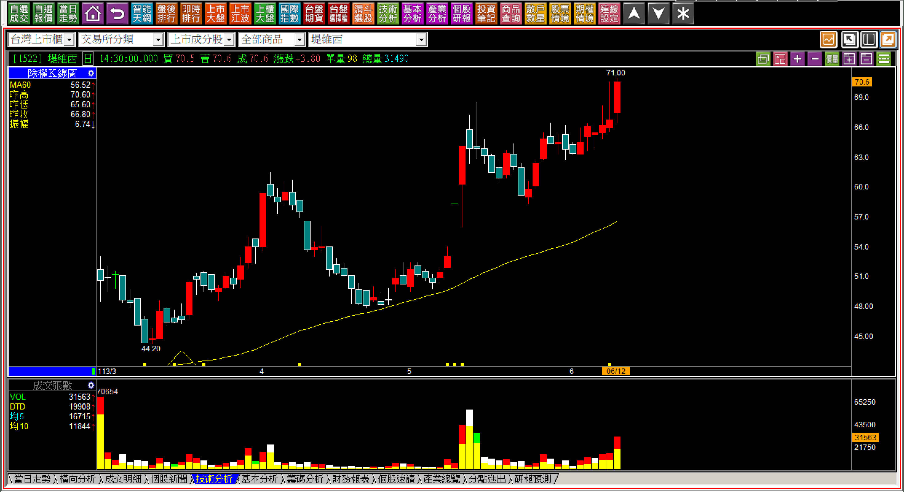

這裡不做交易的細部分解解說，單純就做為講解的範例讓大家思考。遇到了上影線往往人們會有誤解，以為這是賣壓重，還抱著的人就盡快賣一賣，隔天竟然創新高，原本的投資持有者，就會懊悔不已，以後有低檔還要買回來。

進階一點的短線交易需要知道，往往這根上影線之後還會不會拉抬不知道，但是高點通常還是會越過，因為主力不太可能放任自己虧損很大一段。這一點就需要對比當時的大盤環境，假如環境是跌勢，或者大盤偏弱，那就更可能短期進入高檔整理，等到機會來臨時，又往上拉抬。

**環境背景的重要性**

**113-04-01臻鼎(4958)**

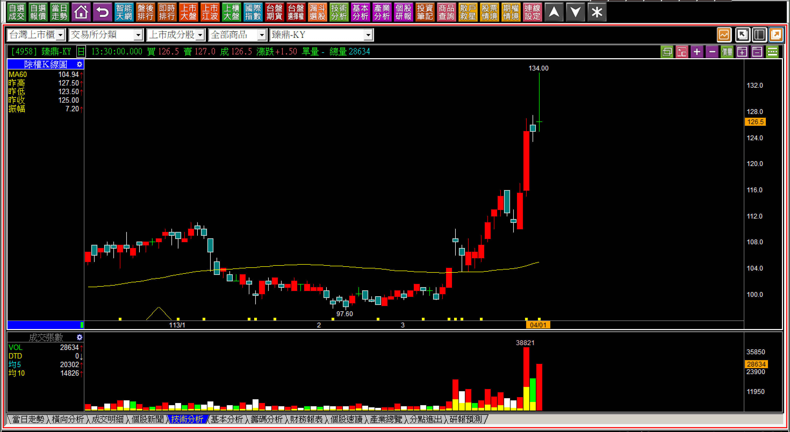

假如是突破新高第一天，但是是靠著拉抬一大段「之後」才突破很久以前的新高，這樣的上影線高點還要越過，就比較吃力，還好還是可以用這一根來作為攻擊假設。必須要把K線圖縮到很小(日期範圍大)，才能看得出來這一根是還原權值創下歷史新高的第一天，假如只是看近期，就會是拉抬一大段的狀況。

**113-04-02臻鼎(4958)**

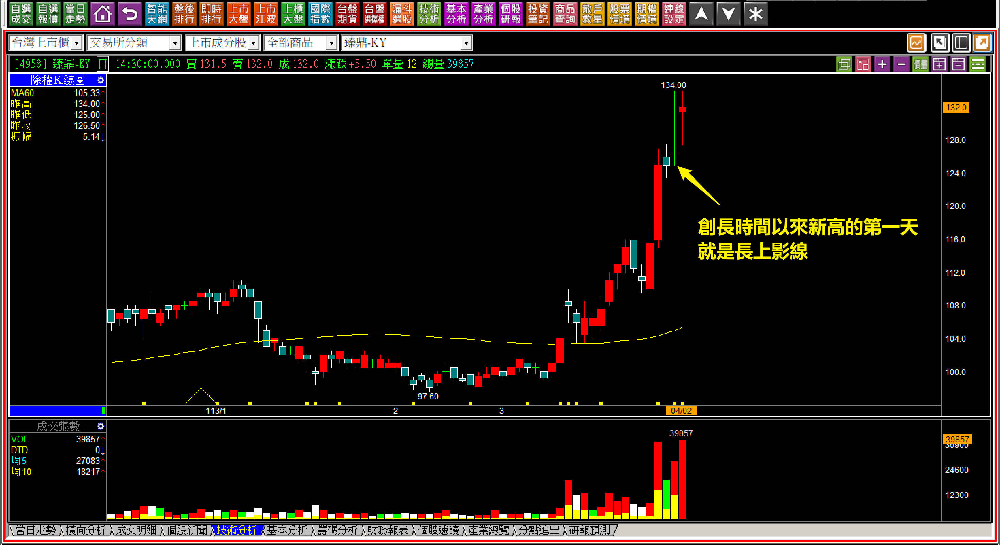

結果股價只有平新高，意思已經到了。

這一個範例可以作為未來交易判斷的參考，輔以當日大盤的氣氛反向看待，也就是氣氛越悲觀，股價再往上越過的機率高，氣氛樂觀，主力並沒有一定要在一檔的價位中堅持要越過，做出還要拉的樣子，目的就已達到。

**對於高點越過的補充範例**

以下是過去我在實體課程教學中，遇到上影線的解說。

當然股價自此展開日出攻擊、一大段拉抬的，上影線的高點當然越過了，不需要放在我們今天教學的範圍中，這些例子是沒有馬上接續強勢攻擊的，但是答案相同，創新高的上影線高點，會不會越過？這是值得在短線價差交易者累積的經驗判斷。

**108-02-19新日興(3376)**

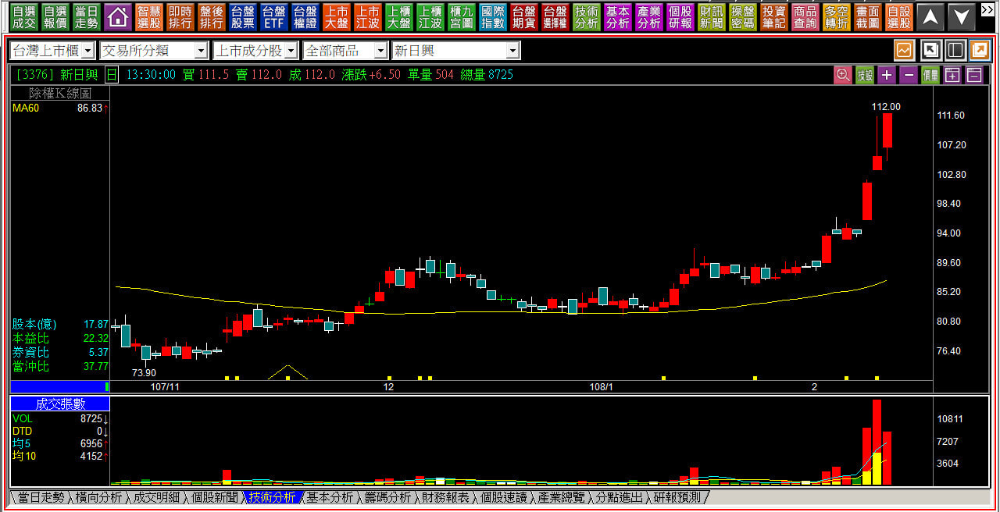

帶著大量的上影線，代表著當天主力耗費的力氣也大，那麼上影線的高點越過的機率也就越高。

**112-07-05啟碁(6285)**

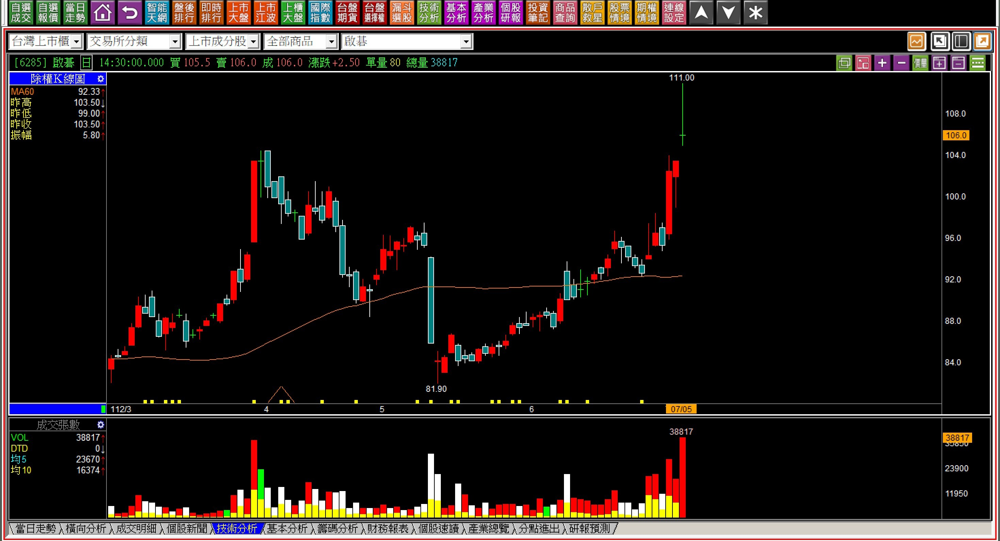

創新高的上影線，通常也代表攻擊意義，尤其是突破頸線，會有更好的停損標準可以運用，但是在明日K線用於短線交易的範圍，高點往往還有更高，當然就是高點還會越過的意義。

**109-04-15凡甲(3526)**

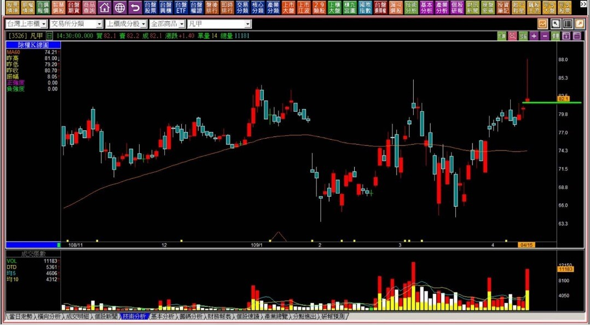

越過前高的創新高上影線，在攻擊假設中可以以此低點作為停損，但是作為短線交易在「明日K線」的範圍判斷，可以推估接下來這個高點越過的機率非常大，就算沒有越過，停損點往往明確就代表是划算的交易判斷。

**109-05-07凡甲(3526)**

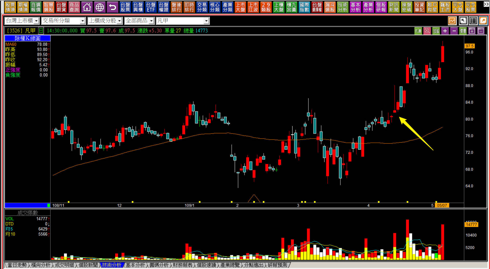

箭頭所指位置，就是創新高第一天的上影線，在股價沒有跌破攻擊假設的前提之下，上影線的高點依然越過，所以根本就不需要害怕遇到上影線，相反的，要對剛創新高的上影線有正確的判斷。

**創新高的上影線高點越過不代表結束或繼續**

就目前的解說，剛創新高的上影線「高點」通常會越過，這就代表股價就漲到這而已嗎？當然不是；代表股價就會繼續往上攻擊嗎？當然也不是。

人性的問題就是想要一個單一解答然後套用到全部狀況，實務上不會有這種東西，股價的高點往往由資金來決定，這就像是我們每個人對投資的觀點看法也隨時會變，何況是主力，只不過這是一個明日K線的小細節，既然股價創了新高，就這樣算了放棄的主力很少，所以當沖或者短線隔日價差，可以利用這個判斷。

當然也會有股性很差、主力不甘不脆、遇到利多反而放棄的狀況出現，這就是依然需要設定停損的原因，但假如這是一個大盤多頭趨勢的剛開始，那就不應該只用於當沖隔日沖。

令人害怕的環境，人們總是賺錢越做越短、賠錢越做越長。

**113-06-06瀚荃(8103)**

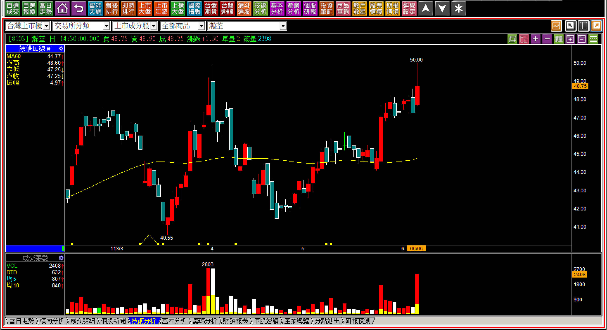

有時候交易我們難免會遇到一些尷尬的狀況，例如上圖，股價越過前高有著上影線，本來有著高點會越過的推論，不過等到更仔細看才發現，原來上方在111年還有過還權的高點，但是這類型依然可以作為我們平常研判力量的環節，也就是賣壓化解的過程，力量判斷。

**113-06-11瀚荃(8103)**

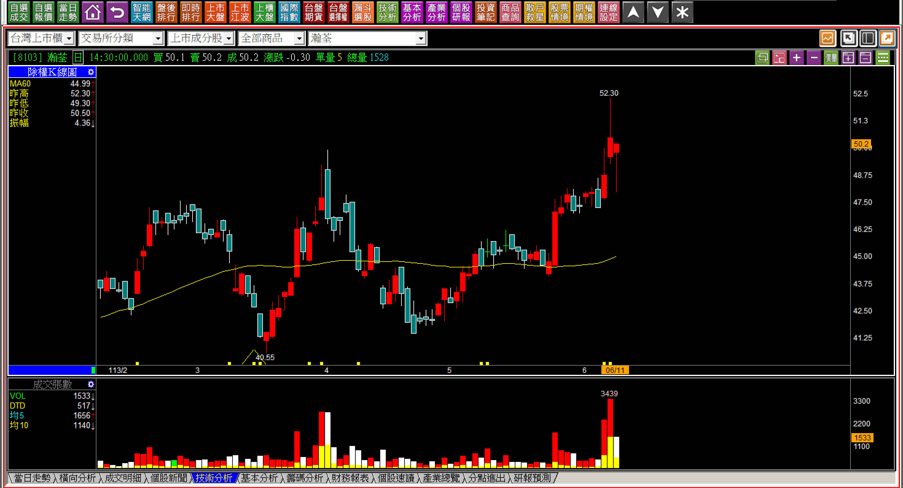

隔天才真正創新高，再隔一天出現下影線。

這是過往我們教學過的「合併十字線」，時機在創新高與隔天，才有合併看待的背景條件。這裡我們不討論，而是即使如此，高點依然越過的機率很高，不為什麼，只因為散戶不會在區間整理過後，馬上去追高價，因為他們還在「箱底買進、箱頂賣出」的慣性之中。

**113-06-17瀚荃(8103)**

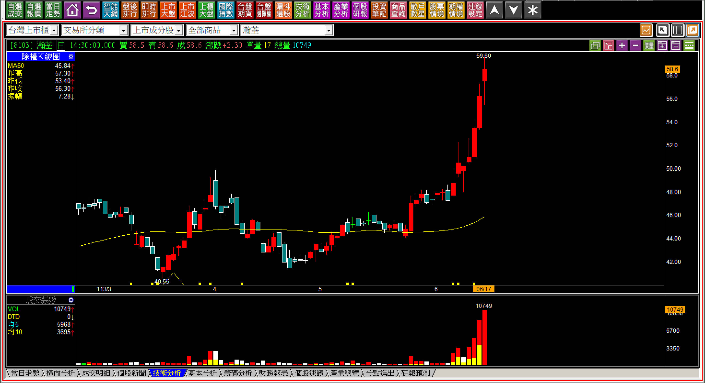

明日K線聽起來要學很多技巧，實則是對資金力量出現之後的判斷，或者力量消失之後的辨別而已，以過往的各種範例來學習，是唯一的方法，不只要學攻擊、也得要學轉折，還有各種K線理論與技巧。

對於短線交易者來說，可能會在盤後才發現原來某一檔股票是突破前高，創新高的第一天，且還是上影線，往往這個高點還是會越過，作為明日K線的判斷，對比停損點來說，機會相比風險來得大一些，就是本篇的功能，短線交易者需要這類型的經驗判斷，因為光是把「對於追高的恐懼」拿出來說，沒用，因為散戶都是這樣的觀念。