# 【明日K線】「多方轉折出現」的下一步

明日K線單元的教學接近尾聲。

很多人在學「轉折組合」之前，往往有一個錯誤的觀念，以為轉折是用來判斷股價的反轉點，這馬上就想到了「高檔放空、低檔做多」的交易動作，看到多方轉折就以為是多方買進點。

轉折判斷採用的是「力竭」原理，是原本走勢的「結束」，並不代表另一個方向會馬上開始，或者也可以說，看待股價的走勢，不宜再用之前的趨勢態度來面對，同時也有可能中期下跌到多方轉折出現，股價還是比應有的價值高很多(或者營運狀況變更糟糕了)，所以還是可能會再破底一次，就像是空方轉折出現後，有時股價還是會創新高一兩次相同。

所以在明日K線的角度，對於轉折的出現之後，「下一步」應該怎樣看待？其實在空方與多方是不一樣的。

空方轉折出現之後，即便股價很快又再創新高，力竭的意義始終存在著，除非基本面有著成長股的特徵存在，沒有的話，通常空方轉折就是結束多方了。

這一點在空方轉折的篇章中我們經常談到。

**北極星藥業(6550)的黑K吞噬**

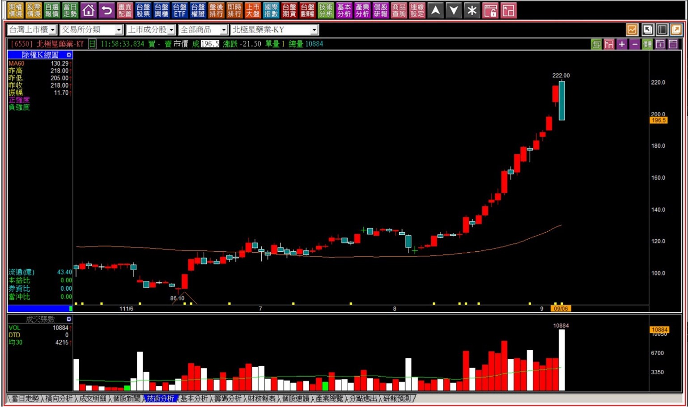

這算是一個比較特殊的例子，因為公司原本正在進行第三期臨床解盲，還沒有答案，只不過股價已經反映了一個事實：不論解盲有沒有成功，都不會再漲。

**111-09-26北極星藥業(6550)**

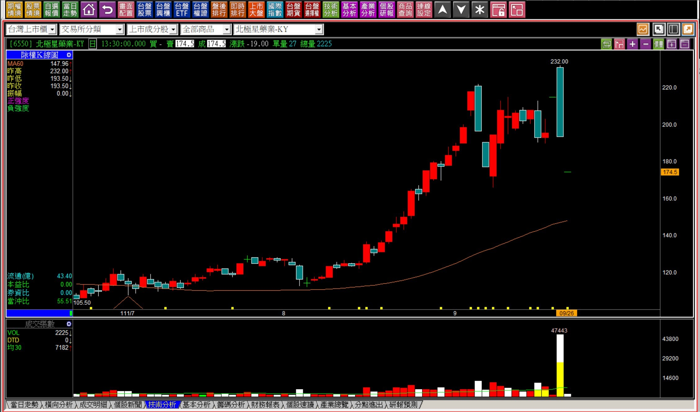

空方轉折沒有什麼好深入研究的，都是呈現多方力竭，原本的多方力量就是主力而已，主力最終就想烙跑，所以遇到了空方轉折，我們最該做的就是閃開，是面對空方轉折組合出現之後的明日K線應對，或許中間會有主力出貨不順，又拉抬一次，或者高檔區間整理的方式慢慢出貨，但對於我們來說，都是要避開的。

**關於多方轉折出現後的明日**

站在技術分析的立場，買點有三種：空頭買在趨勢改變、盤整買突破、多頭買攻擊，其中的盤整買在突破是基於型態學的理論，多頭買在攻擊是基於攻擊K線的力量辨識，但是空頭買在趨勢改變指的是空方的結束，對於不懂轉折的人，基於趨勢線的原理，等到確認空方趨勢線突破，確定結束了，才進場，那多方轉折可以算這種趨勢改變嗎？

我的答案是：「原則上不行」。

因為我如果要說某些狀況可以，就還得要講解哪些狀況可以，對於還沒有學過K線研判的人來說，總不可能先幫對方上過幾個小時的課，然後再說明哪些可以，所以答案才會是原則上不行。

對於已經有一定基礎的讀者來說，那就沒這麼多考量，答案是還必須要考慮「市場節奏」。

假如市場處於空頭趨勢之下，整個大盤都是悲觀的氣氛且進行三個月以上了，那績優個股如果出現多方轉折，表示空方已經力竭了，是投資的進場時機，只不過不要期待股價會像多頭狀態那樣買了飆漲。相對的，如果市場熱絡，個股卻獨自走空，表示有一定程度的經營上問題，這時就算跌到一定的程度，出現了多方轉折，那也沒用，股價要再破底也是輕而易舉，因為基本面太差了。

⭕️重點提醒：**多方轉折的明日檢視項目，就是「股價不能再破底」。**

**109-09-25日月光(3711)：母子晨星**

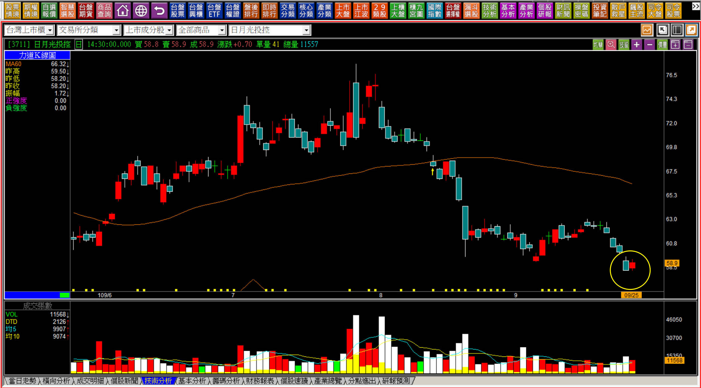

109年是疫情爆發的那一年，股市從新春開盤之後一路狂跌，很多個股都看不到只跌，連績優股都持續再破底，當時的日月光在創新低之後出現了「母子晨星」的多方轉折，這個位置也是至今的最低點。

所以如果背景環境適合，例如大盤已經走空超過三個月，個股有一定的基本面本益比偏低，這樣績優股多方轉折出現的明日，已經可以確認就是投資買點的意義。

**對照組的對比範例：日友(8341)**

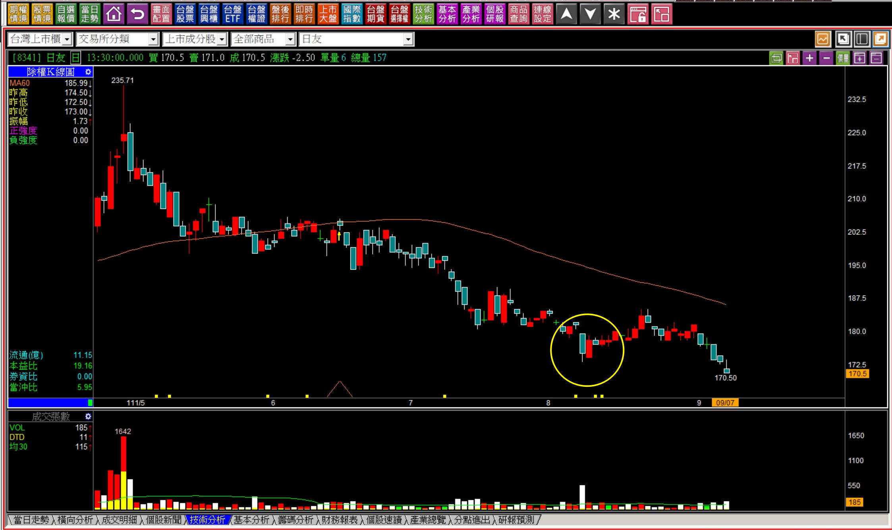

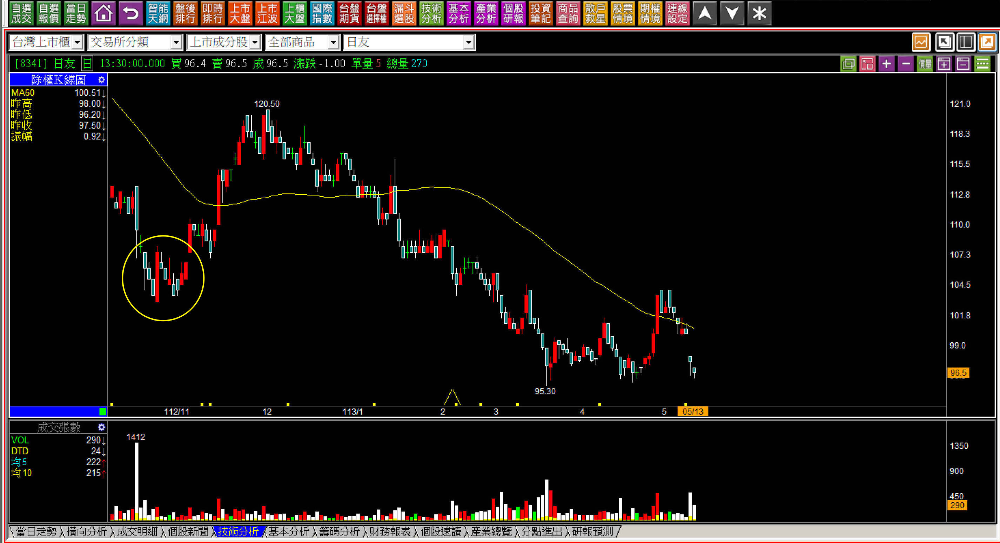

日友可以說是台股中出現最多次多方轉折的股票，不論是111、112、113年都出現過，可是股價依然持續的經過一段時間之後又往下破底，主因實在是因為每股盈餘從一年八元掉到連四元都不到，這個基本面真的是撐不住百元以上的股價啊。

所以如果要把多方轉折視為買進機會，基本條件就是必須是績優股，股價當然不能貴到讓人覺得誇張，或者根本就沒有那種價值的價位。

**通常多方轉折後來會失敗，是因為基本面實在是太差所致。**

**出現多方轉折的契機還有逆向環境的節奏**

簡單地說，就是出現多方轉折時，當日是市場覺得悲觀，有一種總賣出現象出現時，也就是散戶因為利空的感覺，認為股價還會再大跌，所以才會在低檔損失很大時，還是嚇到把股票賣掉的背景，這時候的多方轉折就很符合「空方力量竭盡」的意義。

**113-10-30海悅(2348)的明日K線應該如何？**

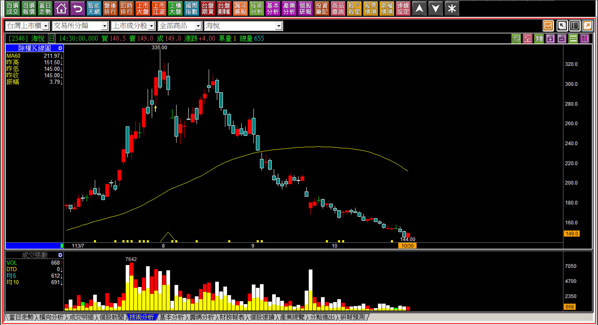

很可惜的一件事，雖然這是母子晨星的定義，但是營建類股才剛剛出現央行打房，所以股價跌完了嗎？基本面來說可能挑戰才開始，所以空方趨勢不一定會結束，很有可能雖然有空方力竭的意義，但是跌勢還會再起，這就是出現多方轉折之後還得要進一步判斷的明日K線重點。

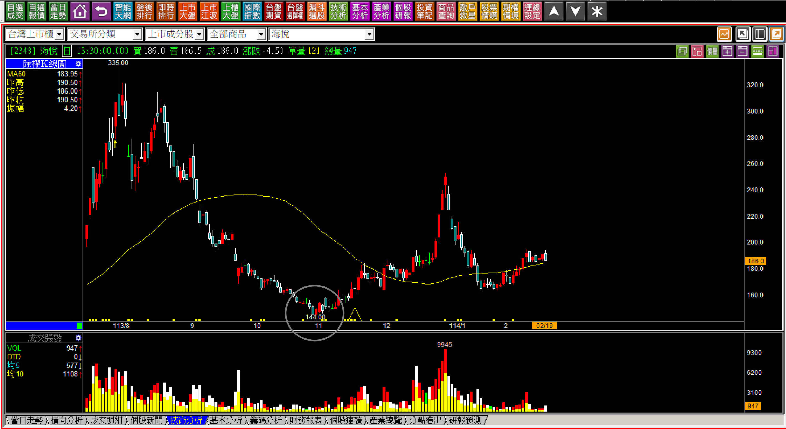

雖然從這張圖看起來，10/30的母子晨星似乎是空方力竭，但是一定要知道基本面沒有改變時，以營建股來說就是政府政策，通常空方走勢還是會再來的。

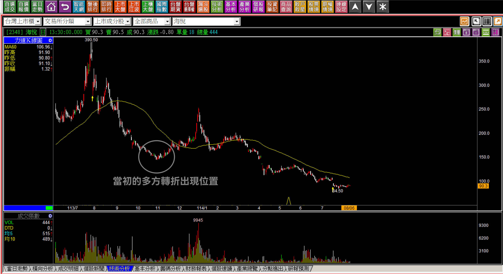

雖然九月四日傳出政府鬆綁新青安，造成營建類股全面翻揚的狀況，但是K線上對於多方轉折出現的位置來說，明日起依然要留意基本面的問題，而不是把多方轉折當作是多方進場點。

**基本面不佳的多方轉折出現**

接下來我們做一個實戰測驗。

**114-10-07帝寶(6605)**

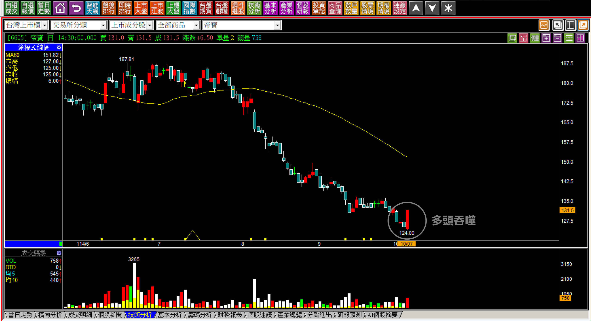

車燈大廠帝寶的股價，在這個台股創下歷史新高的背景，顯得淒涼。所以第一個標準已經不符合，這不是大盤空頭市場所造成的背景，因此已經沒有股價被「誤殺」的狀況，但是卻又真實在大跌一大段之後，出現多頭吞噬。

因此重點在於「不能再破底」，且因為是基本面的緣故造成的大跌，基本面沒有改變之前很難有真正的漲勢出現，這就是對明日K線判斷的關鍵：不要抱持太大的上漲期待。

**114-10-20帝寶(6605)**

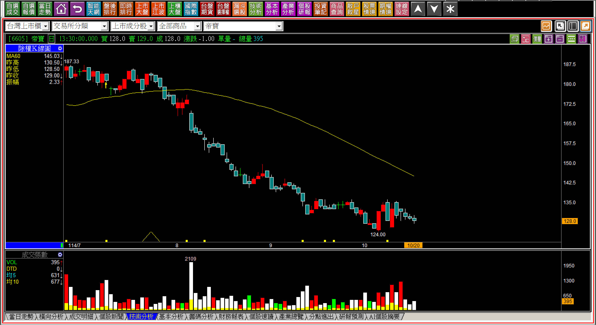

敬請再定期檢視明日起的K線，多方轉折就是空方力竭，但不代表就是買點，因為買進的必要考慮，就是股價會不會漲，而不是股價是不是不會再跌了。

**沒有基本面問題的多方轉折**

其實這裡講的就是「大盤」，因為大盤不會有個股基本面太差，所以股價還是嚴重偏高，雖然有多方轉折，過一段時間還是會破底的問題。

所以只要肯定是力竭意義，那這個位置可以成為優於「下降壓力線突破」的投資機會點，對於明日K線來說是輔助我們買績優股低於價值的「時機」點。

為什麼在談多方轉折時，不單只談個股，一定要來談一下大盤的多方轉折呢？因為出現的頻率很低，但是一出現就是投資的最佳機會。除了104年的8月25日母子晨星之外，再來就是108的島狀反轉，還有111年的母子雙星。

**108-01-08大盤孤島型態**

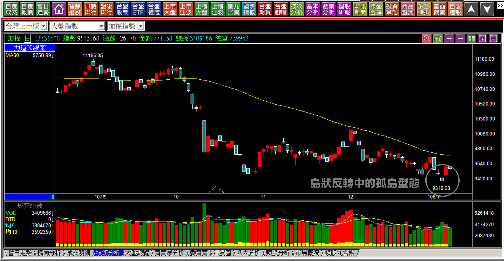

**111-10-27大盤母子雙星**

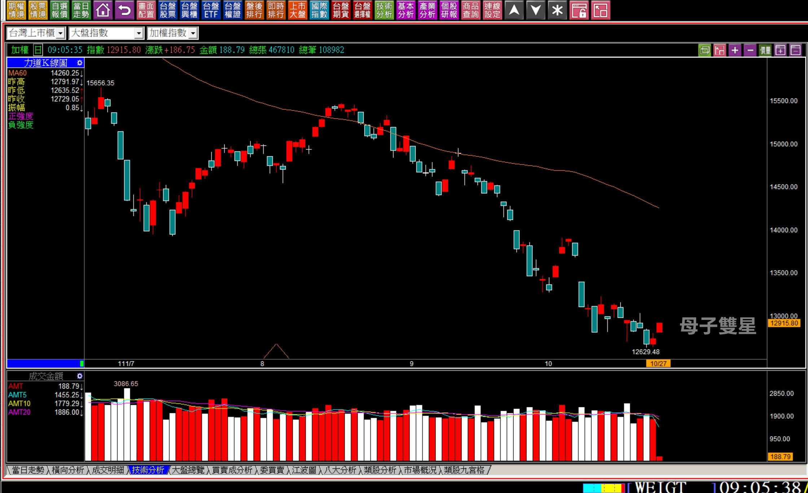

過去十年大盤一共在低檔出現三次的多方轉折，111年之後就再也沒有出現，是因為這些年空頭時間都很短暫。

當大盤的多方轉折出現時，一定是在大盤已經經歷過長時間空頭，或者是非常大幅度的崩跌之後，然後千載難逢的投資機會出現，錯過一次就不知道下一次何時才會再來了。這就是我們學習轉折組合的原因，沒有別的，很少用到但是只要遇到一次就夠了。

為什麼這些都得列入「明日K線」範例？因為這種位置散戶還是哀怨的、不想看、不想討論的，這就是錯誤與宿命。