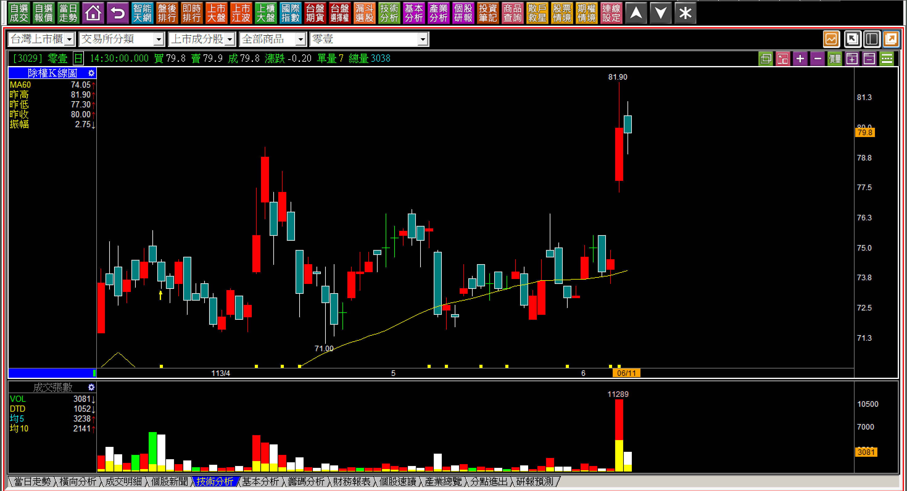
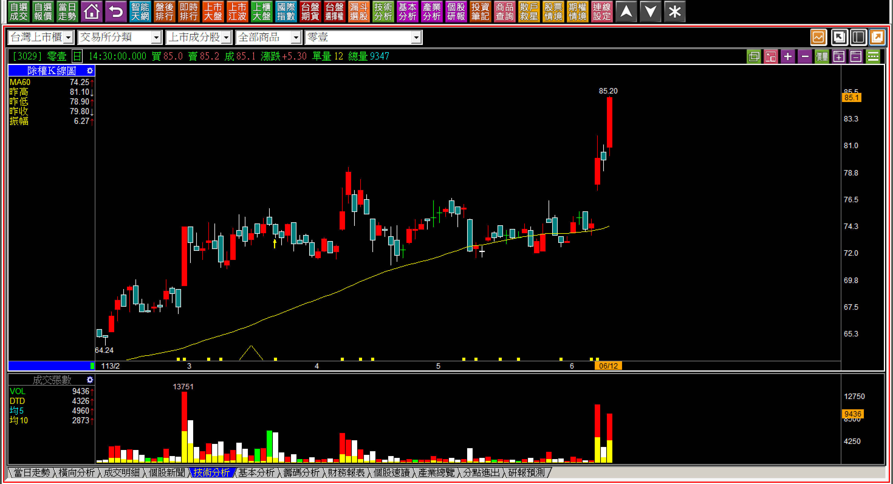
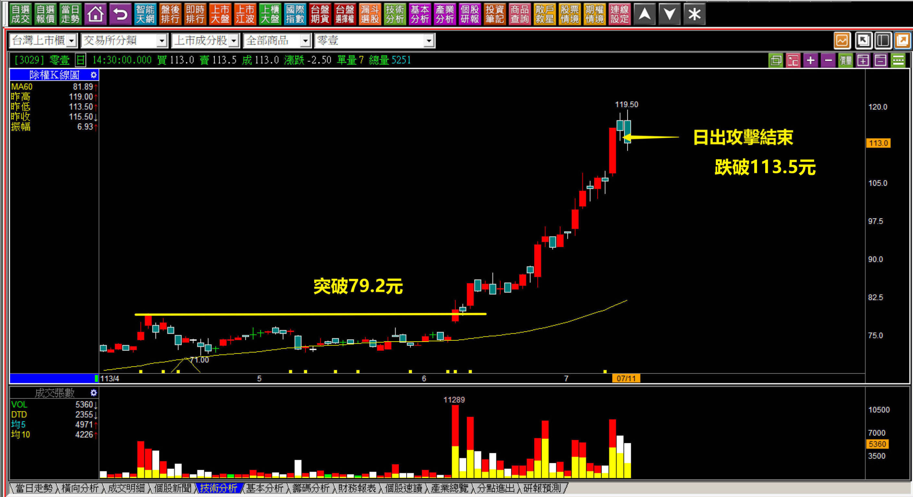
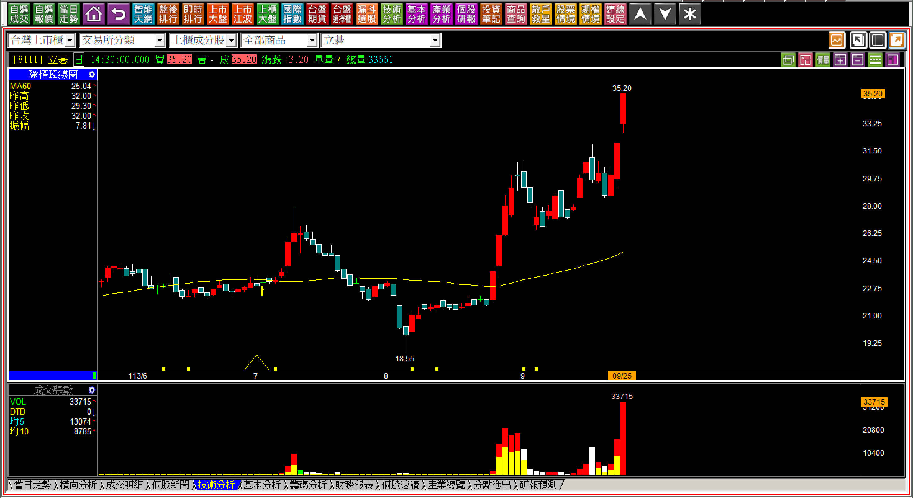
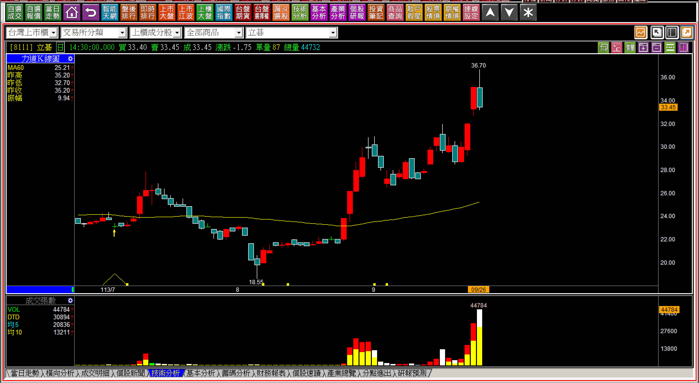
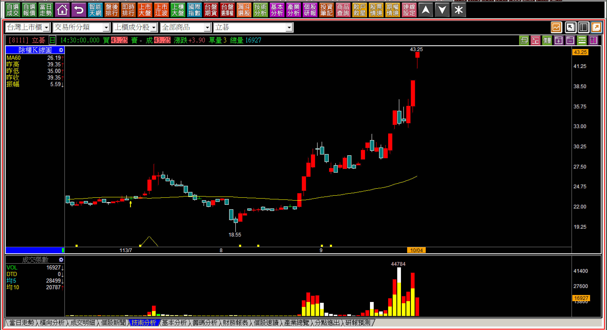

# 【明日K線】「休息一天的攻擊」篇

股價的攻擊模式有很多中，「日出攻擊」當然是人們最愛的，主力知不知道日出攻擊的拉法，散戶勇敢的時候、或者市場當下並沒有太多攻擊股票的時候，照樣有當沖客敢買剛創新高的股票？他們當然知道。因此，把波動狀態拉長，就是突破後先休息一天的攻擊模式。

這個休息不是再回到「攻擊意圖」之下，因為不可能主力發現散戶還沒買，散戶就想買拉回，所以先掉下來讓大家買一買才往上拉，讓大家賺錢自己付出更多成本。散戶基於不敢追高的心理，買了拉回之後股價一漲就想價差賺一賺，主力沒有必要這樣做，因此創新高的隔天休息一天很正常，卻不可能跌回到散戶想買的地步，如果有，就是這次不打算要攻擊。

**範例一：113-06-11零壹(3029)**

跳空突破，意思是用跳空的方式來突破前高，判斷上只要沒有跌破攻擊假設，就是攻擊意圖依然存在的意義。隔天短暫的整理，通常是主力讓那些還沒注意到已經解套的散戶，習慣高出低進的人有一個整理賣出的機會。要稱其為洗盤也沒有不可以，只不過意義不大，很單純就是攻擊狀態下的短暫休息。

自此，隔日起隨時會有攻擊出現，判斷上的要點依然是不可以跌回跳空突破的缺口。

**113-06-12零壹(3029)**

一來，在突破日做當沖隔日沖的短線客，兩天就把籌碼洗乾淨。二來，股價真的想攻擊就會往上拉，再次形成越漲籌碼越穩定的狀態。這是具備攻擊邏輯者，對於明日K線的判斷要點，至此股價已經展開攻擊，未來就是攻擊結束的判斷即可。

**113-07-11零壹(3029)**

這是基本的「只做日出攻擊段」的價差交易可以賺到的區段。通常人們會有一種想要趁股價很高的時候賣一趟，就會賣在半山腰，最正確的做法是在股價上漲的狀態中，保持著移動停利的觀念，也就是設定好停利點，跌破才賣，對於價差交易者不難，不過再創新高的隔日，稍一休息，就會有很短線的人開始想太多，以為不攻擊，以為主力要出貨，其實不用想太多，沒有跌回缺口之下，都是攻擊意圖依然存在。

要說明日K線在此的意義就是不跌破停損設定，就不出場，其實也是可以。

**範例二：113-09-25立碁(8111)**

對於茫然無知的投資人，對於K線與技術分析一知半解，有時候因為想要獲利了結，就會拿出錯誤的認知，例如「量爆得太大」這種說法，沒有任何理論依據，卻可能變成賺到賣掉放口袋的藉口。

**113-09-30立碁(8111)**

站在前一天賣掉的人來說，隔日更大量的黑K，似乎證明自己前一天的判斷正確，還在開心自己賣到高點的同時，卻忽略了股價根本就沒有掉回到攻擊意圖之下。

單純的看，連攻擊跳空缺口都沒有回補。

其實這是一種主力耐心的呈現，把創新高當天當沖隔日沖的人洗掉之外，還造成一種高點有賣，等以後有幅度的下跌之後再買回來。以明日K線來判斷，正確的邏輯是，股價只要往下回到一定的幅度，就等於確認不攻擊，因為不可能讓人來來回回賺價差。

散戶通常沒有想過，自己的高賣後低買，有多麼荒謬，因為市場不存在著專門高買，然後又低賣的交易心態，既然如此，真正的強勢哪一天開始無法預期，可是如果沒有跌回去，表示攻擊者的意圖還在，這就是接下來唯一的判斷重點。

**113-10-04立碁(8111)**

明日K線在股價剛剛創新高的紅K之後，如果出現了一根休息的黑K，是考驗接下來對邏輯認識的時刻，也是對人性最大的考驗。事後看圖解說都很簡單，偏偏就有存在著人性的矛盾障礙，所以才需要正確的觀念來輔助：『股價的攻擊並非一定要每天且連續。』

攻擊企圖就是攻擊意圖出現之後的「隔日」，就得要有攻擊表現，攻擊跳空通常就是答案，可是考驗的是隔日起，不能因為擔憂、害怕、想獲利了結的這些心理，做出誤判。