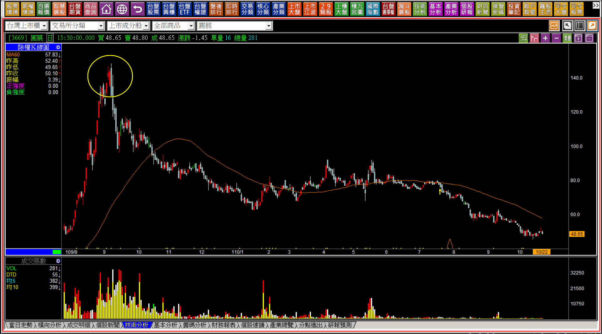
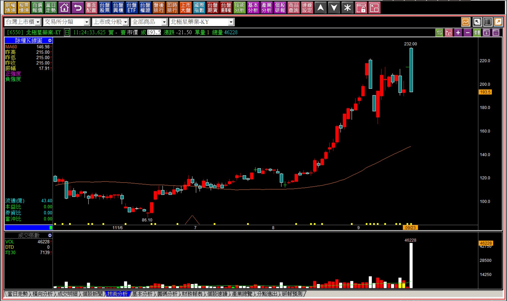
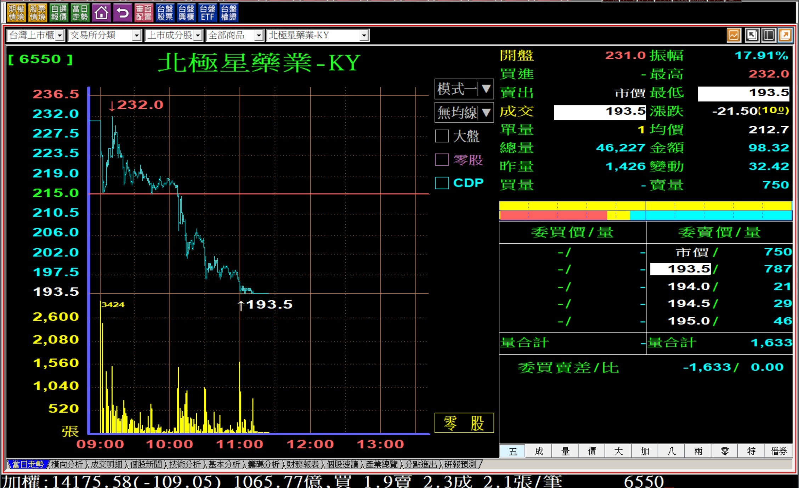
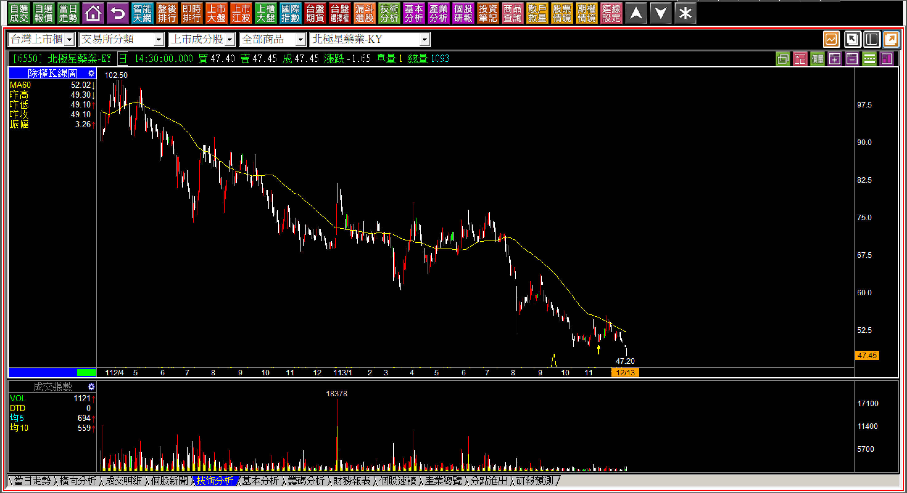
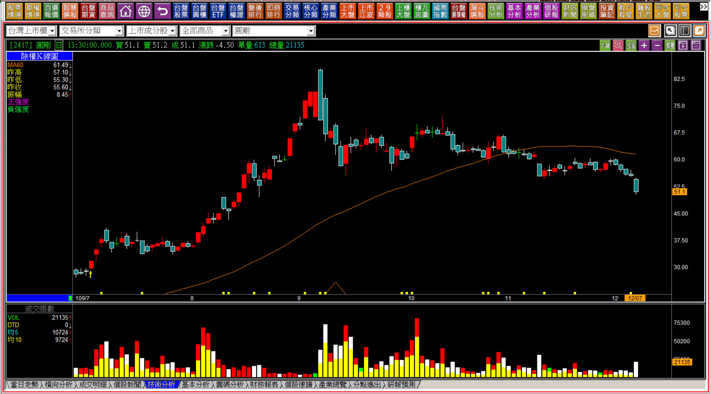
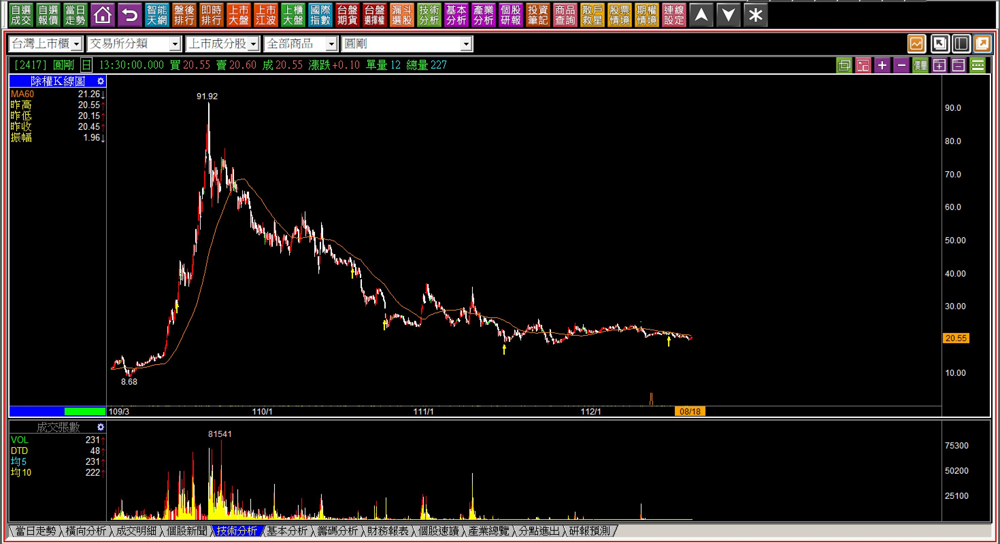
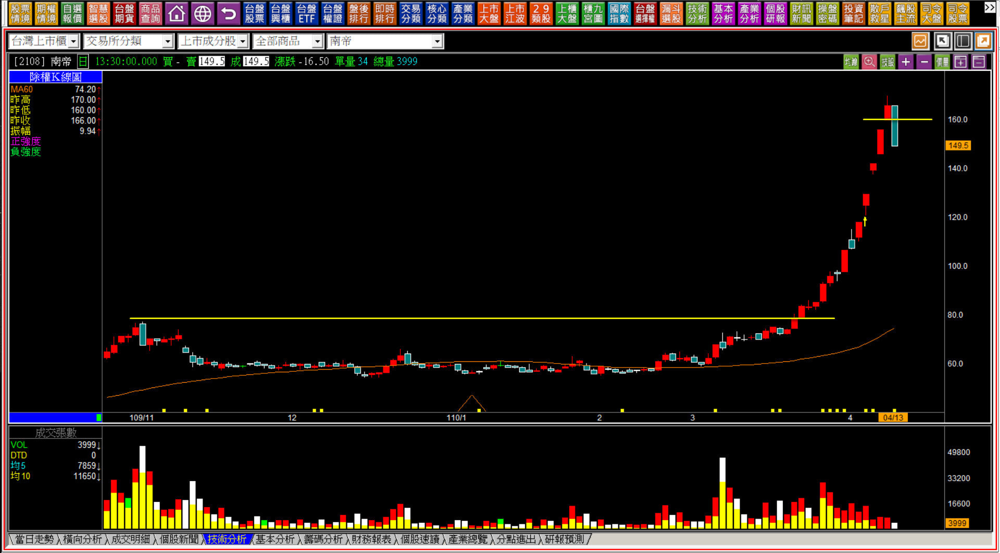
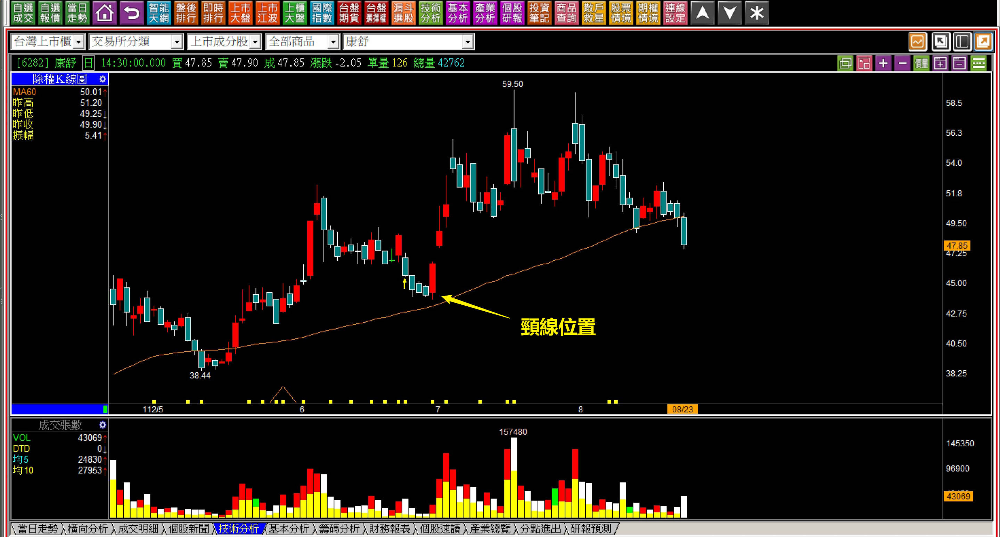
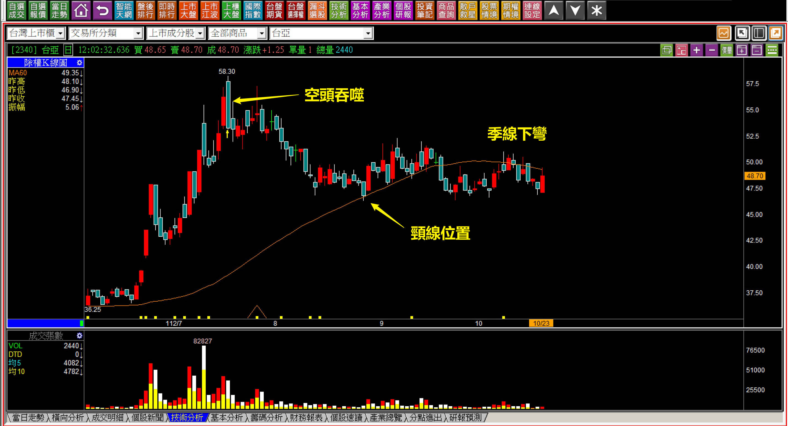
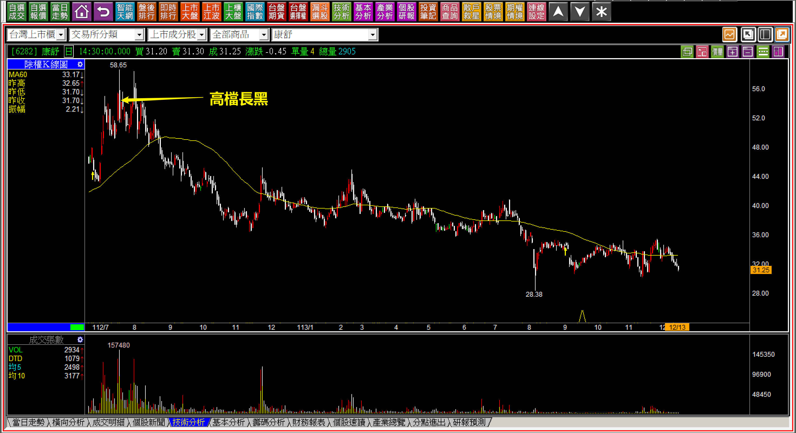

# 【明日K線】「下山」篇

股價像是一座山的走勢，這是我常常用來形容一檔股票飆漲「過後」的狀態。其實每個人想一想也都能理解，當主力賺過一大波之後走掉了，股價掉下來，主力還會再拉抬一次嗎？好不容易出貨完畢，誰要去幫散戶承接了一堆籌碼的股票拉股價呢？

市場多得是股票可以搞，主力不會總是繞在同一檔股票上，只有一般的投資大眾、散戶才會對某一檔股票戀戀不忘，尤其是賺過一趟的，把低接買回當賺價差，遇到套牢的只好不賣了，還要伺機低檔攤平，最終就會在一檔股票的跌勢中畢業出場。

**110-10-22圓展(3669)**

通常股價最後變成山的形狀，已經是從高點跌回原點。事後看，這一大段的回檔應驗投資人最愛說的：「怎樣上去就怎樣下來」，可是對於拉回買進、攤平的投資人來說，慣性逢低承接的思維，會讓投資嚴重虧損，所以要避免，就要在股價變成一座山「之前」，就要具備對「明日」K線的認知。

等到股價已經變成了一座山，再來討論任何研判都沒有意義，頂多就是知道股價怎樣上去又怎樣下來而已，明日K線的角度就是得「在股價還沒有下山之前」，已經先有未來K線狀態會怎樣的研判。還可以分成很多細節辨識，不過要先有一個觀念：當一檔股票出現走勢不合常理的強勢拉抬，那未來十年有可能最強的就是這一段了，除非基本面有看起來明顯獲利成長的表現。

**類型一：只有題材還沒有未來**

**111-09-23北極星藥業(6550)**

對於已有轉折判斷能力的人來說，這根K線是送分題。

因為十一個交易日前才出現過黑K吞噬，當時就是多單應該要出場的地方。在九月二十一日才公告的解盲成功，先有一條線，很快股價就被長黑摜殺，千萬不要以為解盲是利多，事實上更多籌碼是在等待利多出現要來獲利了結賣出的。

這就是明日K線需要具備的判斷，既然有了大家都期待的好消息出現：解盲成功，那就表示看好的都早就買了，不可能等到解盲才在期待，因此是送分題的原因，就是股價接下來會往一座山的方向邁進。

因為只有題材，還沒有實質的未來可期，股價成為一座山是可以確認的。

**113-12-13北極星藥業(6550)**

台股還在23000點，下山的股票把投資人帶到更深的谷底，這是一開始就已經可以預期得到的。

**類型二：短期一次性的利多**

**109-12-07圓剛(2417)**

因為政策所帶來的利多狀況，或者是因為利空的受惠，可能這一年的好處吃完，未來的營運就沒有辦法持續這個利多，通常股價也會慢慢的變成一座山，可是因為看得到的營收盈餘還在，所以股價即使是經過暗夜雙星的黑K包覆，卻沒有立即往下長成一座山的樣子。

可是一根貫破頸線的黑K就可以確認，一座山已經無法避免，因為股價的轉空加上基本面只不過是因為政府的前瞻計畫、校園多媒體採購而已，不可能每年都採購一次，所以每股盈餘只是曇花一現，就等於是為一座山鋪陳了。

**112-08-18圓剛(2417)**

明日K線的意思，就是今天就可以判斷出明天起股價的走勢，這個例子很清晰。

**類型三：再次型態突破的高熱度股**

**110-04-13南帝(2108)**

通常政策或者環境的短期受惠，是很容易看出來的，只是如果搭配了每股盈餘短期看起來有爆發，那最後變成一座山，是可以預期到的，除了剛剛談到過的圓剛、圓展，還有耳溫槍的熱映、口罩股都是如此。

只不過投資人在當下會以為這就是未來展望，事後看才知道不值一提。

這一根黑K不僅僅是日出攻擊的結束，也是股價最後一波力量，用力的強烈拉抬之後，戛然而止。明日起的走勢，除了一座山之外，很難有其他的走勢可能，這應該是簡單就能判斷出來的。

**類型四：利用環境刺激話題**

這個類型是最常見的，變化多端但是不離常態，例如併購題材的康舒、改名台亞半導體的光磊，或者吵一下董監改選題材的智冠，大同，最後基本面的數字要跟這些刺激出來的話題對比，一點都沒有可談之處，那股價要變成一座山，幾乎就是唯一的答案。

關鍵是，還沒變成一座山之前，就能夠判斷出來，才是明日K線的學習意義。

**112-08-23康舒(6282)**

康舒併購ABB旗下的電源轉換事業部門，網路就開始幫他算毛利率，股價也大漲一大段，很快就開始作出頭部。最終，沒有任何一季的每股盈餘超過0.1元，表示網路上所說的，全部都是虛晃一招。

站在明日K線的角度本來就可以判斷出來，從季線扣抵到頸線位置的確認，股價一路往空方趨勢前進，這種財報、這種跟沒有一樣的題材，最終股價回到原點，看起來就會是一座山。

**112-10-23台亞(2340)**

瞎爆的光磊改名台亞半導體，就在改名前後股價出現空頭吞噬。

改名一直是股市裡洗白的方式，營運沒有改變就什麼都沒有意義，當然還是可以透過趨勢變化的關鍵位置來預判，加上改名這種很瞎的拉抬，最後回到原點就會是一座山，這裡本來就看得出來。

**113-12-13康舒(6282)**

突破前高後被一根超過10%的長黑包覆，稱之為「高檔長黑」；已經有一段漲勢後才是創新高的紅K被黑K包覆，稱之為「空頭吞噬」。在這個例子中，康舒兩種都是。

一開始就預期得到股價會下山，這是一種對K線判斷的基本能力。

**留意要點：高點不再突破**

股價飆漲的很多，但是最後會變成一座山的，都有著一定的特性存在，沒有基本面、或者有基本面但是一看就知道不會持久的，是最主要的原因。

話題性、短期效應、只有根本不像是利多的題材，是輔助判斷之處，但在K線上，從股價已有三個月不再創新高，或者上方有過空方轉折訊號、或是進入季線下彎的狀態，就幾乎可以確認未來的股價漲頂多是反彈，跌就有可能繼續下山。

下山篇與其說是判斷層面的介紹，不如作為研判股價的警訊，因為散戶往往因套而持有、因持有而愛，最後虧了一大堆、抱著一大段，無奈地退出股市，這一篇是為了避免最後走上這個宿命的判斷。

現在來看，這種股票非常非常的多，已經無法一一舉例，股票不會是抱久了就解套，尤其是經歷了一次大長多之後。

**後記：114-12-18億泰(1616)**

攻擊結束之後，還是有可能需晃一招，但是最終就是一座山，是明日K線中屬於認知的環節。