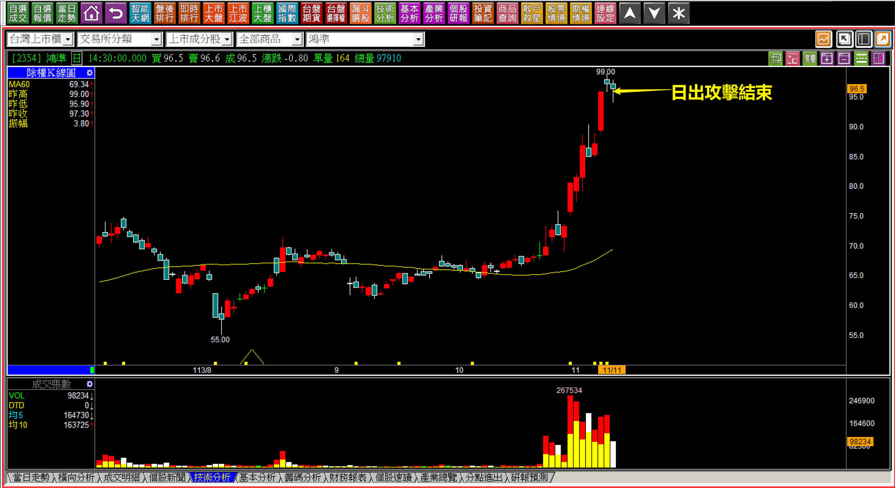
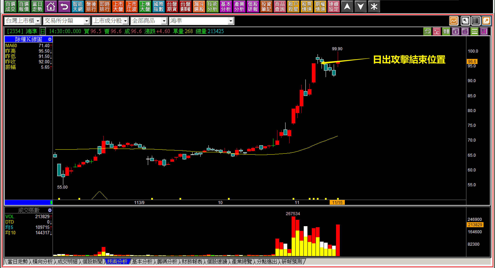
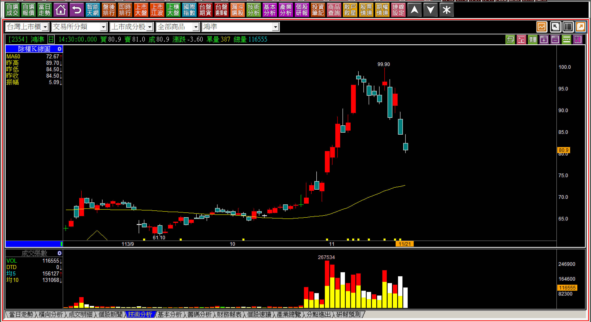

# 【明日K線】日出攻擊結束與上升三法的判斷矛盾

這一篇的教學內容可以說是「明日K線」的經典判斷方式。

為什麼？因為逐日看K線就會遇到這個判斷點的意見分歧之處，什麼時候最需要判斷明天？答案就是「攻擊狀態想要設定移動停利」時，而日出攻擊就是那種每天都在移動停利的情況，而且因為正在獲利，人性上就會想要獲利了結，好不容易遇到了一次日出攻擊，就會想要賺完這一段即離場。

**113-11-11鴻準(2354)**

這張圖有兩個點可以檢視，首先一定是日出攻擊，在這一天日出攻擊已經結束。

真正經歷過手上的持股處在日出攻擊狀態的人，最喜歡這種走勢，因為停利點已經不是前天長紅的低點(這是昨天的停利點位置)，是隔天有個短十字線，而這樣的短十字線實在是太好了，移動停利可以移到前一天十字線的低點，等跌破前一天低點出場，是日出攻擊最簡單的定義。

另外，十月份股價突破創新高之後，整個成交量都放大，表示主力近期介入很深，就等同主力沒辦法採用A型反轉的方式讓股價下跌，因為他們一次回檔出不光手上的部位，因此這種狀況的交易風險相對小，是因為主力出不完通常就會再搞些動作上下震盪，增加我們在相對高檔的地方出場的機會。

矛盾點就在，如果只看過去三根K線，就會發現只要「明天」再來一根長紅，就符合上升三法的定義，那麼到底要採用「日出攻擊結束」來停利，還是再等一天說不定會有上升三法的長紅出現呢？

**不考慮基本面的價差交易判斷**

人性是很矛盾複雜的，本來想要賺點價差，結果跌下來變成長期投資，很常見；本來要賺一點就行，結果賺很多變成想要長期投資，甚至把「存股」拿來考慮的人都有，所以往往等到股價掉下來才又後悔，就是人性問題。

這就是「一開始就要決定」到底打算「價差」還是「投資」的原因。

這樣的矛盾既然叫做矛盾，就是因人而異，所以站在明日K線的角度可以有幾種處理方式：

**一、明天不走出紅K，也就是不依照多方波動時出場，這個做法的缺點是明天往下跳空就會很痛苦。
二、專心等待紅K，這個想法算很笨，沒想過萬一沒有紅K應該怎樣應對。
三、不管上升三法，既然日出攻擊結束就出場。**

我個人的交易傾向於第三種，原因是常態在做價差的人，買的是突破、期待的是股價日出攻擊，這是可遇不可求的攻擊方式，既然好不容易遇到了一檔日出攻擊的股票，就什麼都不需要想，也不期待日出攻擊結束後股價還可以衝更高。

**113-11-15鴻準(2354)**

對於一個不懂K線技術分析的人來說，就喜歡事後論。就像是一個看到股價已經漲了的人，坐在咖啡廳解說「MACD向上、法人買超、底部有量就是買點」般的荒謬。

原因我已經說明過，主力不可能一次就A型反轉向下，所以再搞一下來回是很正常的，當時的上升三法也沒有出現，只不過是判斷明日K線時的矛盾而已，也就是說，假如沒有原本「正在日出攻擊」的前提，明日K線的角度就得要考慮上升三法的出現了。

**113-11-21鴻準(2354)**

從這裡回頭看，就會知道當初日出攻擊結束就出場，意義有多大。

至於主力出完了沒？對於已經做到整段日出攻擊的人來說，已經不重要了，都獲利了結不用在乎了。對於錯過了那一段最強漲勢，就想事後拉回買進的人，判斷起來就很辛苦，或許有一天還有機會做到來回區間，但那就像是已經被吃掉魚身的魚了，只能撿些碎肉當作享受罷了，很可能不小心還得買單結帳付出代價。