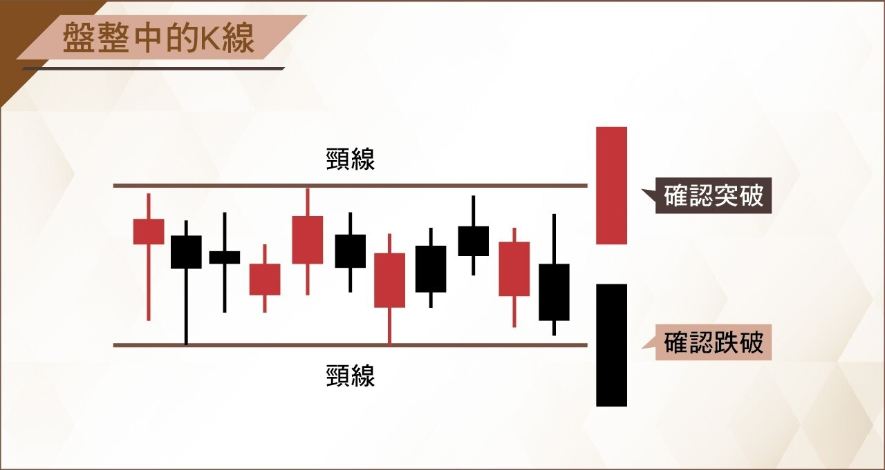
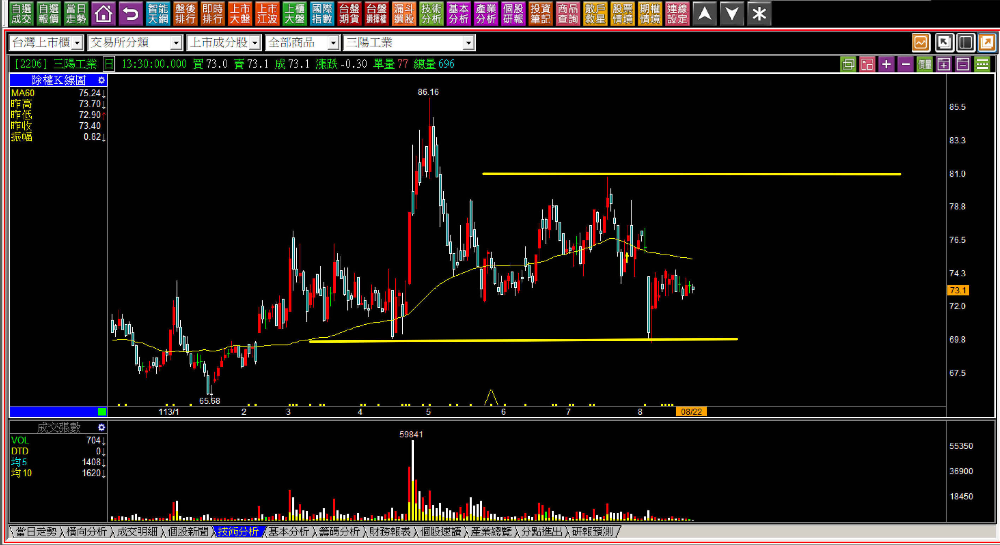
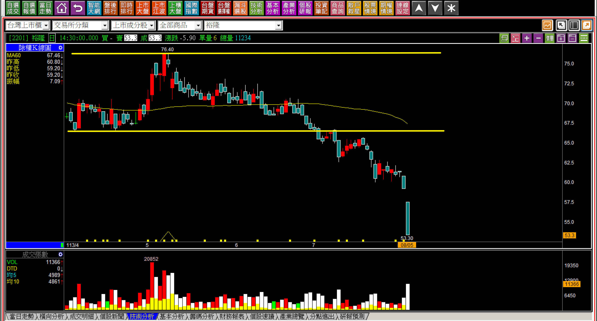
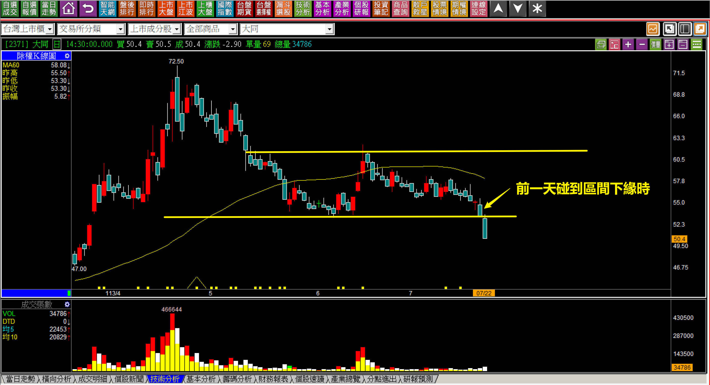
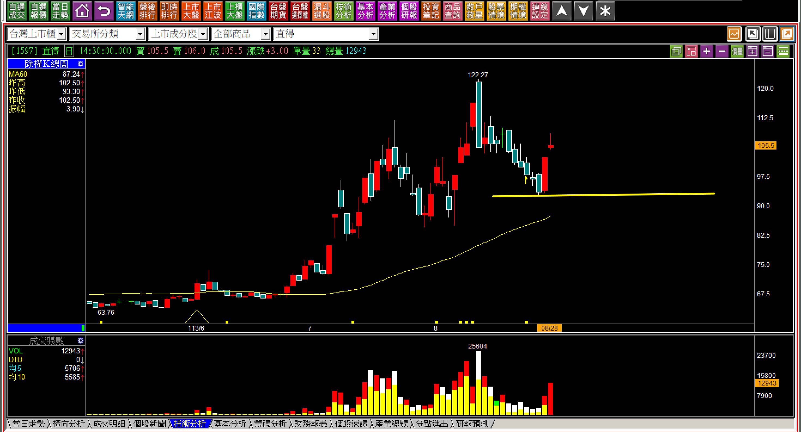

# 【明日K線】「區間整理」篇

對於K線的判斷能力，與盤勢狀況如何無關。多數投資人容易受到當下股市表現的影響，心情不好就變成持續學習困難，如果要等心情好才要學，往往對於「一眼就能看出來」的K線型態判別變成視而不見或者錯判。昨天台股新春開盤雖然遇到了DeepSeek事件的影響，台積電下跌5.7%，不過這只是常態，今天就算沒有中國突然崛起的低成本AI，台積電也不會每天漲，所以，對於K線結構的判斷能力，是交易者、投資人重要的能力。

尤其是型態，簡單基礎卻很容易有誤判。

「區間整理」嚴格說起來，並不算是一種完整的型態，因為型態必須要有方向或者結構上的「答案」出現，才能辨別多空，可是區間整理並沒有，還需要等待一根突破或跌破的確認。

偏偏短期走勢的確認，如果與整理前是同一個方向，中間這一段就稱之為「中樞型態」，整理時間久超過三個月了的，突破跌破的上下緣都是頸線的定義，時間短一點點的盤整也不算是型態，因為這樣也算整理，那股價一年有八成都算是整理中。

那為什麼還是有「區間」整理的說法呢？

因為人性習慣會把過去一段時間的感受當作是標準來定義，想要作為未來的判斷，也就產生了「箱頂、箱底」的即視感。主力知不知道散戶會這樣看股價？當然知道，主力絕對知道散戶不想追高，就是想拉回才要買，跌深了會攤平的天性，所以往往出貨也就是箱底出，只不過散戶沒想過主力知道這件事，只管著自己要跟不要。

所以遇到了股價短期之內看起來是一個區間來回之時，接下來的判斷，就在「明日K線」的判斷範圍。

**區間只是一個沒有決定方向的「現象」**

股價呈現出到了上一次高點之前就往下掉、到了上一次低點就往上彈的現象，次數多了就給人一種是在某個區間整理的感覺。網路上的教學給予一種在這個區間可以「箱底買進、箱頂賣出」的誤謬策略，為什麼說是誤謬？有人賺就有人賠，如果投資人可以這樣操作，那賺到的錢又是誰賠的？

股價要從區間低檔下緣漲到高檔的上緣，要漲就要有人拉，那麼又是誰，目的是專門為了讓散戶的低買賺錢？

答案很單純，那只是一個假象。所以對於明日K線來說，要使用的判斷點就兩個：上緣、下緣。尤其是這個整理區間長達三個月以上，上緣就是轉為多方的頸線、下緣就是轉為空方的頸線；短期且趨勢沒有改變的，稱為中樞。

試想，如果在下緣處買進後，隔天卻遇到了跌破；或者是上緣處賣出，隔天卻遇到了突破，屆時會有怎樣的感受？

既然心態中是買低，跌破之後股價更低，不就越要再買？但那偏偏就是盤整轉為空頭的關鍵位置。反之，如果突破了已經在區間上緣賣掉，那股價更高會重新買回嗎？不買回，不就等於視型態學的突破頸線、突破買進於無物嗎？

**113-04-03力積電(6770)**

有時候區間整理也有可能區間非常的大，這是因為沒有人刻意地做出一定要在哪一個價位，只需要弱弱的來回就行，所以這種區間比較簡易的進入型態學的頸線判斷即可，答案是相同的，箱底？沒有這種買進的意義，明日？跌破就知道威力。

**113-08-22三陽(2206)**

比較難辨別的，就是營運還算績優的股價，真的跌破可能算是低於基本面了，要漲到突破，過去卻又沒有看得那麼好。這種類型的箱型，其實也不用刻意的推估，就是看著就行了。

對於明日K線的態度來說，當股價靠近了上緣，從明天開始就要檢視是否突破？一突破就等於是型態學中的突破頸線買進，當股價接近了下緣，就要看明日開始有沒有跌破，若跌破了，就是整個轉入了空頭，持有都是越來越大的麻煩。

在這裡回頭思考一下，既然懂了這個道理，是否區間整理的最佳策略就是：「空手觀察等待趨勢方向的確認」，並不是「箱底買進、箱頂賣出」？

**區間型態跌破的可怕**

人性存在著「近因偏誤」，意思是用過去一段時間的習慣來作為下一步決策的要點，在K線圖中這種思維往往再加上低買、箱底買，風險實為大增，只不過在還沒有跌的時候，感受不到威力而已。

我們在用明日K線的角度來判斷走勢，目的就是為了避免總是「沒想到會這樣」。

**股價以前有過拉抬的「區間整理」**

站在主力的那一邊，不論是市面上的書籍，或者網路上的推崇，都認為對於股價的判斷需要客觀，要賺價差，就得要站在主力的立場來思考。假如股價之前曾經有過明顯強勢的拉升，當然就表示主力持有部位很大，股價短時間漲太多，如果打算高檔出脫，有辦法「拉高出貨」嗎？

要拉高，就要花更多錢去拉抬股價買進，這樣主力只會讓自己手上的部位更多，是要怎樣出貨？假如你是主力，最好的出貨點是哪？當然就是散戶會去買進的位置，才是最佳的出貨位置。

因此，有過拉抬飆升過的股價，散戶會去買的點就會是有利多消息，且股價過去一段時間相對看起來便宜的位置，也就是大家以為的箱底，這種散戶會買進的點，才有辦法出貨。

**113-07-22大同(2371)**

試想著這一天與前一天意識到危險的差距，就是散戶最慣用的「沒想到會這樣」，其實根本就不應該沒想到，而是前一天就應該要意識到危險何在，等同隔日一開盤就已經確認頸線破了，放著不管，股價後來就是跌到40元，再跌兩成。

進一步說，對於K線的推演，等於是在六月份箱底反彈的時候，就要知道主力就是故意做出一個箱型整理，讓散戶失去戒心，甚至未來加碼攤平，這樣主力才能出貨順利，所以拉抬過的個股，再回檔後的第一根反彈紅K，就應該要理解，這裡可能就是未來的「箱底」。

**113-08-28直得(1597)**

漲多的拉回，紅K哪一天會出現，沒辦法採用明日K線來預測，但是當假象的反彈開始出現時，就已經明白未來區間整理的狀態已經開始出現，然後跌破箱底、等於跌破頸線，如同眾多轉空的範例一樣。

這當然也是為什麼箱底買進的觀念危險的原因。同時，主力出貨的重點精神，就是散戶有買就好，未來他們會自己加碼攤平，這樣主力更能達到出貨的目的，這也是明日K線的重點判斷：**當股價跌破區間時**。

會不會有一天，主力發現市場沒什麼好拉的，或者話題冷飯熱炒，又回來這一檔呢？當然凡事都有可能，這就要看你願意為了這個少數的可能，甘願冒多大風險、願意等待多久了。