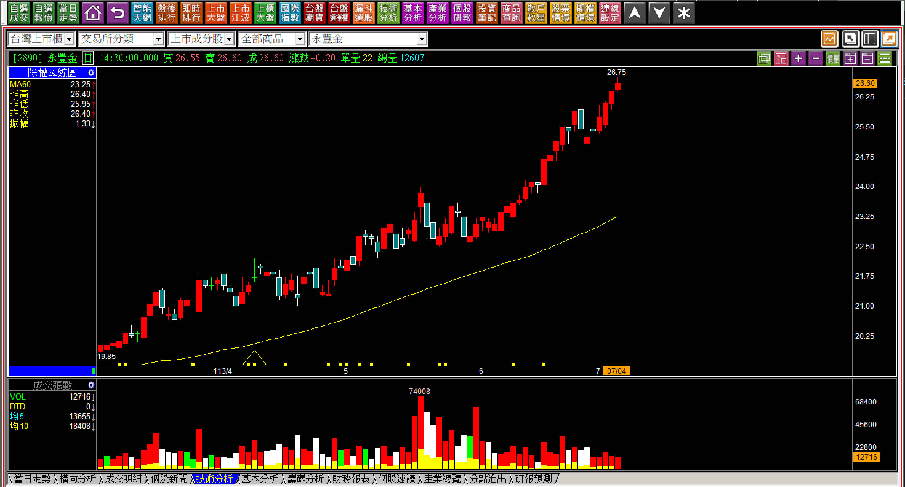
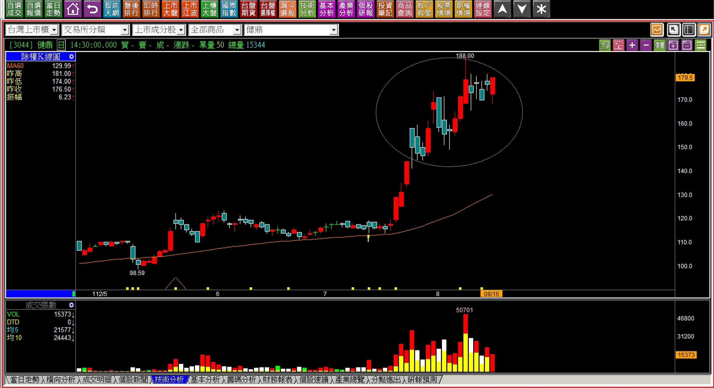
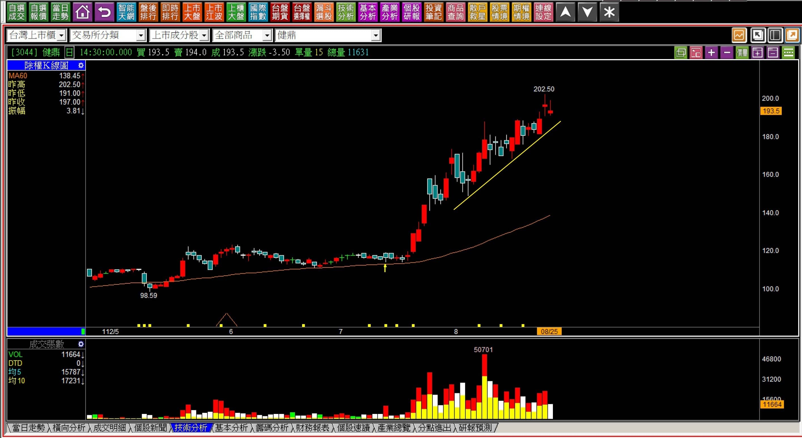
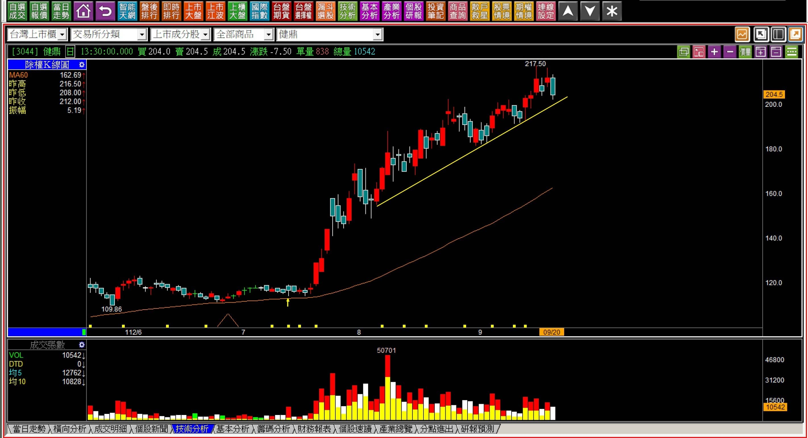
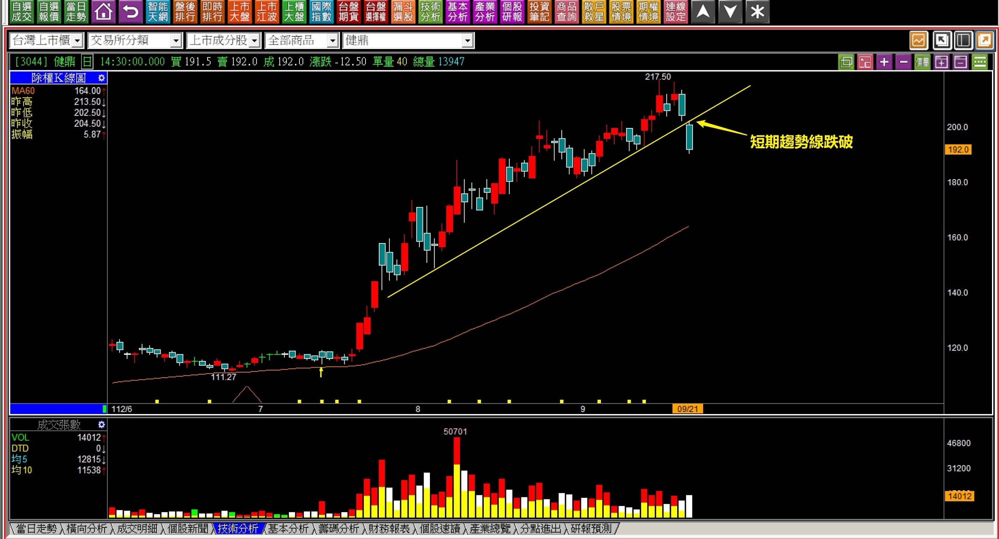
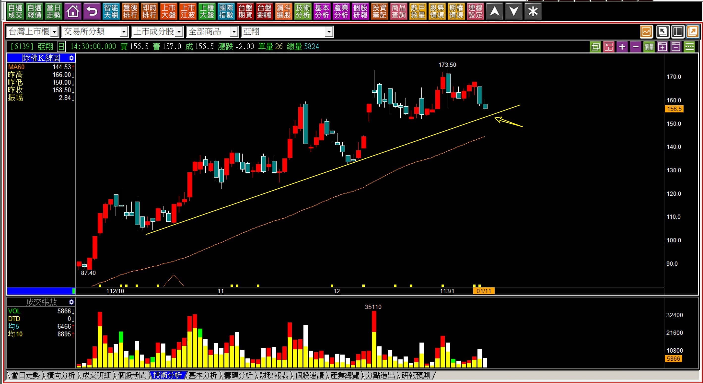
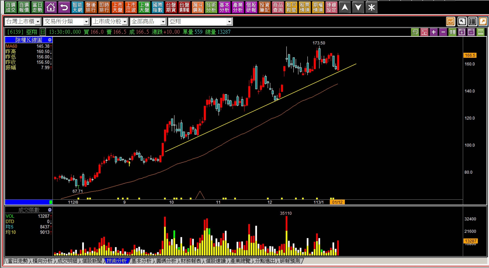

# 【明日K線】「微弱的多方趨勢」篇

通常我們對於股價的多頭走勢，心裡想到的大都是那種強勢攻擊拉抬，或者上一段整理、再漲另一段，又或者是明顯有初升段、主升段、末升段這幾種類型。

有沒有那種比上述三種力道都還要再更弱一點的多方走勢呢？

也還是有的，就是那種看不出來股價有在大漲，偏偏就真的有漲，K線連續的重疊度高，股價有創新高，可是就是慢慢推上去的那一種，要投資就得要保持耐心，也需要對於這個狀態的「改變」位置，有確切的體認，這是明日K線的要點之一。

**微弱的多方趨勢範例**

這一種在攻擊中被歸類於「一般多方走勢」，停利點只有一個，就是採用「多方趨勢線跌破」。

因此當股價從看不出來強勢的力道，到看得出來短期多方趨勢時，就可以開始具備明日K線模式的判斷「停利點」。

**跌破「短期多方趨勢線」的標準狀態**

短期趨勢線只是一種大略的趨勢標準，不像是K線組合那麼清晰定義價位的意義，所以有時候會出現價格上因為畫線不同的變動。

既然是模糊，就會有盲點存在，因此必須要記得的是，用短期趨勢線跌破，通常是在高檔區域已經沒有任何標準可以用來判斷的時候，沒有空方轉折，不得已才使用。

同時，股價已經有著長時間的黏著度，K線與K線的重疊程度高，那就等著股價呈現出短期趨勢改變，可能變成下跌或者區間整理，就沒有等待的必要，可以用這個位置作為最後停利點。

**112-08-16健鼎(3044)**

股價最容易迷惑人心的時期，就是高檔區域卻只有上下震盪。遠遠的看還是可以看出股價就是處在多方趨勢，且是以不強烈的方式在拉抬，偶有創新高，可能多數還是黑K，且價格重疊度高。

在這樣的狀態之下很難使用K線組合來判斷出力量、轉折，只能透過趨勢中期判斷而已。

**112-08-25健鼎(3044)**

時間持續的越久，就越能看出短期趨勢的走向，經歷一段時間的震盪之後已經可以先畫出短期的上升趨勢線。

要留意的是股價只要創新高，就不要預設高點，股價的上漲空間本來就沒有辦法預測出來，基於停利模式的判斷，只要未來的某一天跌破了這條短期趨勢線，就可以執行停利，是一種盡可能獲利擴大的持有方式，缺點一樣是下跌、跌破才能確定，但心裡有底，拖越久不破，獲利程度可能就越高。

**112-09-20健鼎(3044)**

當整理期來到兩個月，除了這個短期趨勢之外，還要加上一條：再過五天，季線扣抵要開始往上扣高，且會越扣越高，屆時隨便下跌都可以讓季線彎平，連續下跌可能會下彎季線，因此明日K線的判斷比起過去還要重要。

**112-09-21健鼎(3044)**

當短期趨勢線跌破，還是有差別，是在開盤確認還是盤中才看到，或者收盤才意識到，對於交易的價差已經很大距離。

**明日K線用於微弱多方趨勢判斷的原因**

有人會直覺地認為，我們單純就用技術分析判斷就行了，交易還要加入明日K線的說法，有什麼必要性？

的確是如此，假如每個人都可以堅守交易準則，的確是不需要多此一舉，但是問題往往是人性習慣看著自己的未實現獲利數字，看越久越想賣，有時盤中的震盪，就突然跑出一種早上有賣現在掉下來又買回，不就賺到價差了？的思維，最後就變成了賣掉也買不回來的窘境。

換下一檔又要再重新面對一次停損風險。

明日K線的概念，就是要讓我們基於對K線的判斷，確認明天股價有沒有可能出現跌破停利點的問題？如果有，那就要保持謹慎盤中要留意，如果沒有，那就不要把時間耗在檢視未實現獲利數字的多此一舉。

**113-01-11亞翔(6139)**

在創新高區域的橫向整理，非常冒險，但是這個區間整理是在股價的回檔之後，與股價的創新高的區域附近，意義還是有所不同。高檔整理往往離再創新高是不到一根漲停板幅度的，原本已經持有的人就得要等待，等待股價再往上攻擊的機會。

當然等待不是無止盡，所以用短期趨勢線來作為輔助，每天都會知道明天不應該怎樣走，錯誤的走勢會拖長整理時間。

**113-01-12亞翔(6139)**

**

**

所幸隔天依然開在短期趨勢線之上，且還是紅K。

明日K線的意義，是為了讓自己在持有狀態中，理解停利點何在、持有的目標為何、每一天的隔天起應該要怎樣應對股價的變化，慢慢的就可以改變總是在看未實現損益的態度，轉向於一眼理解手上的股票是否應該要繼續持有。