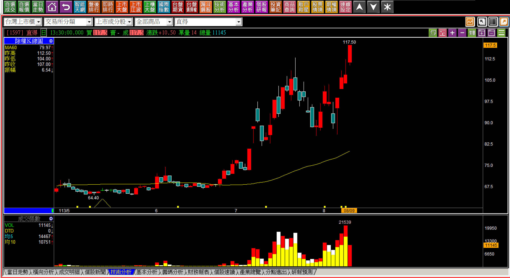
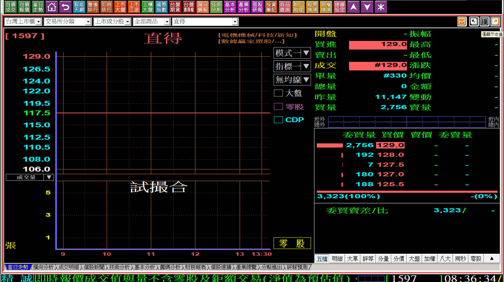
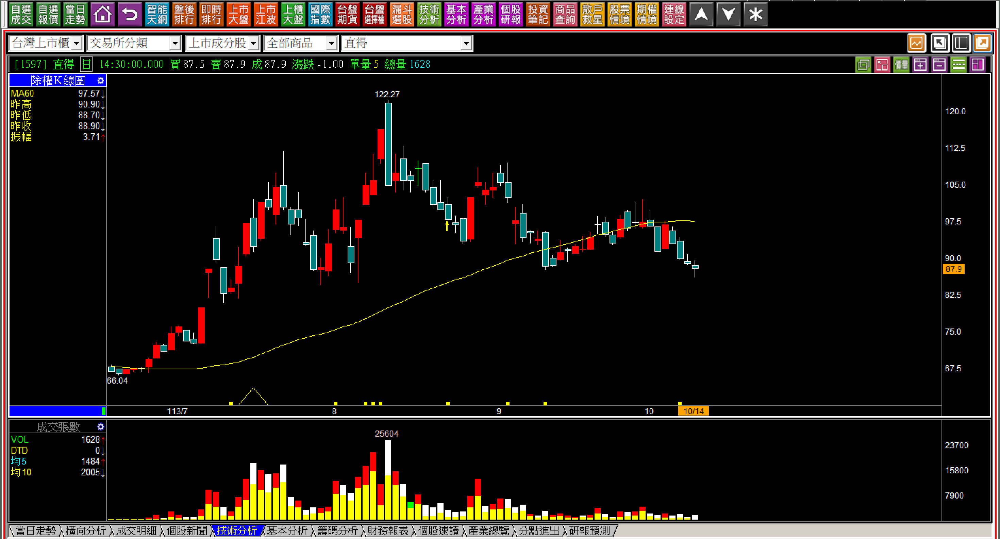
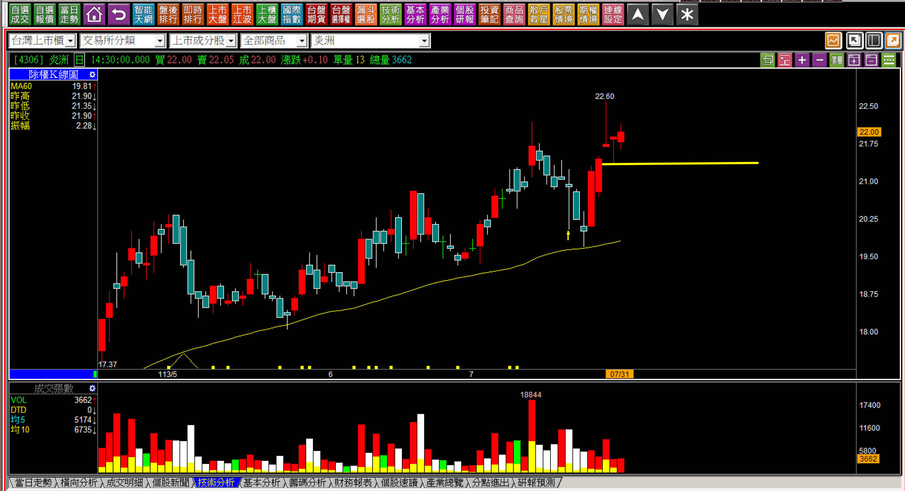
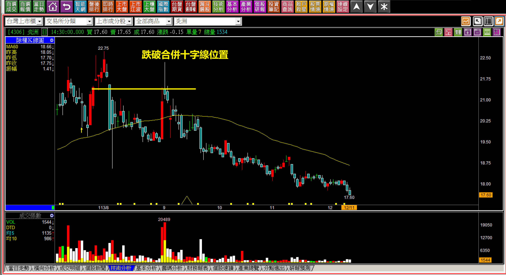
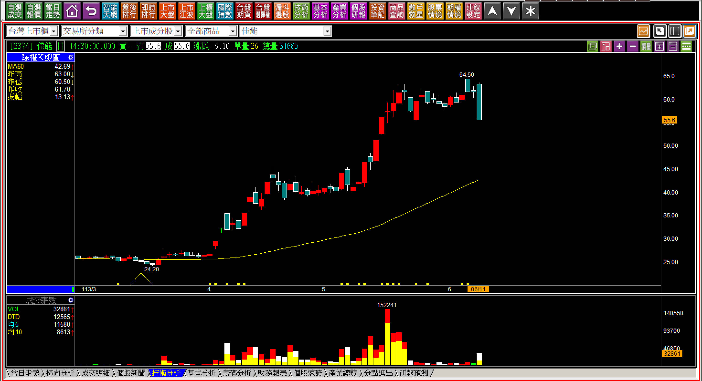
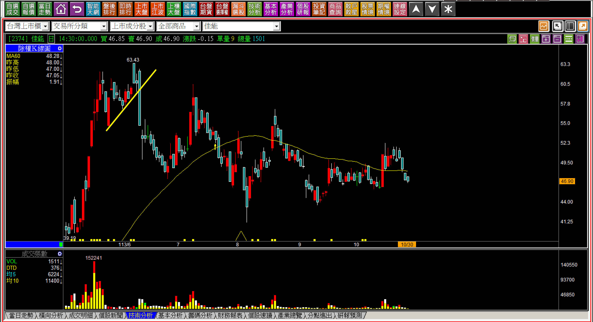
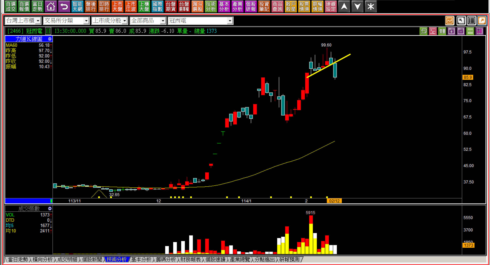
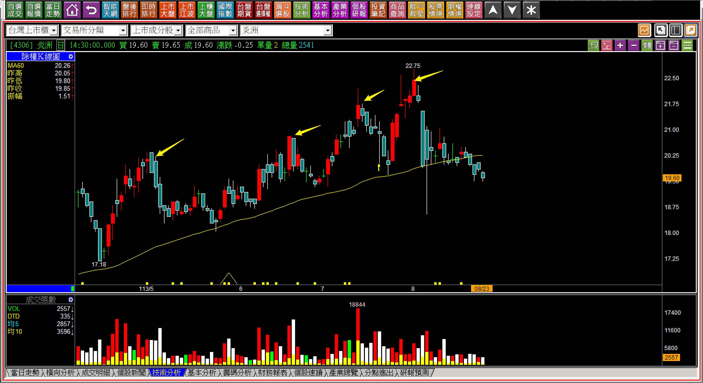
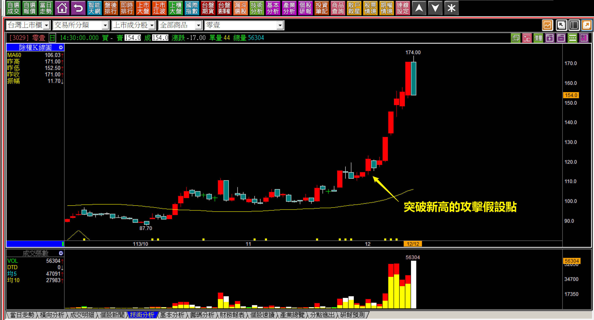

# 【明日K線】「不攻擊」篇

所謂的不攻擊，指的是「這次的突破」並沒有真心要攻擊的意思，並非以後都不會再攻擊了。對於價差交易來說，時間、時機的掌握很關鍵，所以這次沒有要攻擊，就可以更換一個選擇。

對於「明日K線」的這個概念來說，不攻擊的確認是多頭時期交易中最實用、常用、且幫助最大的一種，不過如果是遇到空頭市場的時候，就等於幾乎無用武之地，因為沒有攻擊股就沒有不攻擊的問題。

這幾年在股市裡常態交易的人感受不到，以前那種動轍一年半空頭、長期萬點都是夢的時代，根本就談不上攻擊，趨勢是最好用的、轉折是最重要的。

不攻擊，是一個判斷點，應該攻擊卻不攻擊，就像是汽車停在馬路等紅燈，到了綠燈時卻不開出去是怎樣？大約就是這樣的狀態，結果還倒車，這怎麼能接受？

**突破後的不攻擊**

突破前高，經歷過攻擊意圖(突破頸線前稱之為賣壓化解)，這是最簡易看出的一種變化。

雖然每一檔股價的賣壓化解要花多少資金都不一樣，但是我們需要先假設這次突破的目的是為了拉抬，然後若再跌回而確認不攻擊才停損，所以明日K線的角度就是「攻擊假設的失敗，就是不攻擊」。

同時還有開盤看起來像是要攻擊，結果卻不是真心的狀況，先跌破回補跳空缺口，再跌破攻擊假設的「高檔長黑」。

**113-08-09直得(1597)**

辨識點就是創新高的第一天，股價突破前高，不僅如此，當日還漲停板，表示對於很短線的交易者來說，還有「攻擊成本」可以當作攻擊態度的判斷。

明日，先看有沒有出現攻擊企圖，如果是跳空攻擊，就簡單了，只要股價沒有回補跳空缺口，都在可以接受是有攻擊企圖的範圍，如果是推升攻擊，就得要突破早盤第一個高點。

**隔日的走勢判斷**

盤前預掛漲停，已經是一種假象的警訊在先，才不到五分鐘跳空攻擊的缺口就被回補，也是跌破攻擊成本。

表示攻擊態度非常薄弱，已經看不出來攻擊企圖，假如連攻擊假設也就是前一天低點都跌破，就等於確認這次的突破並不攻擊。

真正的短線價差交易者，不會等到股價都已經變成了高檔長黑才發現，而是前一天低點跌破，表示攻擊假設已經失敗，就應該已經有答案。

高檔長黑是給空手者確認這一檔短期內都沒有進場交易意義的組合。

對於不攻擊，也有很普通的走勢，缺乏攻擊企圖沒這麼明顯，還需要辨識其中的攻擊意願低落，可能還要再創新高後明天的明天才出現，只不過這在每一個明天裡，都有跡象可以預先有所防範，因為有可以拉抬的契機卻根本就不拉，本身還是一種警訊，即使還沒有跌破停損價。

**113-10-14直得(1597)**

對於價差交易者來說，股價如果兩個月不攻擊，早就已經完全不符合價差交易的需求，因為這樣也要用忍耐等待的態度，那就等於沒有任何標準了，萬一遇到一路下跌，就退出股市了，所以這次不攻擊的第一時間發現，對於交易判斷是很重要的。

**113-07-21-炎洲(4306)**

合併上下影線成為十字線的攻擊假設，本身第二根已經是跌破創新高上影線低點了，但是合併成十字線之後隔天如果進場買攻擊，這樣「合併十字線的低點」就成為新的假設位置，跌破就是沒有要攻擊的意義。

**113-12-11-炎洲(4306)**

結果是三天後向下跳空再跌破，不攻擊的狀態出現之後，即使是短期又反彈一次，意義也不大了，對於價差交易來說這就是高風險的交易選項。

**「高檔推升整理」的不攻擊**

高檔整理主要的表徵是「推升低點」，也就是股價在相對的高檔，狹幅整理幾天，但是K線維持在某一個狀態，低點相比之下有緩步推升的樣貌。

既然花了時間花了錢，搞了多日高檔，應該就是要拉抬上去的目的。不過也有某種可能性，根本主力就沒有拉抬的意圖，只是做假動作。

這種不攻擊的直接表徵，就是股價跌破這一段「高檔推升」的格局。

**113-06-11佳能(2374)**

在這根黑K出現之前，股價有兩週以上是維持的慢慢把低點推高的，是「高檔推升」的攻擊型態，卻突然有長黑把這個攻擊型態給改變，試著站在主力的角度看，過去兩個月花這麼多錢拉股價，願意股價被人這樣賣下來嗎？

所以這就是主力自己所為的可能性非常高，明日起有高很容易就又被賣出來。

**113-10-30佳能(2374)**

經過一段時間之後，很明顯就理解當初的預判，股價經過半年都沒有攻擊，頸線位置也開始浮現，當初推升型態一被跌破，交易者就應該有所警覺。

**114-02-12冠西電(2466)**

攻擊的起始也會遇到還沒有跌破攻擊假設，但是型態上卻跌破了高檔推升，這種狀態也是屬於「不攻擊」的走勢，只不過如果遇到短期已經有明顯的漲勢，就算回檔散戶也不會去追買的，股價要馬上跌也沒有那麼容易。

**慣性的不攻擊**

次數多了就是一種慣性表現。

當我們理解了不攻擊的荒唐態度，就會對下一次又站到路口的車子小心，因為這可是有不良紀錄的。股價也是如此，總是不攻擊，這個主力的心態非常可議，所以第二次以上又賣壓化解之後，隔天即為判斷重點，當然也是明日走勢開始之前就可以先有數。

**113-08-23炎洲(4306)**

不攻擊是一種態度，常常不攻擊就是一種慣性。

同一檔股票往前推，創新高之後馬上就不攻擊，是一種主力的習性，所以遇到沒有攻擊也不必意外，慣性的不攻擊股，通常應對的策略就是下降買進的部位以降低風險。

所以每一個創新高出現的時候，隔日就往下變得很正常，因為有著不攻擊的「慣性」，炎洲這類比較麻煩，因為不是突破後立刻跌破，而是過幾天才向下跌破。

為什麼不直接說這種類型出現就不進場交易，因為慣性還是有可能改變，因為主力找不到可以玩的，認真玩就會變成快速拉抬，之前教學過的零壹(3029)出現過不攻擊慣性改變，所以攻擊假設還是必要的標準。

**補充說明：113-12-12零壹(3029)**

有著不攻擊慣性的零壹，又突破一次前高很容易讓人聯想以前的不攻擊慣性，但是在攻擊假設跌破之前，還是沒辦法確認，只能警覺有「又不攻擊的可能」，標準依然是得使用攻擊假設。

**不攻擊與攻擊結束的共通點**

不論是違反攻擊原理，或者是看起來有攻擊姿態卻不攻擊，或者是股價的拉抬完畢結束，都是回檔，這就表示要確認股價已經不會再往上，都是在下跌的狀況確認。

因此，如果還沒有確認之前，開盤往上走，股價持續拉高、再創新高都還沒有開始回檔，都沒有認定不攻擊的必要。

人性習慣防範未然，想先反應著等，又容易被環境嚇到，像是美股大跌、台股大幅高低震盪，自己想賣就想盡量高賣，趁股價有高賣一賣的心理，就會變成股價有高盯著看蛛絲馬跡，股價跌下來變成想等拉上去賣一趟，最後對攻擊狀態的K線產生錯判。

習慣高賣、低買的人，通常就沒有明日K線的認知，也比較難賺到大的整段，往往都是當日賣的時候逢高會很開心，後來看到股價繼續漲就後悔了的短線心理。