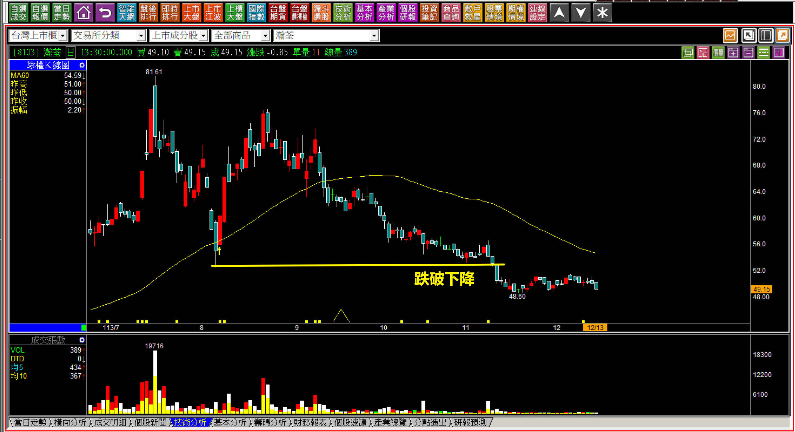
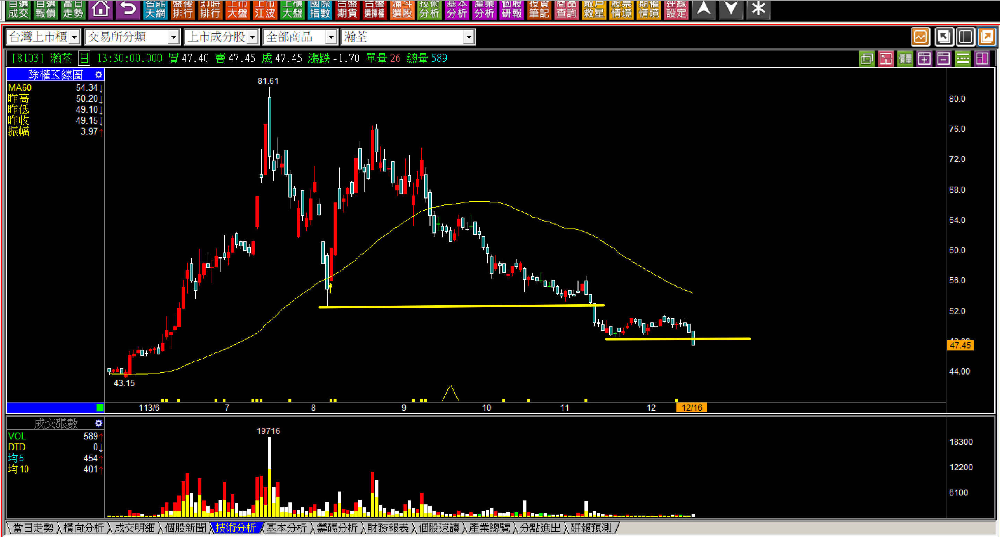
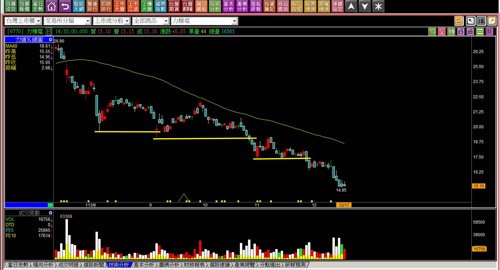
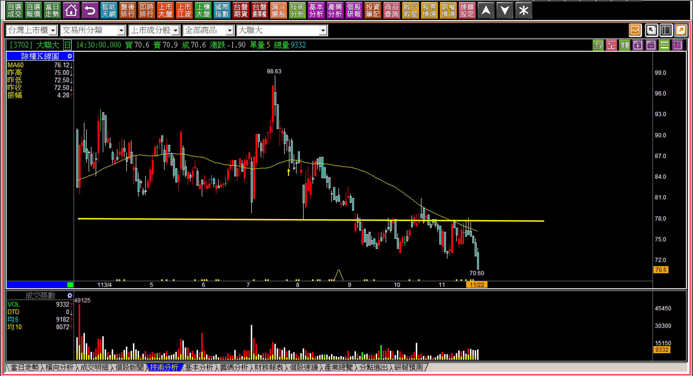
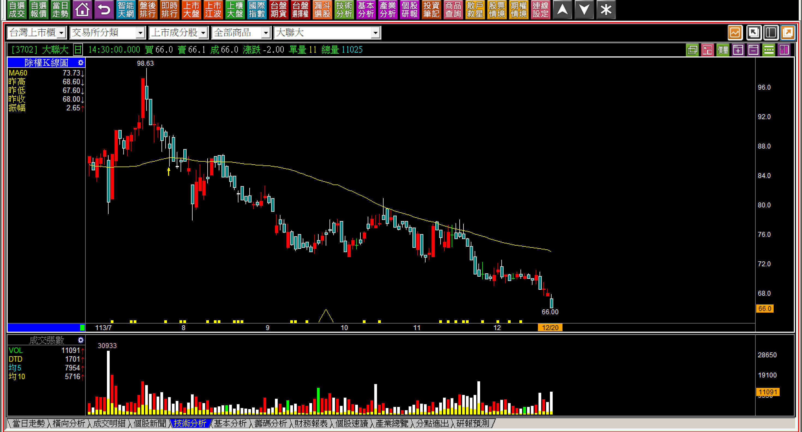
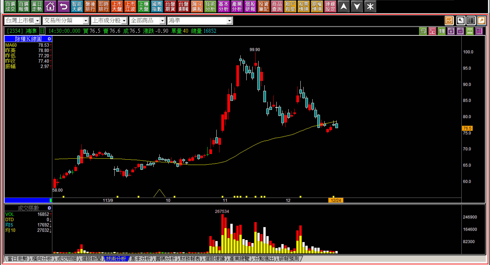
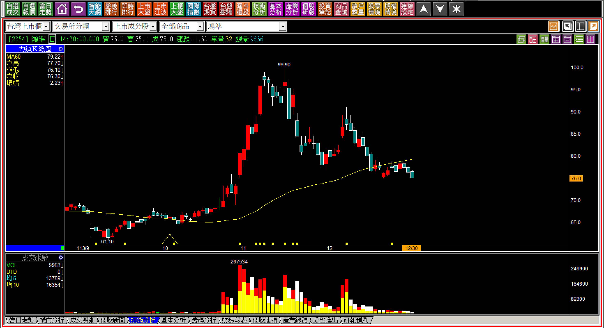
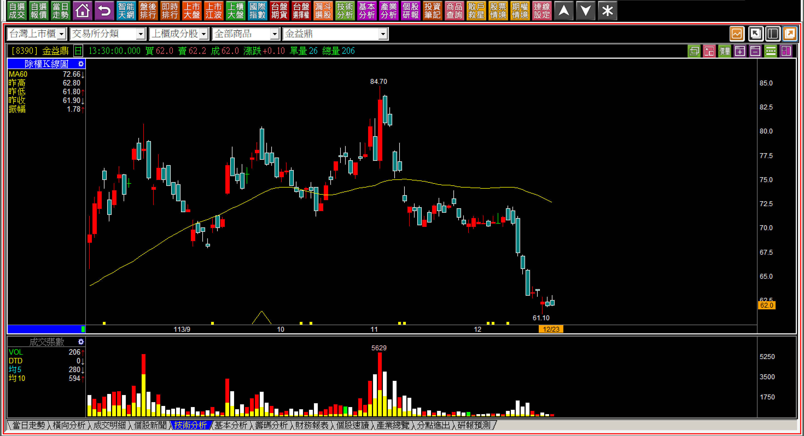
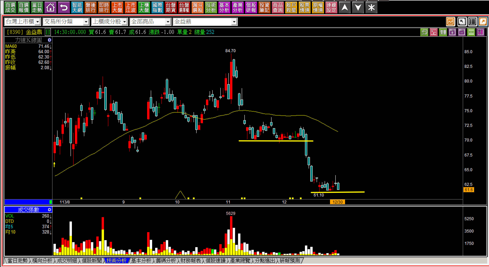

# 【明日K線】從下降三法的可能進展到「下降中樞型態」

「下降三法」與「下降中樞型態」，其實差距就只在中間的整理期，當然，破底時間越久，對趨勢而言是越不利的。

下降三法的定義是「黑K之後中間整理兩天到三天」而已，如果超過了三天以上，再往下跌出長黑，就是下降中樞型態了，只不過這個世界是報喜不報憂的，上升三法有人教，下降三法沒人愛，其實對於K線的判斷者來說，都得要看得懂，避開風險遠遠比取得獲利重要得多。

因為如果沒避開風險，就等於直接「失去了下一次的獲利機會」，因為資金被卡住了。散戶就是因為這樣，所以總是在空頭之後，下一波最強勢的多頭賺不到，因為之前就被卡住了資金，哪來的信心去把握下一階段強勢股？

這就表示，假如盤面中沒有機會的時候，空手並且保持對攻擊股的觀察，比起破底「見獵心喜」想找別人錯過的低檔機會，正確多了，這一點希望讀者可以體會，最壞的時代有最好的機會，那是指整個股市空頭市場已經跌超過三個月以上，績優股也被亂殺一通的時期；假如大盤正常，只有某些個股破底，那就很慘了，因為很可能是產業基本面變差，並沒有搶反彈低檔投資的意義。

下降中樞是上圖的右邊，中間狹幅整理，明日K線指的就是一旦跌破中樞，就是短期內再有新低價的意思。

**下降三法是急跌，下降中樞型態是慘跌**

下降三法對於短期股價變動來說，等於是四到五個交易日就出現很大的跌價損失，是一種急跌的表現。

人心常常是伺機而動的，如果觀念有偏差，就會以為低檔買進就是機會，其實卻是風險，這是因為低檔只不過是現在看到對比過往高價的樣貌，實務上是根本無法確定真正的低點，所以買低，如果遇到了更低，就等於陷入了套牢漩渦。

下降中樞型態則是一種偏向趨勢型的走法，尤其是中間的整理型態是中期的低檔區域，這也是為什麼市場習慣的說辭「底部型態」很危險的原因，因為股價低、卻多日都沒人要大量買進，很有可能並不是真正的低，是乏人問津，散戶卻打算假設這就是底部型態，還試圖找看看完不完整？算是一廂情願的判斷。

極有可能會出現的就是下降中樞型態，意思就是空方趨勢將會繼續延續下去。

**113-12-13瀚荃(8103)**

我們就不討論上半年七月份以前的攻擊走勢，那當然是主力為之。

八月份之後很明顯的看出主力已經完全出貨退場，只剩下散戶在玩買拉回買低檔的遊戲。直到十一月跌破創下攻擊結束以來的新低價時，就已經可以確定頸線跌破進入了空方趨勢。

以上圖來說，就是只差一步就進入下降中樞了，等同這檔股票的價格陷入了再破底的風險之中，關鍵位置就是如果再來一根長黑，就是下降中樞型態出現。

**113-12-16瀚荃(8103)**

可能有人會想，股票不是至少應該有公司基本價值嗎？總不可能無限制的跌下去吧，所以是否應該要找低檔機會做長期投資的打算呢？

這就是我想說的，人們往往高估自己對於跌價的承受能力。或許可以買在低檔願意長期等待，但是等到低檔、繼續下跌時，耐力就得要接受極大的考驗， 不一定撐得住？散戶自以為撐得住，往往只不過是不要打開APP，等到收盤再自我安慰而已。

**投資人自以為可以承受的範例**

短短三年的時間股價一路從80元跌到剩下15元，年初還有30元，年末就腰斬。雖然這一檔並不算是下降中樞型態，但其實整個走勢比下降中樞更慘，沒有任何節奏的走向空方波動。

所以假如我們面對的是下降中樞型態的中間整理過程，就還有機會「不要碰觸」，依然形同趨吉避凶的能力。

**只差一步進入下降中樞走勢**

因此本文教學的要點結論，就是面對「可能再出現一根黑K」，就會變成下降中樞型態，千萬不要小看這個判斷要點，因為一旦沒有注意到，很有可能最後不是嚴重的套牢，就是越攤越平最後只能退出股市等待解套。

**範例一：大聯大(3702)**

從跌破前低開始，就要想著，如果股價從這邊開始進入橫向整理，超過三天以上就變成了有下降中樞的可能性。如果是這樣，不但是頸線反彈遇壓，股價跌出空方波動，還創新低，再往下走下降中樞，這是投資的噩夢。

**113-12-20大聯大(3702)**

現實中，我認識的人就有人陷入了這個漩渦，就因為沒有意識到風險，這個風險可以用下降中樞型態發生的可能來理解，以免自己進入了「攤平、再攤平，股市以後跟自己無關」的窘境。

**範例二：鴻準(2354)**

不論股名是什麼，當我們看到跌破回檔之後的新低，然後股價開始橫向超過三天，就等於「只要不反彈，都還位於下降中樞型態的風險之中」。

**113-12-30鴻準(2354)**

雖然結果還未定，還沒有來一根明確的長黑，大家也可以再檢視結果，然而這又再一次證明了「買低風險遠比買攻擊高」的邏輯。

**114-03-28鴻準(2354)**

雖然跌出下降中樞沒有立刻就一路破底，但是下降中樞是一種極弱勢的表現，對未來的研判不見得是「明日」，可是可以理解未來的走勢應該會如何。

**範例三：金益鼎(8390)**

我個人並不討厭金益鼎這家公司，但是K線圖說出來的故事，就是股價隨時處在下降中樞型態繼續的情境之中。只要具備風險意識，就一定會看得懂，不見得股價一定會跌，但是風險遠大於機會。

**113-12-30金益鼎(8390)**

與鴻準一樣，現在又都再次進入了下降中樞型態的可能。下降中樞的判斷，下降、中樞、下降，對於價差交易者來說，往往非常有效果。