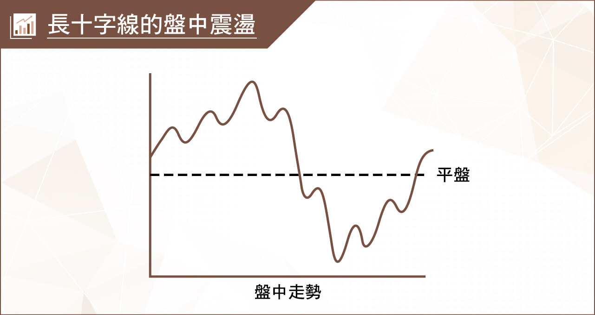
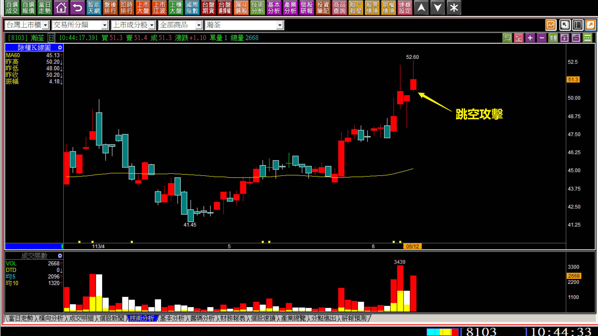
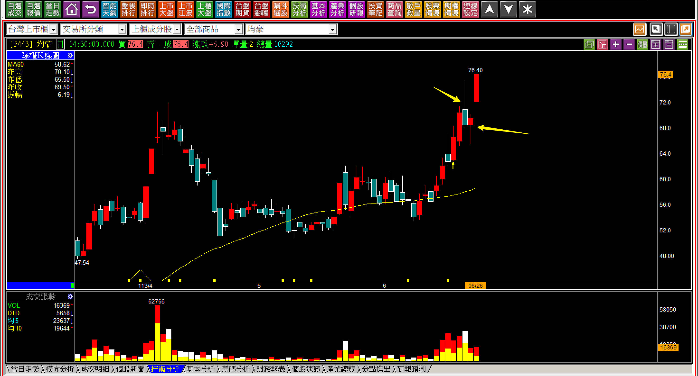
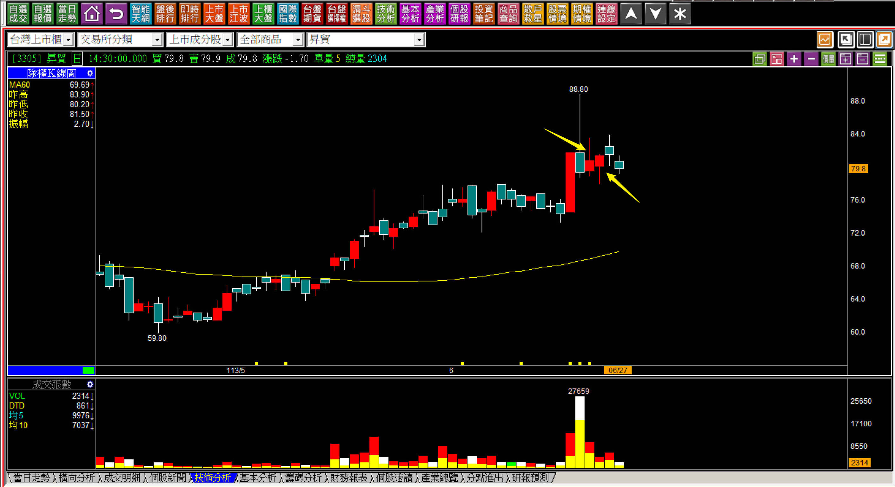
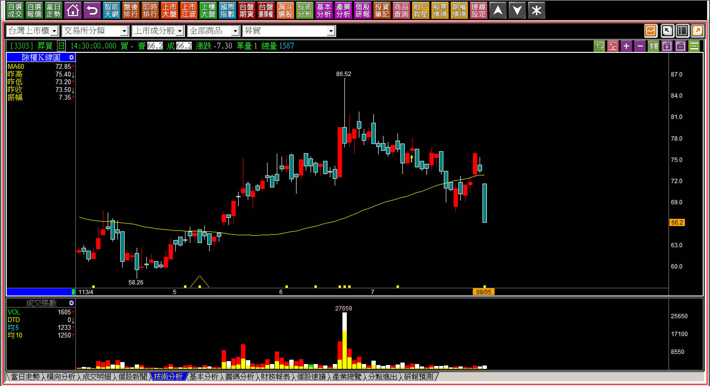

# 【明日K線】「合併十字線」篇

合併K線對於「沒有」K線判斷思維的投資人來說，算是很複雜的技巧，因為怎樣的狀態下合併？要不要合併某兩日？合併起來看又是如何？都是直覺思考就會遇到的問題。

其實合併二字沒有門檻，意思就是任何K線、任何天數都可以合併，只是要想一下合併起來要幹嘛？例如把週一到週五的K線合併起來看，就是週線，想要用週線看當然可以，問題是合起來看有沒有意義？因此可以說明，合併起來要有意義，當然就是以「所處的位置」當作為考量。

假如這是個關鍵變化的位置，合起來之後也是一根有意義的K線，就可以進入合併的範圍，意思就是把兩天的盤中走勢合起來看而已。

位置，當然是攻擊與否的判斷最為明確，所以就是「剛」創新高之後；力量意義，當然就是力量型K線，主要就是長紅黑、長上影線、長十字線。

通常紅黑本身就已經算是一股力量，所以不用合併就已經有答案，上影線單一根的判斷已經很清晰，人們的誤解是上影線代表壓力，釐清之後可以知道剛創新高的上影線代表盤中有過攻擊的力量，更容易混淆的是長十字線，尤其是一根上影線加上一根下影線，合起來變成的「長十字線」。

**先知道長十字線的力量定義**

要把兩根K線合併看，且合併起來變成長十字線，就得要知道長十字線的力量意義。

股價在剛創新高的位置，長十字線代表的是盤中有過先上漲的拉抬，然後跌下去翻黑，在經歷一次往上拉，由於是在股價創新高狀態下，這兩次拉抬都是在意股價不希望股價就這樣跌下去的力量，這也是攻擊意義的來源。既然是攻擊意義，就是先有上漲，才有下跌後的往上拉，不會是反過來。

因此合併成長十字線，通常也是一根上影線、加上一根下影線，才更有力量意義，假如先下影線，再上影線當然也是可以，不過這樣就只需要看上影線就好，因為創新高的上影線也是攻擊過的意義，就不需要合併前一天了。

**合併長十字線的「明日」**

既然長十字線在剛創新高的位置，代表的是資金力量存在的意義，那就需要理解，主力資金可能各種姿勢都會做，卻不會給市場散戶有太多機會可以拉回低接，尤其是創新高代表的是賣壓化解過後，等於是剛剛經歷過賣壓化解的過程。既然主力花了大錢把套牢者的籌碼吃下，就沒有理由讓還沒發現剛創新高的散戶，或者當沖客買進更低的價位，所以既然合併起來是長十字線，原因是什麼不考慮，隔天就要開始攻擊。

**攻擊的開始有兩種方式：跳空攻擊、推升攻擊。**

**113-06-12瀚荃(8103) 10:44**

這是開盤後一小時半的K線走勢，重點在於一開盤就往上跳空。

對於明日K線來說，既然呈現出賣壓化解創新高，只不過多整理的一天，成為合併十字線，那麼明日，就得要出現攻擊企圖，就是明日K線的要點，如同上圖，隔日跳空攻擊就是「攻擊企圖」。

**113-06-26均豪(5443)**

箭頭所指的就是上影線加下影線，可以合併起來成為十字線，且位置就在剛創新高的狀態，那麼明天的重點就得要攻擊，且這是一定要發生的，無法變成後天、大後天，因為關鍵就在於攻擊企圖的呈現。

對於明日K線來說，當你收盤確認了K線圖兩根合併就是長十字線，位置也沒有錯誤，表示股價已經具備了攻擊意圖，隔日就得有攻擊企圖，以上述的例子來說，隔天一開盤跳空就是確認攻擊的開始。

**沒有合併理由的十字線「沒有」意義**

對於交易K線判斷的新手來說，常常會混淆的就是「位置」的條件，也就是學完了合併，就想找任意兩根來當作合併的學習的話，就會忽略的位置才是關鍵。

**113-06-27昇貿(3305)**

上圖可以看出，創新高的位置是六月二十一日的上影線黑K，並不是後來兩根上下影線，所以就算把這兩根合併起來，依舊沒有任何攻擊的意義，而是上影線的低點如果跌破，就是沒有攻擊的企圖。

假如沒有合併成為十字線的理由，也就沒有明日K線判斷的意義，反倒是很單純的上影線的低點不要跌破才是停損判斷的標準，這一點透過攻擊假設就可判別，既然是這樣，股價剛好在兩天後跌破攻擊假設，沒有繼續期待攻擊的必要。

**113-08-05昇貿(3305)**

用這張圖來說明，只不過這與明日K線的關聯不大，談的是跌破攻擊假設後的股價走勢而已。

對明日K線而言，有些是單純關鍵點，明日以後不管哪一天都可以，都是觀察重點，但是對於攻擊來說的明日K線，創新高的關鍵點，有些「明天」就得表態攻擊企圖，沒表態就沒有，「合併十字線」就是這樣的類型。