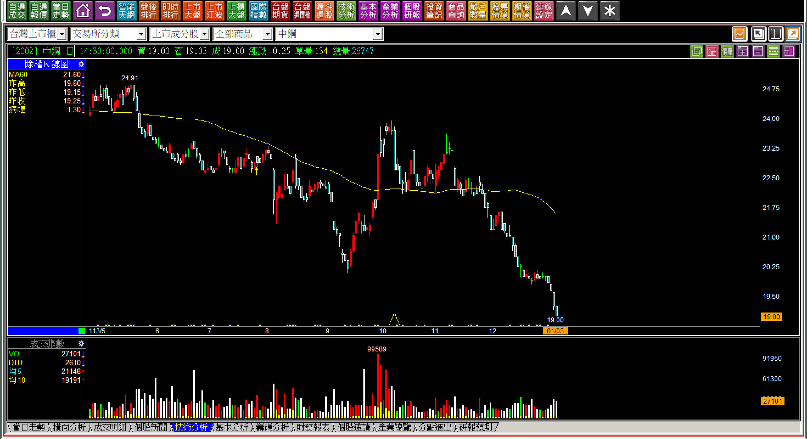
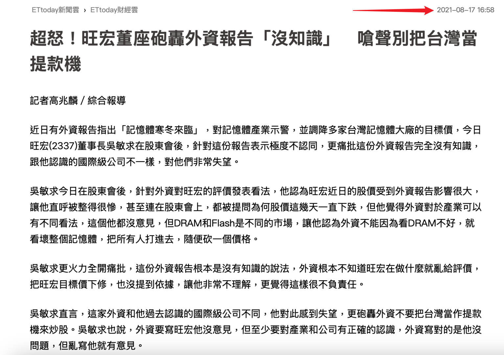
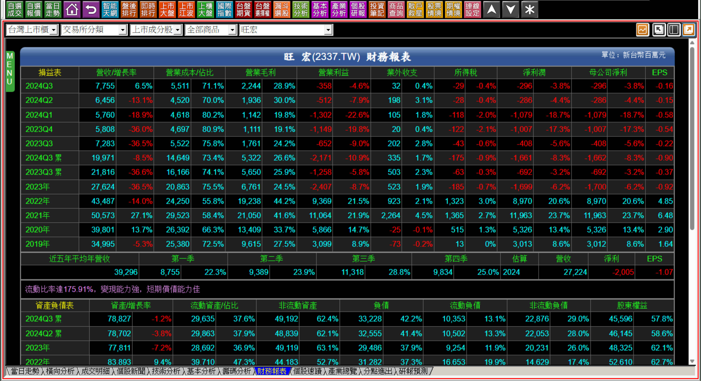
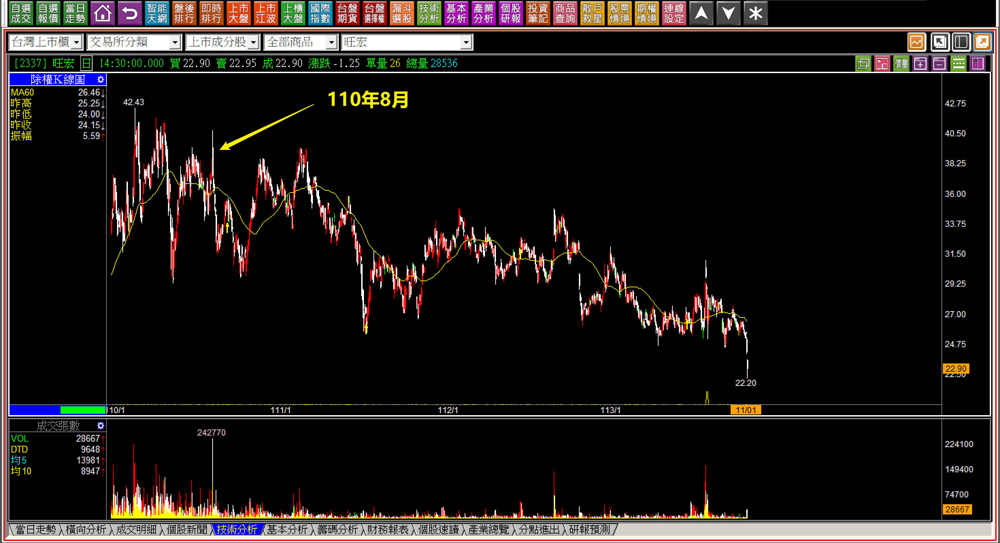
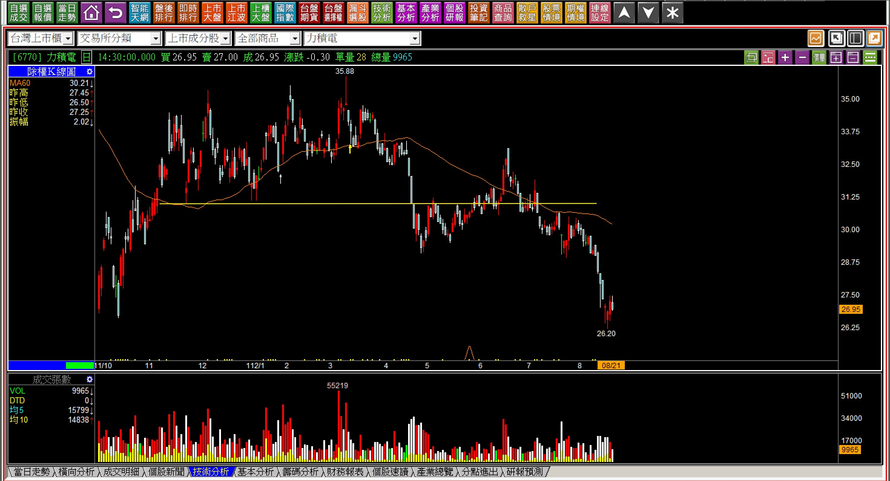
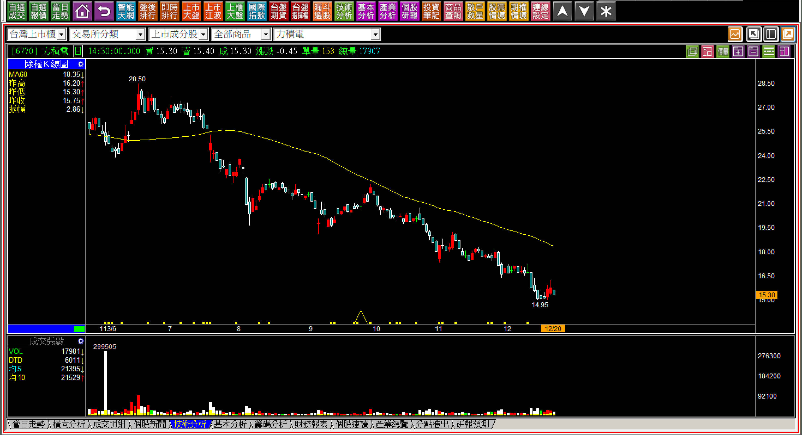
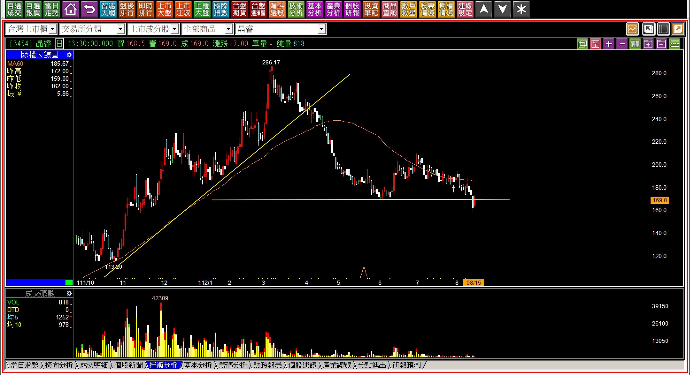
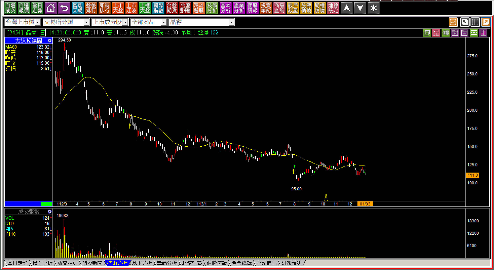

# 【明日K線】從「破底股」的糾結談接下來的走勢

這是一個長期會被人遺忘的議題，其實對於K線邏輯來說很簡單，「破底」跟「創新高」性質有點相似但是方向相反，當股價創下新低的第一天，就被稱為破底，可是投資大眾通常不喜歡這種話題，當然也就不想研究。對創新高有著恐懼追高的心理，就會反過來以為股價越低越是機會。有時候還會想著，有沒有最低檔的反轉訊號出現ㄉ。

但是遇到了破底，等於股價剛進入、或者已經進入空方趨勢之中，未來呢？暫時只有一條路，就是空頭走勢。面對空頭人們往往比較有興趣的只是空頭何時結束？這與兩件事情有很大的關聯：**什麼引起的破底？發生過什麼之後的破底？**

既然主題是明日K線，談的是「自此開始」的K線走勢，就得回顧破底的原因到底是什麼。

**範例：中鋼破底再破底**

不談到底已經跌價多少，破底之後馬上再跌三根，這種損失誰都不想遇到，卻在攤平的投資心理中直接承受跌價，原因很有可能就只是懶得認識股價變動原因，就想無腦存股的心態，這是大多數投資人的通病。

原因當然現在都知道了，中國大陸的傾銷。但是當初第一次破底時並不是那麼清楚，所以股價破底就得想辦法知道為什麼原因，不會是無腦低檔投資就行了。現在很多根本不研究股市的存股族，被慘套在這檔上，都是不認真研究，就想買買買不要賣的人。

**破底之後的明日研判**

研究破底類型之前要知道，基本面有趨勢性，股價也有，兩者不一定同時同步進行，通常是股價先行，也就是股價先轉弱、甚至破底，市場後來才慢慢知道，甚至公司自己才慢慢知道原來原因是因為營運衰敗。

你可能會想，怎麼可能公司不知道？

當然，因為很多上市櫃公司老闆都是自我感覺良好的，因為他們長期在自己的帝國世界生活，旁人都是員工或者依賴他生活的人，講出來的話都不會忤逆老闆，更多是附和拍馬，有真話放心裡，慢慢養成了老闆的越來越自大問題，最明顯的例子就是旺宏。

110年八月媒體報導，旺宏的吳敏求怒斥外資炒作股價，直言外資評論記憶體寒冬的形容跟他看到的訂單狀況不一樣，詳細內容大家自己看一下報導，但我相信大家更有興趣的是，到底是外資有問題還是老闆太天真？

報導的當年度每股盈餘6.48元，一年多後才轉盈為虧，股價就不用看了：「慘不忍睹。」那到底是誰錯了？

其實股市投資裡向來都是看未來展望，並不是看已經發生的過去，所以兩個角度也都算是沒有錯，慘的是看不懂的投資人股東而已，這也是本文教學的目的，當股價破底時，明日K線應該要有的觀點。

**113-11-01旺宏(2337)**

只要具備對「破底」的認識，雖然沒有辦法在外資示警時，就立馬相信且脫離危險，但至少面對股價的破底時，不會因為見獵心喜「本來沒事，變成都是自己的事」。

旺宏到去年底時股價僅剩19.5元。

**類型一：產業或基本面有問題的股價破底**

投資談的是未來，也就是我們投入一筆資金相信一家公司的「營運」獲利，如果很顯而易見的，未來不會有希望，這家公司就根本、完全、沒有投資意義。

每次講到這個就讓我想起宏達電，一家從千元搞到百元，還是沒有轉虧為盈，每年都在打空炮的公司，連續虧損九年多之後還是嚴重虧損，股價不到半百，老闆一點也不臉紅的公司，會有未來營運展望嗎？目前怎樣看都沒有，所以破底只是剛剛好，以後還是有可能更慘。

假如沒有嚴重到像是宏達電或者力積電那麼糟糕，但是目前營運受到產業景氣，或者中國大陸傾銷的影響，例如塑化、鋼鐵、LED、太陽能、記憶體、成熟製程......，這種破底就得要等到「原因結束」才可能有投資機會，在此之前都沒有，所以明日K線的判斷非常簡單，就是還沒看到曙光。

**112-08-21力積電(6770)**

破底創新低的股價是26.2元。

交易目地、投資目的都一樣，面對破底的股價，對於未來的判斷就是：只要原因沒有消失，都沒有任何買進的意義，即使你認為自己是抱得住低檔的也一樣，不要因為房價夠便宜而買，以後賣不出去是很嚴重的問題一樣。

**113-12-20力積電(6770)**

股價剩下15元，是在當初破底的時候就應該要已經預期得到的。

這是很簡單的股市生存能力，面對危機的風險意識，不可以事後來一句：「我哪知道會這樣。」因為每個人本來就應該都要知道，股價破底一定有原因，原因沒消失前，無法投資。

**類型二：主力拉抬過後的股價破底**

主力拉抬很像是平靜的湖面被船駛過，改變的湖面的水文波動，等到船開走了，最終湖面又回到原本的靜止，有風也很難像是船馬達駛過帶來的力量。

更簡單地說，股價被拉抬後主力出貨，賣給了看到過高價，買拉回逢低布局心態的散戶，等到股價破底，散戶的買進、攤平、損失嚴重等待解套，讓一檔股票籌碼變得更加混亂，長期都很難再有任何強勢上攻的機會。

**112-08-15晶睿(3454)**

上述股價破底時價格是169元。

這家公司帶給我的經驗很爆笑，曾經我跟一個財經界的資深長輩會議時，當時股價正在最強勢的狀態，一度漲到將近300元，他說他就是買來永遠不要賣的，安全監控就是未來趨勢，拉回他還要大力再加碼。

我很想跟他說，主力拉過的，以後就沒有機會了，可是畢竟他是資深前輩，我算是小小晚輩，就不給建議了。

破底的明日？沒有什麼明日，因為每股盈餘本來就不高，當時也是疫情解封之後產業補庫存的需求作祟，之後只要盈餘衰退，「本益比修正式下跌」才是最可怕的跌價損失。

股價剩下111元。

一切如我所說，但不是我的「預期」，而是多頭樂觀的時候市場人們會結果誤謬的把上漲波動當成未來都會這樣而已。明日K線的角度在破底沒有太多的新鮮事，就是認清曾經被主力玩過的，主力不會再回來的。

**注意事項：當股價破底時，很多人喜歡找低檔買進的機會，例如轉折、下降壓力線突破，這些都無可厚非，不過一定要記得，如果原本股價崩跌的原因尚未消失，那麼股價還是有很大的機會繼續破底，或者，雖然沒有再跌，但是就是倒在地板上下起伏而已。**