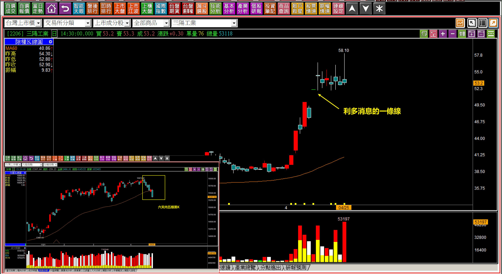
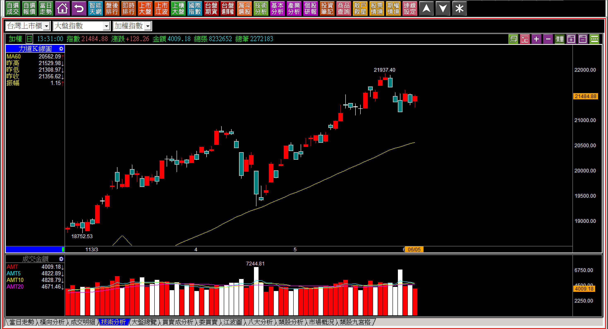
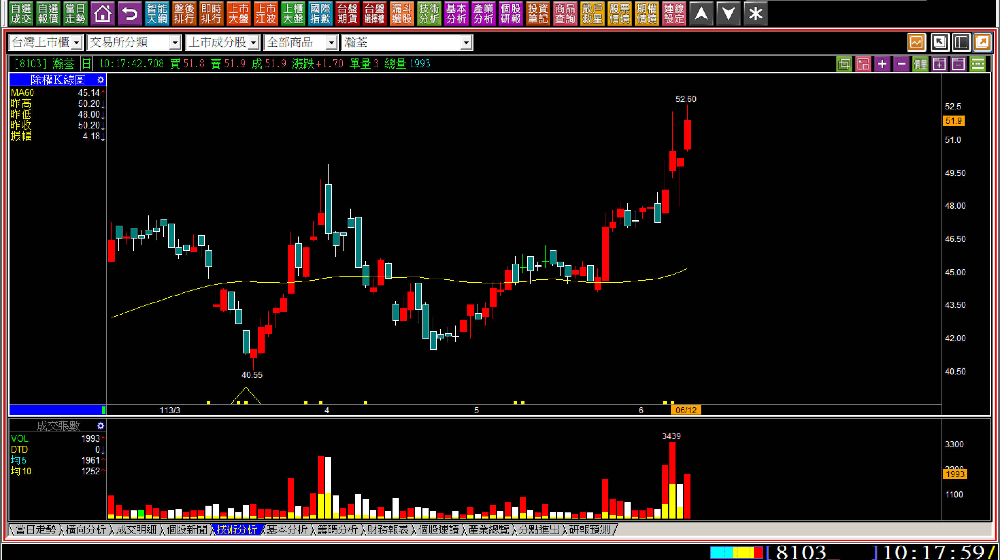
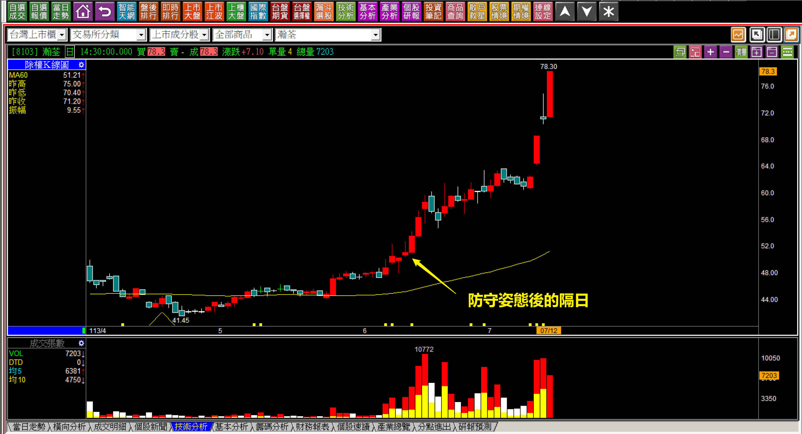
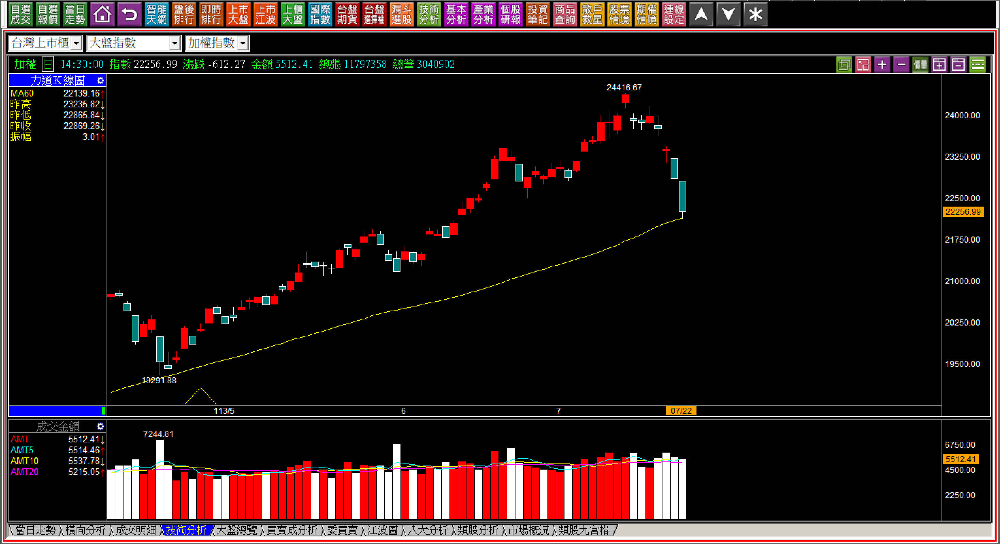
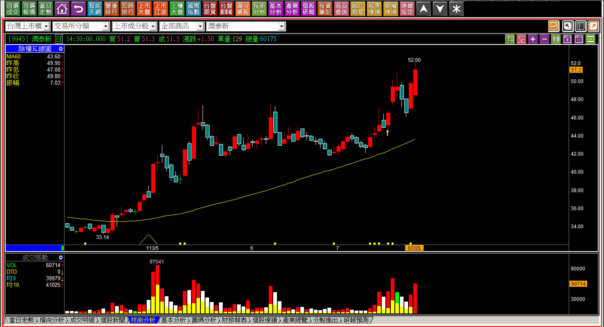
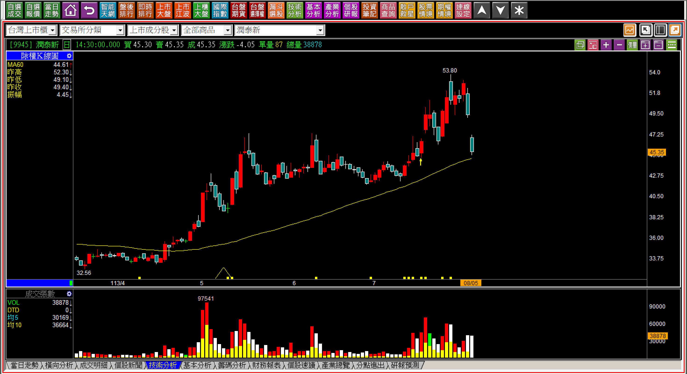
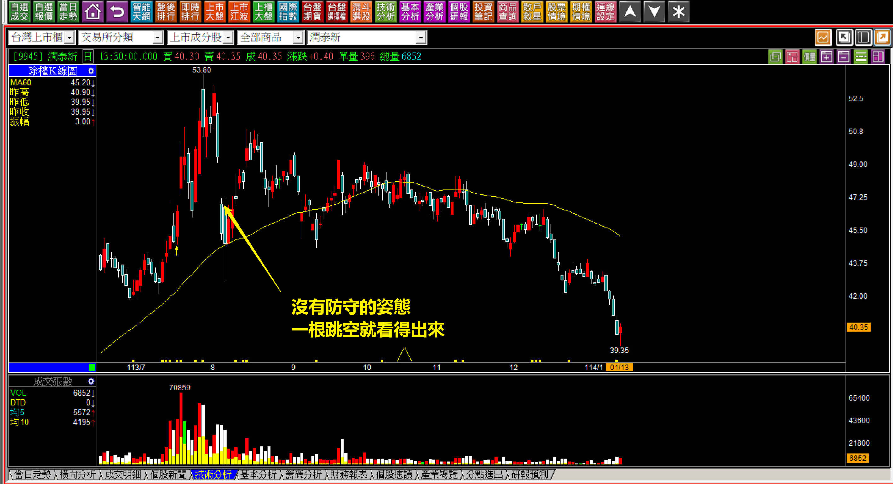

# 【明日K線】「防守姿態」篇

防守姿態是攻擊K線教學的範圍，屬於型態判斷的一環。防守姿態的明日K線，就是股價得防守時，明天到底是攻擊？還是跌破防守價？對未來股價有不一樣的答案。

對於交易來說，這是一種進場、持有與否的判斷，所以「明日K線」的角度檢視股價變化的重點，當然就是股價「是否依然」維持著防守姿態，交易者得要看得懂，就要對防守姿態的嚴格定義很清楚。

防守是一種資金力量呈現，有或者沒有都很清楚，所以K線上得要看得出來股價已經有主力資金進駐，最明顯的類型就是股價已經開始進入創新高「後」，攻擊還不久，但是遇到了大盤環境不佳、甚至是悲觀氣氛濃厚時，股價不管大盤怎樣的跌，都堅守在某一個價位不改變，這只是第一步基本條件都吻合。

再來就是「明日K線」了，一旦攻擊企圖出現，不論是跳空攻擊、推升攻擊都可以，股價會在大盤一穩定之後開始往上攻擊，這個時間點比較明確，就是大盤不佳，隔日趨穩，這一天就應該要攻擊上去。假如沒有，就要堅守看得出來的防守點，主力都把股價拉到創新高了，沒有那種拉不上去的狀況，跌破防守價就是根本沒有要攻擊的意思。

雖然沒有要攻擊，不代表股價就會大跌，但對於價差交易者來說，這樣就夠嗆了，要看得懂，每一個今天都得要對明天做出推演，尤其是持有狀態中，不能被環境氣氛影響，為了減碼賣出獲利狀態中的股票，就是錯失了絕佳機會。

**防守姿態必要條件的確立**

防守姿態如果要當成是買賣交易的判斷點很簡單，但是買進去之後持有部位，就得要有明日K線的判斷。

但是防守姿態的必要條件是已經有主力在其中了，才有人會去守住價位，並不是低檔還守住某個價位叫做防守，如果這樣也當成防守，就跟躺在那的股價，判斷分別不出來。

**條件一：要有主力已經介入，開始花力氣拉抬股價。
條件二：在市場悲觀的氣氛中，股價明顯守住某個價位。**

**圖例解說防守姿態：三陽(2206)**

要用這樣的對比圖，才更感受到當下的市場悲觀氣氛，對比股價的防守有多麼珍貴。利多的跳空漲停板一條線，此後股價都沒有跌回，這就表示在五萬張成交量的背後，是由主力不管不顧的買進吃下才有可能做到，因為當下散戶減碼，也都減手上賺錢的股票。

而明日開始確認「攻擊企圖」，但是明日K線的「明日」指的是哪日？答案就是悲觀氣氛消失的時候。

**對於明日K線角度的防守姿態判斷**

順序上如果是為了短線交易，那就得在大盤開始出現悲觀氣氛時，檢視市場上已經先有拉抬，至少有攻擊意圖在賣壓化解的個股，才去檢視這段時間的防守點。

**113-06-05大盤K線**

先有三天的回檔，這是在市場普遍都認為漲這麼久了也應該要整理一下的氣氛下出現，所以預期中會回檔，股民也一定是想著不要持股水位太高，減碼要減什麼？當然是賣賺錢的，這就是散戶的思維，然後進入三天的橫向，接下來沒人知道大盤會漲還是會跌。

**113-06-06瀚荃(8103)**

股價創下新高，並且在過去的七個交易日，大盤有著暫時轉弱的跡象時，堅守著價格，然後才突破突破前高。對於交易判斷來說，當然是機不可失，因為停損點明確，就是風險固定，接下來等待股價的攻擊企圖，明日開始就要判斷到底有沒有力量的出現。

**113-06-11瀚荃(8103)**

隔天有著創新高的上影線，在隔日下影線組成「合併長十字線」，這一點的確不在當初明日K線想像得到的範圍，可是沒有太大的問題，保護傘就是停損點沒有跌破。

所謂的攻擊企圖，指的就是K線上依然呈現攻擊的力量，因此雖然不是隔日直接來根長十字線，合併起來也在可以理解攻擊的範圍之內。既然如此，明日就得開始攻擊，或者如果不打算攻擊，跌破合併十字線的低點作為確認不攻擊。

**113-06-12瀚荃(8103) 10:17**

這張圖擷取隔日10:17分，完完全全呈現出明日K線教學的意義，一開盤就往上跳空，然後一路再創新高。如果在前一天沒有意識到防守姿態、攻擊企圖可能出現，那就只是一張很一般的K線而已。但是對於理解攻擊原理的人來說，明日K線就是聚焦到股價正常的攻擊表現「應該要怎樣走」。

為什麼明日K線這麼重要？

因為明日K線的用途是一種聚焦，把我們學會的技巧，聚集在「明日應該有的表現」這個點上，有或者沒有？都是答案，看得懂與看不懂，對於交易的績效差異非常大。

**沒有就是沒有**

**113-07-22大盤走勢背景**

短時間內大盤快速的拉回，在這種背景下，一般投資人的決策都是傾向於停看聽，持股要賣也來不及了，就會變成持股過高的散戶，會有減碼的意圖，同樣的，減碼態度依然是賣掉賺錢的，留下虧損的。

**113-07-26潤泰新(9945)**

目前為止，股價的表現都只算是逆勢，所謂的「逆勢」與「防守」不同，逆勢是一種施力狀態，防守是一種籌碼丟出來都照單全收的資金態度。也就是說，只要如果大盤繼續震盪帶來悲觀氣氛，接下來股價不能跌破防守位置，至於防守位置在哪？有時候沒有那麼明確的價位判斷，只能大約。

以此圖來說，就是過去六天的低點，因為這六天是在創新高之後的震盪中。

明日K線就只有一個要點，防守價位不能跌破。

**113-08-05潤泰新(9945)**

開始判斷明日K線時，前五個交易日都還維持在防守姿態之上，可是到了這一天一開盤沒多久就跌破，這就表示股價並「沒有」防守的姿態。

我們為什麼K線判斷不夠，還需要用明日K線的態度檢視？因為人們往往在事情發生之前，都沒有預期到最糟糕的狀態，或者最佳狀態，會不小心自然而然有高想要賣，跌了想加碼，這個邏輯剛好會跟攻擊K線的原理完全相反，是很不利於操作的。

人們最大的問題總是：會、但是做錯或者做不到。

沒有就是沒有，缺口有沒有補？不是防守姿態判斷的關鍵，這邊談的明日K線是防守姿態的前提下，股價已經先逆勢了，但是到底是只有逆勢，還是資金有防守意圖，準備進一步攻擊？那根明日的跳空說明了一切。