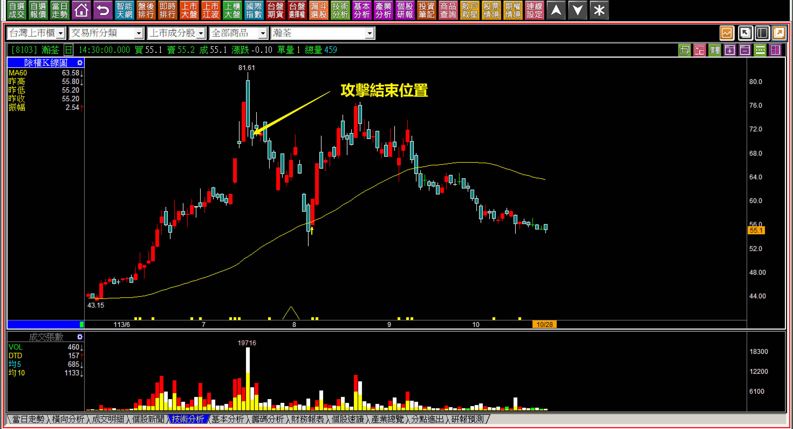
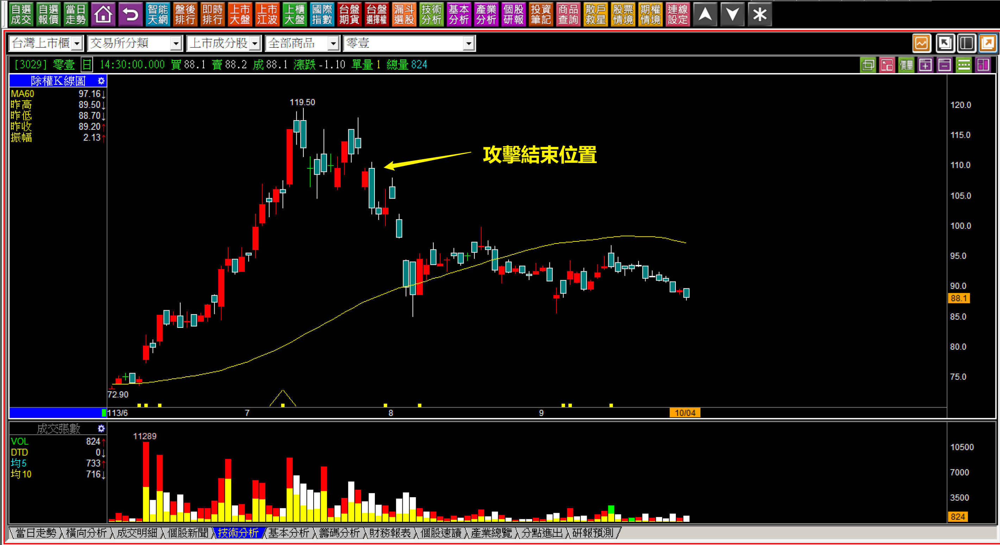
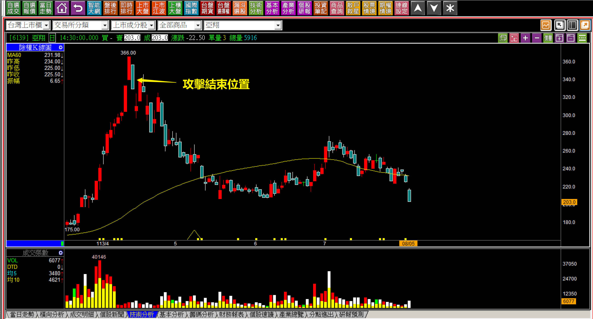
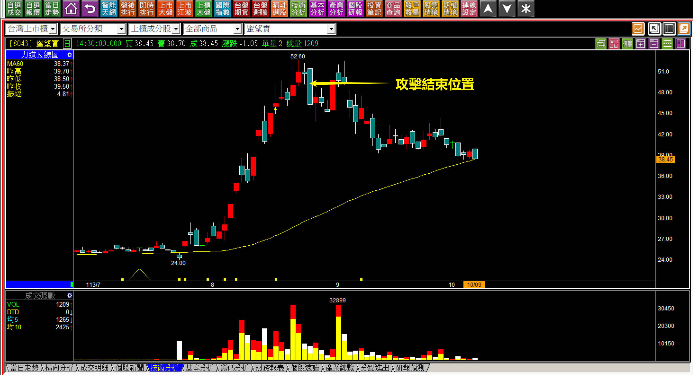
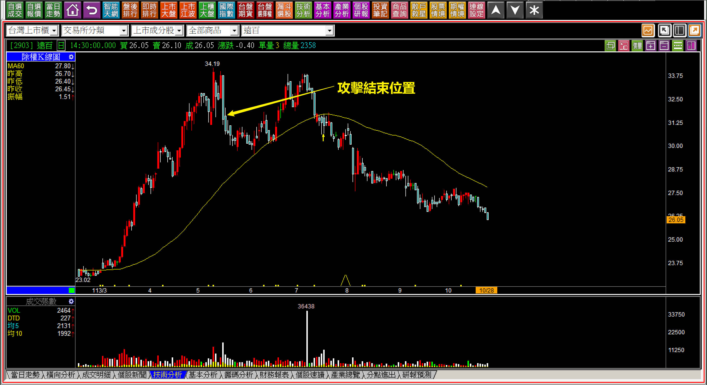
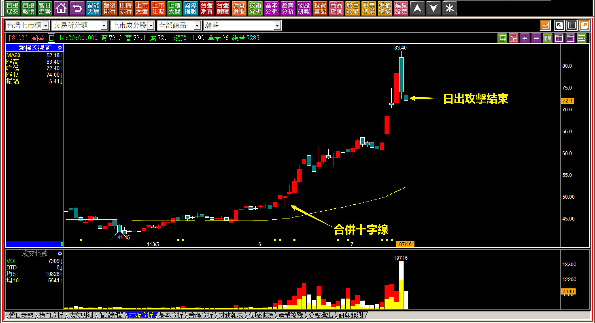
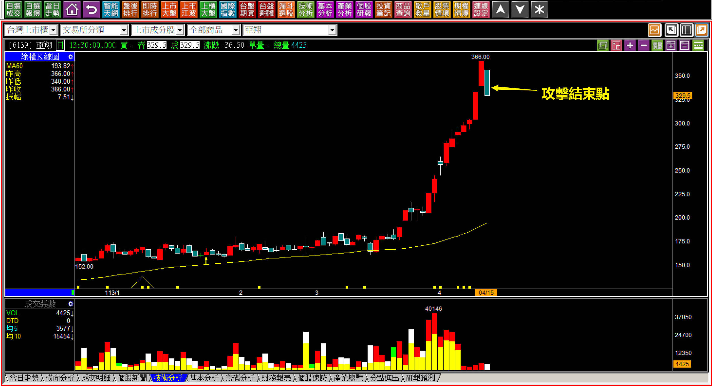
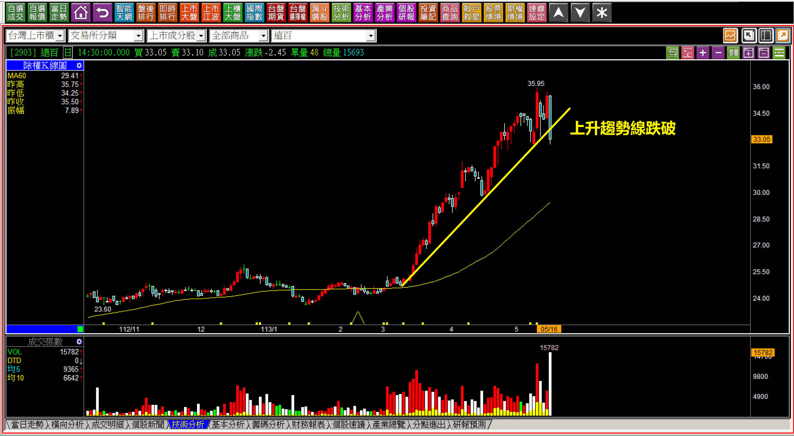

# 【明日K線】攻擊結束之後

這一篇我希望把「K線代表力量」最大變化意義的地方做解說，這是交易中的「出場」位置，且短期內都不要再進場的判斷點：『攻擊結束之後』。

股價是一種狀態，並非實現；或者可以說，是一種流量而不是存量；又或者說是變動的過程，並非營運的最終結果。但是用了各種形容我都覺得還是「狀態」二字最為貼切。

股價是資金堆疊出來的狀態，當資金撤退之後，股價就像堆疊起來的城堡，支架如果不再有力量，就會坍塌，直到下一次又有力量撐起，如果這個形容能夠理解，就明白攻擊狀態之下，是力量展現最大的時期，可是這個力量一結束，過去有過的仰角，就會失去威力。

替換成最容易理解的文字，那就是「攻擊結束」，明日K線指的就是攻擊結束之後怎樣研判？攻擊結束對於價差交易者來說有多可怕？本文採用倒敘方式，呈現攻擊結束之後的明日K線樣貌，先看以下範例回推攻擊結束點。

**範例：瀚荃(8103)**

這些個股在攻擊結束之後，股價表現並沒有任何規律，沒有一定會快速崩跌，也沒有一定會回到最初起漲點，相似的是成交量都開始大幅度慢慢地萎縮下去，回到了過去沒有過攻擊的時期，這就是狀態，當年可能是一灘池水，被風浪挑起之後，現在又趨於以前的平靜。

所以攻擊是狀態，攻擊結束就是價差交易者的最後出場點。自這個位置開始，散戶會進場逢低逢拉回加碼攤平，會有斯德哥爾摩症候群，愛上原本根本就沒有想過要長期投資的股票，慢慢的變成長年持有等解套的包袱。

對於一個認真看待K線做交易的人來說，不會想讓自己進入這樣的境地，因為這樣不只卡住了資金，還陷入虧損的風暴中，會以為自己的錯誤是不會賣，其實根本就是買錯買在狀態過後的拉回，錯誤是犯了錯沒有危機處理，反而風格移轉變成了認定長期投資也沒什麼不行。

這就是高估了自己對跌價承受能力。

**發生「攻擊結束」的時候**

如果正確的理解攻擊是一種「狀態」，就會明白如果狀態不再，股價就可能會跟消風的皮球一樣，最終回到原本的樣貌，尤其是「基本面根本匹配不上股價的時候」。

多頭市場的後遺症，就是時間持續的太久，主力拉無可拉，台股有題材的都拉過了，就會開始找籌碼穩定的標的，尤其是傳統的績優股，可是當下卻是話題十足到處有人找受惠股，根本沒注意到完全沒有題材的傳產，宏全、遠百都是這樣的狀態下起攻。

**「攻擊結束」的明天開始**

除非是明顯的日出攻擊，日出攻擊結束的價位是確實的停利點之外，攻擊姿態要確認結束並不見得都很容易，當然，最後停利點是趨勢線，簡單的就是上升趨勢線被跌破，或者是波動狀態下的前一次低點。攻擊結束點之後，未來只有一個走向，就是開始採取任何可以看得出來的「弱勢」模式。

股價依然還是有漲有跌，只是跌多漲少、跌大漲小、跌深漲淺。

要繼續檢視當然可以，不是快速的崩跌，就是採取區間來回再跌破箱底，或者呈現波動狀態，只是大多數人沒有耐心看著弱勢股，這個檢視不做，等到一大段時間過去之後，就又重回投資人眼中的低買高賣，底部進場而已，然後再回到許多人會問的：「賣壓要看多久以前？」

攻擊結束就是強勢的「狀態」沒有了，明日起回到原本的樣貌，只不過以前熱絡過的，現在只剩下還在套牢的人記得當初有過什麼題材而已，交易者必須要認清，資金動力消失就是股價最大的問題，而非再漲一次的機率。