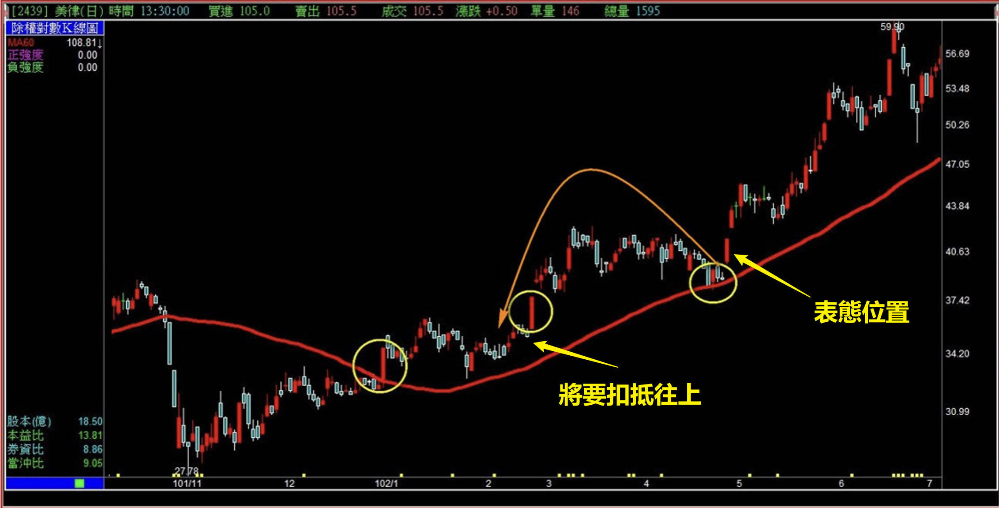
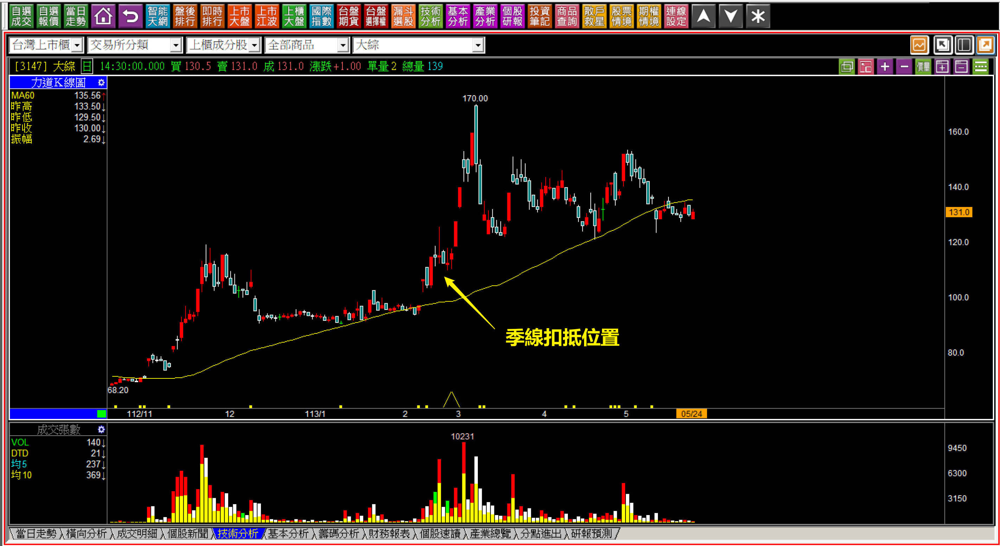
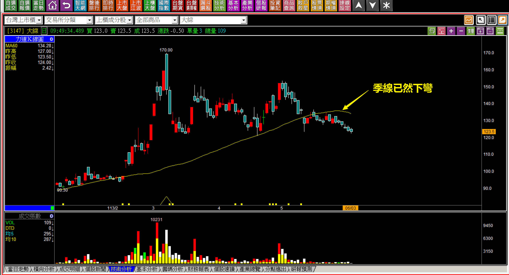
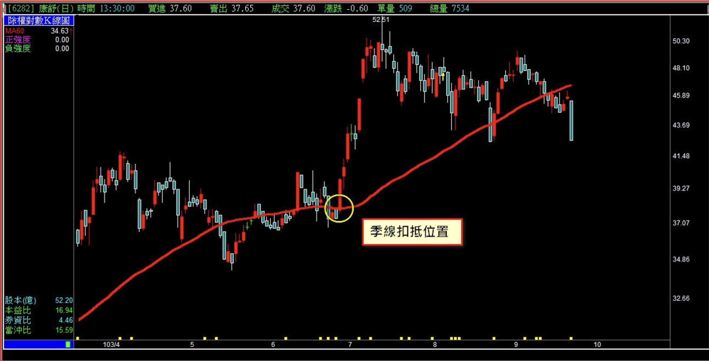
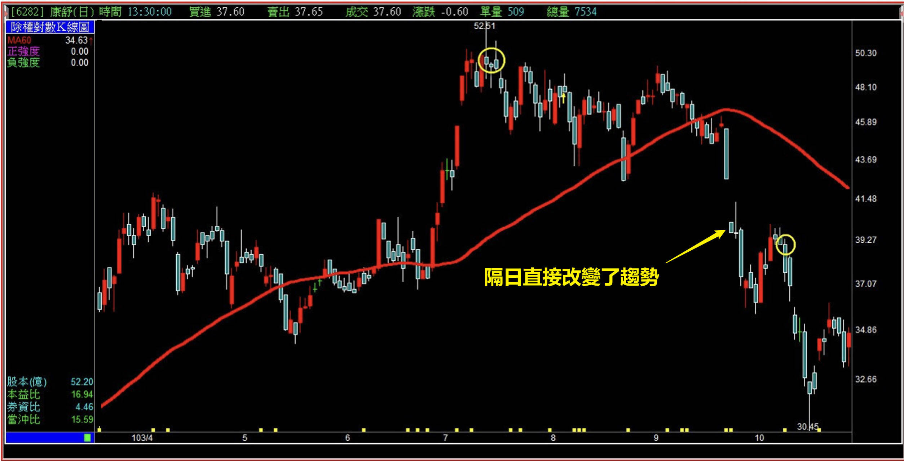
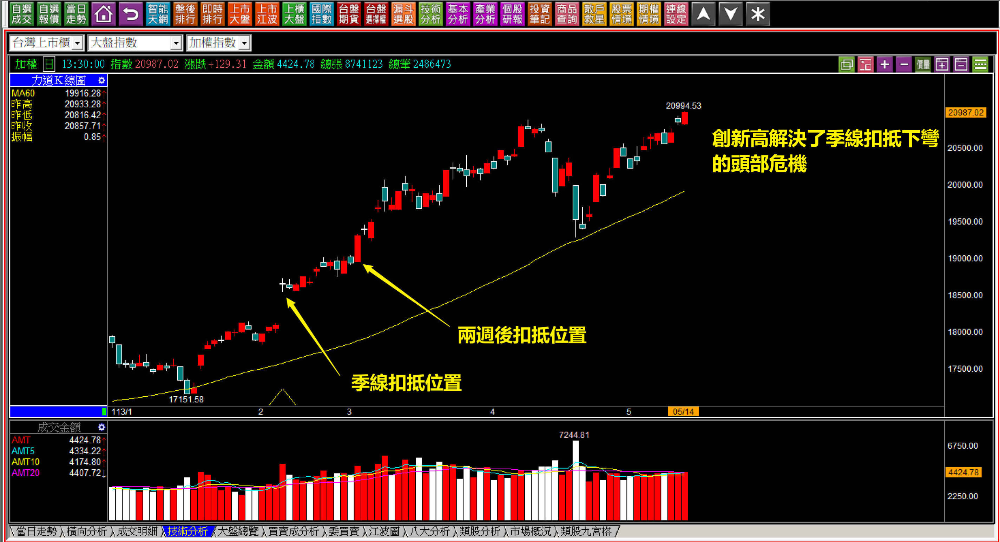

# 【明日K線】「季線扣抵」篇

季線的學習要點來自於「移動平均線」，這就要先認識真正葛蘭碧八大法則的原理，這個邏輯網路上教學雖多，但是後人多數以訛傳訛，加入了找買賣點的說法讓人比較能接受，實際上重點並不在於買賣位置，而是**「扣抵」**的判斷。

認識扣抵的目的，就是為了確認季線所代表的趨勢是否將要發生轉變。光是從季線的學習角度，就可以理解這一點。再進一步，頸線的判斷就是以季線的上彎或者下彎作為第一個條件，前高突破或者前低跌破作為第二個條件，畫上去頭部或者底部需要三個月以上，是第三個條件，顯見季線所運用的範圍依然是趨勢的改變關鍵。

「明日K線」得要再更深入一點，從股價發生的變化的起始點，回頭看扣抵，發現已經出現了質變之後，對於明日開始的K線就會更加瞭然於心。同樣的，這並非預測行情的功能，而是理解市場資金的心態早就已經發生了變化，現在只不過是確認這個變化已經徹底「影響了趨勢」而已。

對於明日K線的功能意義來說，這就是「影響」已經出現的確認。

**對於已經確認的趨勢表態**

**102年美律(2439)多方走勢**

用一個比較早期發生過的例子來說明股價的「表態」是什麼，先以右方的黃圈碰上季線，當時的扣抵來到二月份，幾天後即將會有一根紅K，之後會越扣越高，還沒碰到之前，股價就以紅K再往上來拉升，表示多方力量的持續，這就是表態。既然多方表態了，隔天就得要再繼續，因此當時的「明日」，就是隔日跳空上漲創新高。

不討論攻擊，就以季線扣抵的角度證明了多方趨勢將會繼續。當然這個例子是有表態的，假如當時的明日開始都不表態，股價就不會有任何機會。理解了這個意義之後，我們再看一般狀況看明日K線。

**113-05-23大綜(3147)**

這樣的例子到處都是，表示季線扣抵的判斷在K線圖中很常見。

上圖在經歷三天之後扣抵就要開始往上，所以現在開始的明日起，每一天都要留意股價是否有往上的表態，畢竟真正的重大壓力只不過是三月當時空頭吞噬，前次四月份的高點沒有太大的量，真的要越過也不是難事，明日起會不會有這樣的呈現呢？就是對於這檔個股的看盤重點。

**113-06-03大綜(3147)**

結果是，接下來沒有任何一天股價有過紅K的表態，季線下彎，代表著都沒有看到多方力量出現。

對於趨勢的角度來說，季線的下彎呈現的就是近三個月資金沒有任何攻擊股價的意圖，一眼看得懂隔日開始的重點，是看盤的要領，「沒有」攻擊的出現，就沒有做價差交易的意義，「沒有」，也是明日K線的判斷。

**找回對「趨勢改變」的戒心**

**對明日扣抵開始往上的戒心**

上圖季線扣抵已經開始要往上扣，雖然季線仍呈現上揚，不過這根黑K已經確認了季線會下彎，原因是如果這檔股票存在著多方力量，就不會在關鍵時刻往下殺一根，這樣就會變成再跌就出現頭部。

如果存在多方的看好，就可以直接往上拉，不需要先跌一根黑K才往上，等於是明日起股價將會出現「改變趨勢」的關鍵K線，因為「明日開始」季線就會下彎。

**隔日開盤就理解已經改變**

當然以結果論，隔天是跳空向下，證明判斷無誤，趨勢改變，但是前一天是否已經看懂？這才是能力上的差異。

雖然不見得每一個例子都會有這種跌勢出現，但是對於交易目的來說，「不攻擊」就是最大的問題，何況在這個狀態下等於是一根衍生出：季線下彎、頸線、頸線跌破、趨勢改變的意義，對於明日K線來說，一開盤就馬上有答案。

**清晰趨勢延續的創新高**

最迷惑人心的走勢往往是盤整階段，盤整的時間越久，季線的扣抵就越逼近。如果季線的扣抵位置與現在的價格相近，就是盤整中最撲朔迷離的時期。

當然，只要指數創新高，就可以解決盤整未明的格局走向清晰的多頭，或者指數跌破盤整區間，會把頭部形成，變成一個明確的壓力區，跌破盤整的下緣，定義上就是頸線跌破。

還需要知道的是，再創新高比起跌破頸線，更加需要受到重視，因為耗費資金力量突破股價，不是簡單的事，比起沒人想拉股價而跌破頸線，當然難得的多。

**113-05-14大盤K線圖**

這是一個解盤的必備能力。

本來扣抵已經開始往上扣高，兩週之後會開始扣19500點以上，扣抵很快就會到達20000點的位置，這就表示時間並不站在多頭這一邊，假如股市要繼續往上，必須要盡快化解季線彎平的危機。就在這樣的日子指數創下新高。

對於明日K線來說這是最簡易的答案，也就是股市會**「從此處重返多頭市場」**。

**明日K線的主要功能**

技術分析本來就是對於已經發生過的事情做出判斷，但是往往有那種還沒發生，卻已經可以預期到隔日若發生，將會對股價的波動產生質變，例如趨勢的改變、反轉的出現、型態的變化......隔日發生看得懂，跟前一天已經預期到有可能的變化，還是有一定程度的價格或速度落差，這是透過明日K線的訓練可以幫助到的判斷。

所以即便是移動平均線的要點是在扣抵，我們已經都理解，但往前一天如果有關鍵K線的判斷，才是學K線的眉角。