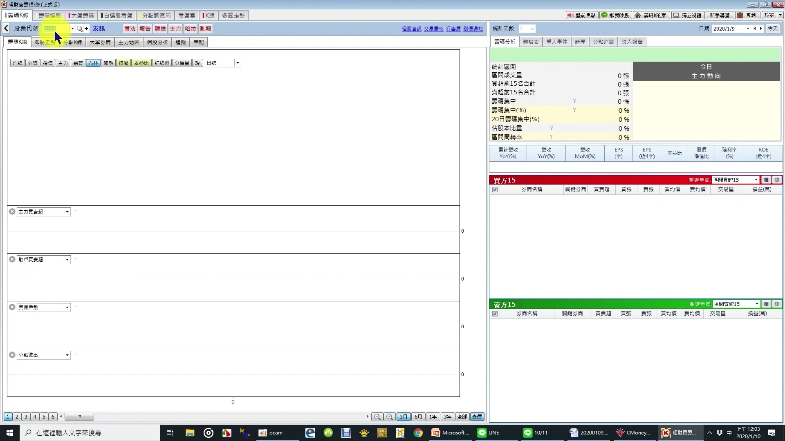
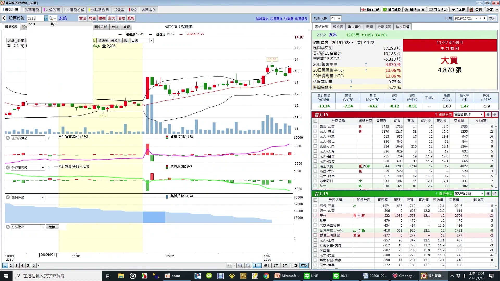
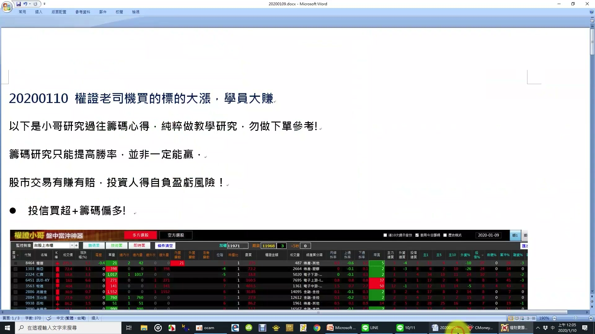
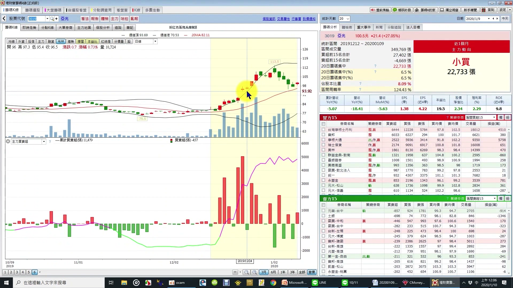

# 權證交易快速上手筆記（自學用）

> 來源：權證小哥籌碼技術分析課程 ch16–ch19
> 講師：權證小哥（**注意：與林家洋老師、主力大尼克老師為三位不同講師**）
> 章節長度：ch16 14:03 / ch17 17:43 / ch18 07:55 / ch19 17:15（共約 57 分鐘）
> 用途：Howard 目前不操作權證，本筆記純為「之後想學的時候有完整自學資料」
> 全部繁體台灣用語、引用標註 `(chXX MM:SS)`

---

## 0. 先看權證的兩種命運（ch16 開場 00:14–02:13）

老師一開始給看了兩張 K 線圖、講權證最重要的事：**權證怕擺**。

- **完美情況**：標的走大長多 → 權證從 0.6 元爆到 19 元以上。但「一般的股票大長多的線型不多」(ch16 00:52)
- **盤整情況**：標的橫盤 → 權證即使現股漲、權證會跟著漲；但現股一盤整、「**權證它就下跌了**」(ch16 01:44)

> 老師關鍵句：「權證它是很怕擺太久的一個金融商品、很容易在一個盤整的時期、它的時間價值會流失很多。」(ch16 01:59)

這是學權證前必須先放心裡的第一句話。

---

## 1. 權證類別與名詞解釋（ch16–ch17）

### 1.1 認購權證（Call、代號後 C 之前的「購」字權證）

- **定義**（ch16 02:21）：投資人付一個權利金、獲得權利於特定日期（到期日）、按約定價格（履約價）、向發行人買進約定數量（行使比例）的標的證券。
- **為何重要**：這是看多最常用的權證類別。
- **實例**（ch16 03:34–06:50）：**台積電群益 91 購 03**（041172）
  - 標的：台積電 / 發行商：群益 / 9 = 109 年、1 = 1 月到期 / 「購 03」= 同名第三檔認購
  - 履約價 234.1、行使比例 0.062、到期日 2020/1/30
  - 當時台積電 337 → **內含價值 = (337 − 234.1) × 0.062 ≈ 6.38 元**
  - 發行商委買 6.35、委賣 6.85（25 張掛單回收）

### 1.2 認售權證（Put、代號後 P）

- **定義**（ch16 09:03）：投資人付權利金、獲得「於到期日按履約價向發行人**賣出**約定數量標的」的權利。
- **為何重要**：看空時用、不必借券、沒有融券標借費問題。
- **實例**（ch16 09:39–13:12）：台積電認售
  - 履約價 152、現股 337 → 「不可能去賣 152、棄之如敝屣」(ch16 13:13)
  - 反例：履約價 352 認售 → 內含價值 = (352 − 337) × 0.101 ≈ 1.5 元、就有履約意義

> 老師關鍵句：「權證它是一個**有權利但沒有義務**的。」(ch16 11:09)

### 1.3 權證編碼規則（ch17 00:00–00:57）

格式：**標的 + 發行商 + 年月 + 購／售 + 流水號**
- 9 = 109 年（民國年最後一碼）、5 = 5 月到期
- 10 月 → 8A、11 月 → 8B、12 月 → 8C（用 A/B/C 接續）
- 「購 01」= 同名第一檔認購、「售 01」= 同名第一檔認售

### 1.4 牛證 / 熊證（ch17 01:02–05:09）

| 項目 | 牛證（代號後 C） | 熊證（代號後 B） |
|---|---|---|
| 方向 | 看多（類似融資）| 看空（類似融券）|
| 優勢 | 沒有融券標借費、找不到券問題 | 同上 |
| 特色 | 履約價低、有「**界限價**」觸發即結算 | 履約價高、有界限價觸發即結算 |

- **實例**（ch17 01:55–04:25）：**高股息凱基 95 牛 01**（03618C）
  - 標的 0056、發行商凱基、109 年 5 月到期、牛證第 1 檔
  - 履約價 19.79（原始 21.07、配息後下調）、**界限價 20.54**
  - 0056 跌到 20.54 → 立馬結算、**時間價值瞬間歸零**（內含價值仍有）(ch17 04:52)
  - 財務費用率 6.03%（相當於用 6.03% 利率借錢買標的）

> 老師關鍵句：「到了界限價立馬結算、所有時間價值瞬間歸零、還是會有內含價值。」(ch17 04:52)

### 1.5 展延型權證（ch17 05:09–08:06）

- **代號**：認購用 X（如「元展 10」03010X）、熊用 Y（市場罕見）
- **定義**：到期可以再展延、不會強制結算、履約價發得很價內（很低）
- **實例**：**鴻海展延牛證**（03010X）
  - 上市日 2014/7/31、活了 5 年以上
  - 履約價 35.98（原始 42）、界限價 40.37、現股 91 → 離界限價非常遠
  - 財務費用率僅 **2.5%**（比一般牛證的 6% 低很多）
- **優點**：時間價值流失少、走勢「跟現股走勢好像」(ch17 07:47)
- **缺點**：報價價差（買賣價差）較大
- **適合**：波段交易（不適合短線）

> 老師關鍵句：「展延型權證適合波段交易。」(ch17 08:06)

### 1.6 希臘字母（ch17 08:12–13:05）

#### Delta（Δ）— 標的漲 1 元、權證漲 Δ 元

- **定義**（ch17 08:24）：標的漲 1 塊、權證漲 Delta 元（絕對價格、不是百分比）
- **實例**（ch17 08:38–09:11）：南亞現股 72、權證 2.57、Delta 0.23 → 南亞漲到 73、權證會漲到 2.80
- **意義**：Delta 越大、槓桿越大

#### Gamma（Γ）— Delta 的微分

- **定義**（ch17 11:02–11:39）：標的漲 1 塊、Delta 變動的幅度。專業講法是「Delta 的微分」。
- **行為**：股票漲越多 → Delta 越大；股票跌越多 → Delta 越小
- **意義**：影響發行商避險動作（見下節）

#### Theta（Θ）— 每天減少的時間價值

- **定義**（ch17 10:11–10:57）：股價沒動時、權證每天會少掉多少
- **單位**：千分之 X（X 越大、時間價值流失越快）
- **實例**：Theta 千分之 9.3 → 每天少 0.01 元、2.57 → 2.56 → 2.55 …

#### 有效槓桿（實質槓桿）

- **定義**（ch17 11:39–13:05）：標的漲 1%、權證漲 X%
- **實例**：6.4 倍 / 6.9 倍 / 8.7 倍 — 每檔不同
- **注意**：成交價有時失真、要看委買價變動才準

### 1.7 發行商避險邏輯（ch17 13:05–17:39）

這是進階知識、決定為什麼大戶買權證會推升現股。

- **Delta 避險**（ch17 13:11–15:05）：散戶買 100 張 Delta 0.5 的權證 → 發行商需買 **50 張現股**避險（100 × 0.5）
- **Gamma 避險**（ch17 15:10–16:25）：
  - 股票漲 1 元 → Delta 從 0.5 升到 0.6 → 發行商需**再買 10 張**現股
  - 股票跌 1 元 → Delta 從 0.5 降到 0.4 → 發行商需**再賣 10 張**現股
- **實例**（ch17 16:25–17:30）：**4728 雙美**大戶買很多權證 → 「股票下跌、自營商避險就要賣股票」「股票上漲、自營商才會買股票」(ch17 17:17–17:24) → 走勢出現雙向放大

---

## 2. 價內 / 價平 / 價外（ch18 全章）

### 2.1 定義（ch18 00:05–00:38）

| 類別 | 認購權證 | 認售權證 |
|---|---|---|
| **價內** | 股價 > 履約價 | 股價 < 履約價 |
| **價平** | 股價 = 履約價 | 股價 = 履約價 |
| **價外** | 股價 < 履約價 | 股價 > 履約價 |

- 看權證軟體：**綠色負值 = 價外、正值 = 價內**(ch18 00:55)

### 2.2 價內外優缺點對照（ch18 02:54–04:39）

| 項目 | 價內 | 價外 |
|---|---|---|
| 利率（隱含借錢成本） | 低 | 高 |
| 權證價格 | 高（有內含價值）| 低 |
| 槓桿 | 小 | 大 |
| 風險 | 低（有內含價值保底） | 高（沒拉過履約價直接歸零） |
| 報酬 | 較低 | 較高 |
| 履約 | 可履約 | 不能履約 |
| **降隱波影響** | **影響小** | **影響大** ⚠️ |

### 2.3 隱含波動率（IV）對價內 / 價外的差別影響（ch18 04:40–07:52）

這是這節最關鍵的概念、**價外權證最怕降隱波**。

#### 案例 A：超級價內 → 降隱波幾乎無感

- **GIS 凱基 68 購 01**（ch18 05:00）：股價 263、履約價 93、**價內 182%**
- 隱含波動率不論怎麼變、合理價都在 11.04 → **幾乎只剩內含價值、不受 IV 變動影響**

#### 案例 B：價外 50% → 降隱波損失慘重

- **群創某認購**（ch18 06:20）：股價 14.95、履約價 21.86、**價外約 50%**
- IV 45% → 合理價 0.60
- IV 44% → 合理價 0.57（少 0.03）
- IV 43% → 合理價 0.53（再少 0.04）
- 「降 1% IV、權證大約少 5% 價值」→ 持有 1 萬元權證、瞬間少 500 元

> 老師關鍵句：「我們講這個價外的權證、最怕降隱波。價內呢、就比較不怕降隱波。」(ch18 07:44)

> ⚠️ 補充：**隱含波動率（IV）** 是發行商替權證定價的核心參數、發行商可主動「降隱波」壓低權證委買價、是發行商吃肉的主要手段之一。

---

## 3. 權證獲利方法（ch19 00:00–12:25）

### 3.1 多空操作四種組合（ch19 00:00–00:26）

| 看多 | 看空 |
|---|---|
| 買進認購權證 / 牛證 | 買進認售權證 / 熊證 |
| 賣出**庫存的**認售 / 熊證 | 賣出**庫存的**認購 / 牛證 |

注意：**權證不能當沖**(ch19 00:13)、賣出必須是庫存才能賣。

### 3.2 發行商可以不掛單的時機（ch19 00:29–01:26）

| 情況 | 發行商不掛 |
|---|---|
| 標的漲停 | 認購委賣、認售委買 |
| 標的跌停 | 認售委賣、認購委買 |
| 開盤前 5 分鐘 | 可以不掛價 |

> 風險：標的跌停想逃命 → 認購可以不給你賣、被鎖死。

### 3.3 三口訣選權證（ch19 02:07–02:25、09:22–10:36）

老師明示的選權證三大原則：

1. **差槓比低**（ch19 09:22）
   - 公式：價差比 ÷ 實質槓桿
   - 價差比 = （委賣 − 委買）÷ 委賣價
   - 為什麼：差槓比越低、進出損耗越小、不會被發行商吃太多
   - 實例（ch19 05:48）：買 3.17、賣 3.16 → 價差比 0.3%、槓桿 5 倍 → 差槓比 0.06% **「算很優質的權證」**

2. **比較價內**（ch19 02:07）
   - 為什麼：**價內權證比較不怕被降隱含波動率**(ch19 01:50)、時間價值衰減慢、有內含價值保底

3. **好券商**（ch19 02:03）
   - 老師點名 OK 的：**元大、統一、凱基**
   - 為什麼：大券商造市穩、報價不會亂搞、降隱波較克制

### 3.4 合理價怎麼判斷（ch19 02:18–04:23）

#### 方法 A：看委買量是否 25 張固定量

- **收盤價 ≠ 合理價**(ch19 02:23)
- 真合理價是**委買 25 張固定數量處**（國票 25 / 群益 25 / 元大 100 都是發行商統一掛量）
- 實例：收盤 5.5、但委買 7.05 掛 25 張 → **真合理價 7.05、5.5 是低估**

#### 方法 B：元大權證網反算 IV

- google「元大權證網」→ 輸入權證代號
- 看歷史委買隱含波動率（綠線）、找穩定值
- 把穩定值填回、按計算 → 算出合理價

### 3.5 權證小幫手欄位完整解讀（ch19 04:55–11:30）

| 欄位 | 解讀 |
|---|---|
| 代號（6 位數）| 權證代號 |
| 名稱 | 標的 + 發行商 + 年月 + 購／售 + 流水（93 = 109 年 3 月） |
| **差槓比** | 越小越好（市場資訊越透明、差槓比越小）|
| 價差比 | （委賣 − 委買）÷ 委賣 |
| 價內外 | 正值價內、負值價外 |
| 買隱波 | 跟其他檔不要差太遠就好、差太遠「就怪怪的」(ch19 07:09) |
| 天數 | 短天期槓桿大但時間價值流失快、長天期較穩 |
| 買量 / 賣量 | 收盤多為 25 張（國票、群益）或 100 張（元大） |
| 成交價 | **不一定等於買賣價**、可能失真 |
| 漲跌幅 | 因成交價失真、「不用太 care」(ch19 08:09) |
| 外內比 | 紅 = 偏多（外盤成交多）、綠 = 偏空、±100% = 全外 / 全內、0% 附近 = 對等 |
| 槓桿 | 4.9 / 5.2 倍等、挑差槓比低的、槓桿自然會大 |
| Theta | 千分之 X、每天減少的時間價值 |
| Delta | 標的漲 1 塊、權證漲 Delta 塊 |
| 行使比例 | 一張權證可對應幾張現股 |
| **流通比** | **超過 50% 要特別小心**(ch19 09:58)— 散戶持有比例過高、或被同業吃走、發行商懶得維護報價 |
| 到期日 | 最後交易日 vs 到期日通常差 2 個營業日 |

---

## 4. 個股案例 — ch19 13:30–16:30（關鍵分點 + 布林軌道）

> 這段是 ch19 結尾的實戰示範、把「**多重理由才做**」「**關鍵分點動作**」「**布林軌道型態**」三個結論串起來。

### 4.1 截圖 1：ch19 13:30（友訊 2332、輸入股票代號）

- **對應字幕**：「最近呢 比較特別的一檔股票」(ch19 13:30)
- **解讀**：老師正在切換到下一個案例、空白籌碼 K 線介面、準備輸入代號 2332。

### 4.2 截圖 2：ch19 14:30（友訊 2332、地緣分點集中）

- **對應字幕**（ch19 13:45–14:08）：
  > 「在之前還沒大漲的時候、我們把時間調成 20 天 …… 20 天內買進的分點有：國票－台南、元大－府城、元大－林森、元大－歸仁、凱基－北門、元大－大彎、元大－金華 …… **這裡全部都是台南分點**、所以代表 — 欸關鍵分點 — 這些地緣分點大買、後面怎麼樣 — 大漲。」
- **個股**：**友訊（2332）**
- **解讀**：**地緣分點集中 = 關鍵分點訊號**。當一檔股票被某地區（這檔是台南）多家分點同時大買、那是該地公司派/在地大戶的動作、後續多會大漲。

> 老師關鍵句：「關鍵分點、一向是很厲害的分點。」(ch19 13:11)

### 4.3 截圖 3：ch19 15:30（投信買超 + 籌碼偏多盤中沖神器）

- **內容**：教學文件截圖、標題「**20200110 權證老司機買的標的大漲、學員大賺**」、條件「**投信買超 + 籌碼偏多**」、底下接權證小哥盤中當沖神器螢幕
- **對應字幕**（ch19 14:55–15:18）：
  > 「在高檔的時候 兆豐－鹿港 …… 高檔的時候它站在賣方、跌回來才開始買。所以這種厲害的分點 …… 在高檔、在上軌的時候關鍵分點買、所以我們在上軌的時候就空了 …… 在這邊空、我這邊也賺不少。」
- **個股**：**為升（2231）**、關鍵分點 **兆豐－鹿港**
- **解讀**：地緣分點不只「買 = 做多訊號」、**高檔賣 → 上軌做空、跌回再買 → 接回做多** 也是訊號。同一個分點正反兩個方向都有意義。

### 4.4 截圖 4：ch19 16:30（亞光 3019、壓縮後打開沿上通道）

- **對應字幕**（ch19 15:51–16:30）：
  > 「布林軌道我們最喜歡怎麼樣 — 最喜歡壓縮或打開 …… 看玉晶光、壓縮後打開、打開了股價沿著上通道 …… 例如說、**亞光、壓縮後打開、沿著上通道、一離開你可以停利、後面不用管** …… 這檔呢、是因為關鍵分點、我們看到在這裡大賣、那後面股價整個漲上去了 …… 所以呢、你看關鍵分點、再加上布林軌道型態、其實呢、做交易會變得很輕鬆很簡單。」
- **個股**：**亞光（3019）**
- **解讀**：
  - 收盤 100.5、漲幅 +27.05%（截圖右上）
  - 布林通道 **壓縮 → 打開沿上通道** = 強勢起漲訊號
  - 配合主力大買 22,733 張（畫面右側「小買」標籤、但累計買超 11,479）→ 雙訊號確認
  - 一離開上通道立刻停利、不貪後面

### 4.5 案例綜合心法

> 老師關鍵句：「**多空要有多個理由才做**」(ch19 12:30)
> 例如：① 關鍵分點買 + ② 主力買 + ③ 基本面好 + ④ 外界要低 → 越多理由越穩。

---

## 5. 「不能做」清單（風險管控）

老師明說的高風險陷阱、整理如下：

### 5.1 商品本身的陷阱

1. **盤整期持有權證**（ch16 01:44–02:13）
   - 標的盤整、權證會自己下跌（時間價值流失）
   - 老師原話：「權證它是很怕擺太久的一個金融商品」

2. **深價外權證**（ch18 06:20–07:49）
   - 50% 價外的權證、發行商隨便降 1% IV、權證就少 5% 價值
   - 沒拉過履約價直接歸零、風險最高

3. **流通比超過 50%**（ch19 09:58–10:26）
   - 散戶持有比例過高、或被同業吃走 → 發行商不認真維護報價、買賣價會擺爛

4. **時間價值將盡的短天期權證**（ch19 09:18）
   - 短天期槓桿大、但時間價值流失快、適合刺激、不適合波段

### 5.2 交易時機的陷阱

5. **標的漲跌停**（ch19 00:32–01:06）
   - 漲停 → 認購可以不掛賣價（你買不到）
   - 跌停 → 認購可以不掛買價（你想跑跑不掉）
   - 等於發行商可以「合法擺爛」、流動性瞬間消失

6. **開盤前 5 分鐘**（ch19 01:06）
   - 發行商可以不掛價、別在這個時段交易

7. **發行商品質爛**（ch19 02:03）
   - 老師只點名 OK 的：元大、統一、凱基
   - 沒點名的小券商要小心降隱波、報價亂搞

### 5.3 老師反例案例

8. **發行商降隱波**（ch18 案例 B）
   - 群創價外 50% 認購、IV 從 45% → 43% → 權證合理價從 0.60 → 0.53、瞬間掉 11%
   - 這是發行商「合法吃投資人」的最大武器

9. **大戶買超多的權證**（ch17 16:25 雙美 4728）
   - 發行商 Gamma 避險、跌的時候會跟著放大賣壓、漲的時候會加碼推升
   - 雙向放大波動、新手難承受

---

## 6. 跟現股對照

### 6.1 為什麼權證 ≠ 加槓桿買現股的便宜版本

| 現股（甚至融資）| 權證 |
|---|---|
| 沒有時間價值衰減 | 每天 Theta 蒸發 |
| 沒有發行商會壓你的報價 | 發行商可降隱波、可不掛單 |
| 利息固定（融資 ~6%）| 財務費用率 2.5%~8% 都有 |
| 不會歸零（除非下市）| 沒拉過履約價直接歸零 |
| 沒有界限價 | 牛熊證碰界限價立馬結算 |
| 流動性自然有 | 漲跌停 / 開盤前 5 分可被拒絕報價 |

### 6.2 權證適合的情境

- **短線爆發**：明確的多空催化劑（大買單、突破壓力）+ 預期幾天內動
- **大行情**：標的明顯走大長多時、權證可以複利爆發（ch16 開場第一張圖）
- **規避融資成本**：展延型權證 2.5% 財務費用率、比融資 6% 便宜（ch17 06:44 鴻海展延案例）
- **看空想空**：認售 / 熊證、沒有融券標借費 / 借不到券問題（ch17 01:28）

### 6.3 權證不適合的情境

- **盤整**：時間價值穩定流失、最殺的場景
- **長抱波段**：一般權證撐不過 1 年（除非展延型）
- **無催化劑、賭運氣**：發行商靠降隱波、Theta 兩面吃你
- **流通比 > 50% 的爛權證**：報價爛、買不到合理價

---

## 7. 自學進階建議

### 7.1 老師沒講透、需自己補的部分

1. **隱含波動率的取得**
   - 看哪裡：元大權證網（ch19 03:04 提到）、Goodinfo 權證 IV 歷史、CMoney 籌碼 K 線權證頁
   - 怎麼用：看 30 日 / 60 日 IV 區間、判斷現價是貴是便宜

2. **牛熊證 vs 認購 / 認售的差別**
   - 老師有講界限價、但沒講為什麼牛熊證利率比認購高
   - 自學重點：歐式 vs 美式、重設 vs 不重設、停損結算機制

3. **展延機制細節**
   - 老師說「會增加展延機制」(ch17 05:09)、但沒講展延前後履約價怎麼調整
   - 自學重點：展延通知書、新履約價計算公式

4. **發行商造市規則**
   - 「比內含價值多一點收」(ch16 06:46) — 多多少？
   - 自學重點：櫃買中心的「發行人造市買賣價差限制」公告

### 7.2 推薦學習路徑（按類別、不給具體連結）

1. **官方/教科書層**（先建框架）
   - 證交所、櫃買中心：權證專區、Q&A、發行規則公告
   - 主要券商投教：元大、凱基、統一三家的權證學院

2. **個股實戰層**（建立感覺）
   - 元大權證網、Goodinfo 權證頁、CMoney 籌碼 K 線權證模組
   - 看「同一標的、不同發行商、不同履約價」的價差比較

3. **進階層**（搞懂發行商邏輯）
   - 看認購權證每日造市買賣價差統計、找差槓比真低的發行商
   - 觀察 Gamma 避險案例：某檔權證流通比突然衝高、現股跟著怎麼動

4. **跨課程整合**
   - 權證小哥籌碼技術分析後段：布林軌道、地緣分點等可直接套到權證選股
   - 林家洋老師的 K 線力量規則、可作為權證進出場的 trigger

---

## 8. 老師 ch19 結論摘要（最後 3 分鐘）

老師在 ch19 12:25 開始做整段課程的收尾、講三件事：

### 結論 1：多空要有多個理由才做（ch19 12:30）

> 「在做一檔股票的時候、最好是怎麼樣 — 最好是有第一個有關鍵分點買、主力也再買、就兩個理由了；最好基本也會好、哇三個理由；外界要低、哇四個理由。所以**有多個理由做、會比較好一點**。」

### 結論 2：關鍵分點動作非常重要（ch19 13:01）

> 「關鍵分點呢、一向是很厲害的分點。」

- 友訊 2332 案例：地緣分點（台南）集中買進 → 大漲
- 為升 2231 案例：兆豐－鹿港高檔賣（做空）、跌回再買（接回）
- 用法：分點動作可同時驗證做多 / 做空兩端

### 結論 3：布林軌道型態很值得研究（ch19 15:39）

> 「布林軌道我們最喜歡 — 最喜歡壓縮或打開、壓縮或打開的股票真的很強 …… 一離開你可以停利、後面不用管。」

- 玉晶光、亞光案例：壓縮 → 打開 → 沿上通道 = 強勢起漲
- 配合關鍵分點 = 雙確認、停利明確

### 老師收尾原話（ch19 16:39）

> 「關鍵分點再加上布林軌道型態、其實呢、做交易會變得很輕鬆很簡單。希望各位這個可以應用小哥在課程上面所教的方法、然後多學幾種技巧、然後就可以在整個交易上就會做的很順利。最後呢、小哥祝各位在交易上能賺錢、然後在作業上可以多幫助一些需要幫助的人。」

---

## 附錄 A：名詞速查表（按字母）

| 名詞 | 一句話定義 | 章節 |
|---|---|---|
| 認購權證（Call）| 看多用、可向發行商按履約價「買」標的 | ch16 02:21 |
| 認售權證（Put）| 看空用、可向發行商按履約價「賣」標的 | ch16 09:03 |
| 牛證（代號 C）| 類似融資、有界限價、看多用 | ch17 01:08 |
| 熊證（代號 B）| 類似融券、有界限價、看空用 | ch17 01:10 |
| 展延型權證（X/Y）| 可展延不強制結算、適合波段 | ch17 05:49 |
| 履約價 | 約定買 / 賣的價格 | ch16 02:29 |
| 行使比例 | 1 張權證可換多少張現股 | ch16 02:35 |
| 到期日 | 行使權利的最後日子 | ch16 02:28 |
| 最後交易日 | 通常比到期日早 2 個營業日 | ch17 02:23 |
| 內含價值 | （股價 − 履約價）× 行使比例 | ch16 08:39 |
| 時間價值 | 權證價格扣掉內含價值的部分、會流失 | ch17 10:11 |
| 價內 | 認購：股價 > 履約價 / 認售：股價 < 履約價 | ch18 00:05 |
| 價外 | 反之 | ch18 00:34 |
| 價平 | 股價 = 履約價 | ch18 00:27 |
| 深價內 | 價內幅度極大（如 GIS 182%）、幾乎只剩內含價值 | ch18 05:14 |
| 深價外 | 價外 30%+ 以上、極怕降隱波 | ch18 06:37 |
| 隱含波動率（IV）| 發行商定價的核心參數、可主動調降壓低權證價 | ch18 04:45 |
| Delta | 標的漲 1 塊、權證漲 Delta 塊 | ch17 08:24 |
| Gamma | Delta 的微分、影響發行商避險動作 | ch17 11:02 |
| Theta | 每天減少的時間價值（千分之 X）| ch17 10:11 |
| 有效槓桿（實質槓桿）| 標的漲 1%、權證漲 X% | ch17 11:39 |
| 財務費用率 | 牛熊證隱含的「借錢買標的」年利率 | ch17 02:57 |
| 界限價 | 牛熊證觸發強制結算的價格 | ch17 03:57 |
| 限制價 | 界限價的另一稱呼 | ch17 03:57 |
| 流通在外比例 | 散戶 + 同業持有比例、> 50% 要小心 | ch19 09:53 |
| 價差比 | （委賣 − 委買）÷ 委賣價 | ch19 06:16 |
| 差槓比 | 價差比 ÷ 實質槓桿、越小越優 | ch19 05:34 |
| 外內比 | 外盤 vs 內盤成交比、紅偏多綠偏空 | ch19 08:18 |
| 履約方式（現金）| 到期以現金結算差價、不交割現股 | ch17 06:28 |
| 歐式重設認購 | 只能到期日履約、配股配息會重設履約價 | ch17 02:31 |
| 委買 25 張掛單 | 發行商造市的標準量、可視為「合理委買價」 | ch16 05:48 |
| 開盤前 5 分鐘 | 發行商可不掛價 | ch19 01:06 |
| 漲跌停 | 發行商可單邊不掛價 | ch19 00:32 |

---

## 附錄 B：本筆記沒涵蓋但老師也沒教的（之後想學再補）

1. 權證的歐式 vs 美式差異（老師全程只教歐式）
2. 重設條款的詳細計算（配股配息時履約價怎麼調）
3. 牛熊證界限價觸發後、結算金額怎麼算
4. 發行商評鑑（金管會 / 櫃買中心的造市品質排名）
5. 權證稅務（賣權證的證交稅、實際是 0.1% 而非現股 0.3%）
6. 權證下市流程 / 履約申請流程

---

> **本筆記注意事項**：
> 1. 全部引用都標 (chXX MM:SS)、可回去字幕對照
> 2. 非老師原話的補充已標「⚠️ 補充」
> 3. 不含任何操作建議（user 不操作權證）
> 4. 講師為「**權證小哥**」、與林家洋老師（K線力量）、主力大尼克老師為三位不同人、不可混用
